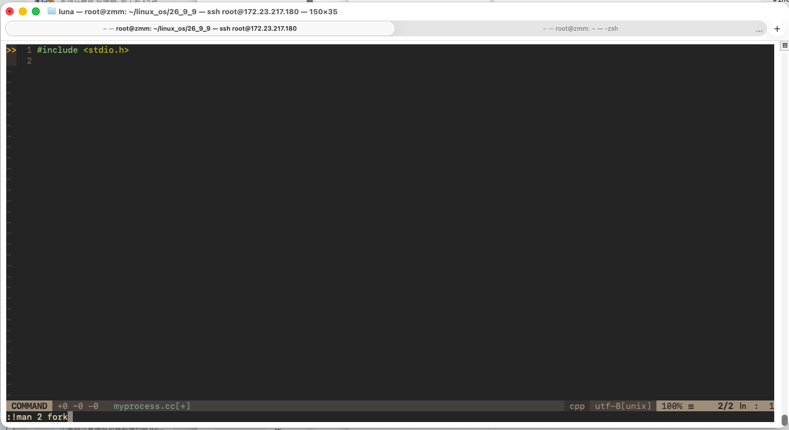
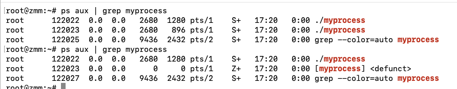
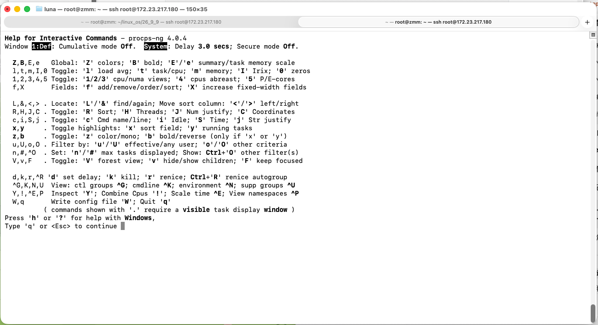
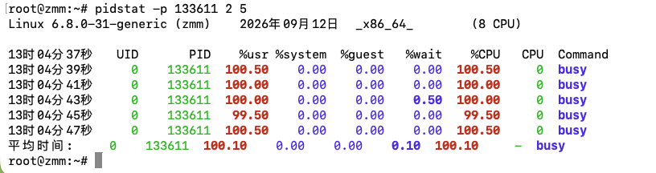
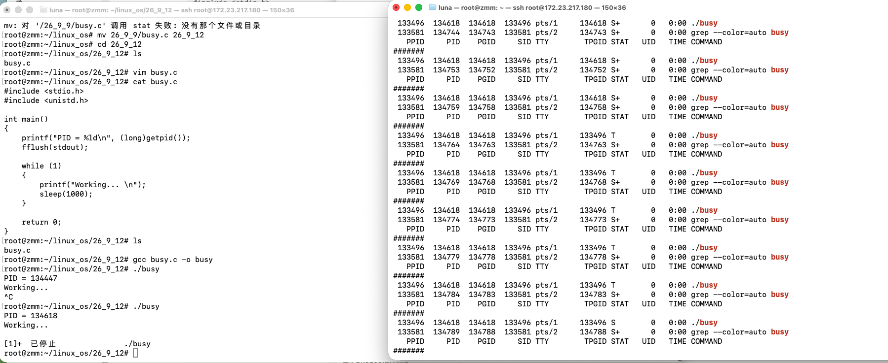

# Linux 进程状态

# 1. 先把“进程状态”真正想明白

## 1.1 从抽象状态图到 Linux 的真实状态模型

假设系统里只有一个程序，它启动以后从第一条指令一直运行到最后一条指令，那么似乎只需要“正在运行”和“已经结束”两种情况。

但真实 Linux 同时有大量进程，而 CPU 核心数量远小于进程数量。一个进程可能：

- 此刻真的占着某个 CPU 核心执行指令；
- 已经具备运行条件，只是在排队等 CPU；
- 主动调用 `sleep()`，等待一段时间；
- 在等待键盘输入、网络数据、子进程退出等事件；
- 在内核中等待某些不能随便打断的 I/O 或资源；
- 被终端按下 `Ctrl+Z` 暂停；
- 被调试器暂停；
- 已经执行完了，但父进程还没有读取它的退出结果。

操作系统不能把这些情况全都当成“正在运行”。

**进程状态的本质，是内核为了管理、调度和回收进程而记录的“这个任务现在处在什么阶段、还能不能运行、在等什么、是否已经退出”等信息。**

可以先把它想成一个学生的办事状态：

```text
正在办理            -> 正在 CPU 上执行
排队等待窗口        -> 已经可以运行，只是在等 CPU
等待材料            -> 睡眠，等待某个事件
被老师叫停          -> stopped
事情办完等待销号    -> zombie
档案彻底销毁        -> 进程彻底从系统中消失
```

这里最容易犯的第一个错误是：

> “进程状态就是 CPU 当前在执行谁。”

不对。状态描述的不只是“CPU 上有什么”，还包含等待、暂停、退出待回收等情况。

---

**课本里的状态图和 Linux 里的字母不是一回事**

很多操作系统教材会画出类似：

```text
创建 -> 就绪 -> 运行 -> 阻塞 -> 就绪 -> ...
                    |
                    +----> 结束
```

这张图没有错，但它是**抽象模型**。

Linux 用户平时通过 `ps` 看到的是另一套更贴近实现和诊断的状态字母：

```text
R  running / runnable
S  interruptible sleep
D  uninterruptible sleep
T  stopped
t  tracing stop
Z  zombie
X  dead（通常观察不到）
I  idle kernel thread（现代 ps 还可能看到）
```

最重要的对应关系是：

```text
教材“运行态” + “就绪态”
            |
            v
         Linux 的 R
```

也就是说，**Linux 的 `R` 不只表示“此刻正在 CPU 上运行”，还包括“已经具备运行条件、正在运行队列里等 CPU”。**

因此：

> `ps` 里看到一个进程是 `R`，不能仅凭这个字母断言“取样瞬间它一定正在某个 CPU 核心上执行”。

这是后面很多面试题的核心。

**“阻塞”和“挂起”也不要混成一个概念**

**阻塞的核心是：进程缺少继续执行所需要的事件/资源。**

> 等键盘输入
> 等网络数据
> 等磁盘 I/O
> 等某个锁
> 等定时器到期

**挂起 = 这个进程暂时不允许继续执行。**

假设你有一个进程：

```
./myprocess
```

它原本完全可以正常运行：

```
while (1)
{
    printf("hello\n");
}
```

它什么都不缺：

- 不等键盘；
- 不等网络；
- 不等磁盘；
- 不等锁。

它完全有条件继续运行。

但是操作系统或者用户把它暂停了：

```
正常运行
   ↓
   ↓  暂停
   ↓
暂时不让它执行
```

这就可以称为“挂起/暂停”。

这里必须先把边界建立好：

```text
阻塞（blocked）：
进程缺少继续推进所需的事件/资源，
即使现在把 CPU 送给它，它也没有条件继续执行。
例如：等待输入、等待定时器、等待 I/O。

挂起（suspended，教材语境）：
更偏向“进程当前不驻留在可直接继续执行所需的内存状态中，
操作系统可能为了内存压力把部分内容换出到外存”的抽象概念。
```

```c
printf("请输入一个数字：");
scanf("%d", &num);

---
  CPU执行程序
    ↓
执行到 scanf()
    ↓
需要你从键盘输入数据
    ↓
你还没输入
    ↓
程序：我现在继续不了，只能等
    ↓
阻塞
```

|                     | 阻塞               | 挂起                  |
| ------------------- | ------------------ | --------------------- |
| 为什么不能运行？    | 自己缺东西，在等待 | 被暂停/暂时不允许执行 |
| 给它 CPU 能运行吗？ | ❌ 通常不能         | 取决于是否解除暂停    |
| 例子                | 等键盘、网络、I/O  | 用户暂停进程          |

**注意：**Linux `ps` 里的 `S` 不是“挂起”

> **`S` 的英文是 Sleep，不是 Suspended。**

现代 Linux 使用虚拟内存、按页换入换出等机制，并没有在 `ps` 的 `R/S/D/T/Z` 中单独给一个“挂起到 swap”的通用字母。因此不要建立下面这种错误对应：

```text
S = 挂起
T = 挂起到磁盘
```

都不对。

因为 Linux `ps` 的字母根本不是这样定义的。

真正应该记：

```
S = interruptible sleep
  = 可中断睡眠

T = stopped
  = 停止态
```

而：

```
swap
```

是**内存管理**相关机制。

所以千万不要建立这种错误对应：

```
S = 挂起在内存      ❌

T = 挂起到磁盘      ❌
```

它们完全不是这个关系。

```
ps 显示中的 S
    ↓
可中断睡眠
    ↓
通常表示进程正在等待某件事情
    ↓
属于我们前面说的“阻塞/睡眠”这一类 （比如sleep(10);）
```

另外，Shell 里常说的“挂起作业”（例如 `Ctrl+Z`）又是**作业停止**的语境，对应 `T`；它和“因为内存压力把页面换到 swap”也不是同一个概念。中文都可能说“挂起”，必须根据上下文判断。

`T` 才是：

```
T = stopped
```

也就是：

> **进程被停止/暂停执行。**

例如你在终端运行：

```
./a.out
```

然后按：

```
Ctrl + Z

---

Ctrl + Z
     ↓
终端产生相应控制信号
     ↓
前台进程通常收到停止信号
     ↓
进程停止执行
     ↓
ps 中可能看到 T
```

Shell 通常会把这个前台进程暂停。

你可能看到：

```
[1]+  Stopped    ./a.out
```

这时候再：

```
ps aux
```

就可能看到：

```
STAT
T
```

所以：

```
S
│
├── Sleep
├── 正在等待某些事情
└── 常见于阻塞

T
│
├── Stopped
├── 被暂停
└── 更接近“挂起/暂停”
```

但是也不要直接死记：

> ```
> T = 挂起
> ```

因为 Linux 内核的实际状态定义比教材里的“挂起态”概念更具体。

你现阶段记：

> **`T` = stopped（停止态）**

最准确。

### 1.1.1 总结

你现在脑子里最好建立下面这张图：

```
                    Linux 进程
                       │
        ┌──────────────┼──────────────┐
        ↓              ↓              ↓

        R              S              T
   Running/       Interruptible     Stopped
   Runnable          Sleep
        │              │              │
        │              │              │
        ↓              ↓              ↓
正在运行 /         正在等待          被暂停
可以运行           某些事件          不继续执行
                   │
                   ↓
              例如 sleep()
              等键盘输入
              等部分 I/O
```

另外还有：

```
R = 运行/可运行
S = 可中断睡眠
D = 不可中断睡眠
T = 停止
Z = 僵尸
```

而 **swap** 是另外一条知识线：

```
             虚拟内存管理
                  │
                  ↓
            RAM 内存压力
                  │
                  ↓
       某些内存页可能被换出
                  │
                  ↓
             磁盘 swap
```

因此：

```
进程状态
R / S / D / T / Z ...
```

和：

```
内存管理
RAM / page / swap ...
```

**不要强行一一对应。**

---

**内核为什么把 `TASK_RUNNING` 定义成 0**

你提供的 PDF 使用了较老版本 Linux 内核中常见的状态展示代码，里面有：

```c
"R (running)"
"S (sleeping)"
"D (disk sleep)"
"T (stopped)"
"t (tracing stop)"
"X (dead)"
"Z (zombie)"
```

现代 Linux 内核源码中的内部定义已经更复杂。当前 `include/linux/sched.h` 会把“能不能运行”和“是否正在退出”分在不同字段中，核心片段可以概括为：

```c
#define TASK_RUNNING         0x00000000  # TASK_RUNNING = 正在运行或者具备运行条件（runnable）
#define TASK_INTERRUPTIBLE   0x00000001
#define TASK_UNINTERRUPTIBLE 0x00000002
#define __TASK_STOPPED       0x00000004
#define __TASK_TRACED        0x00000008

#define EXIT_DEAD            0x00000010
#define EXIT_ZOMBIE          0x00000020
```

初学者经常会问：

> 为什么“运行”反而是 `0`？0 不是“什么都没有”吗？

恰恰因为这里大量状态位可以理解成：

> **“这个任务为什么现在不能正常运行”的原因位。**

如果没有设置任何“睡眠、停止、追踪……”之类的原因位，它就是 `TASK_RUNNING`，因此数值可以是 0。

┌──────────┬──────────┬──────────┬──────────┐
│               睡眠开关        │           深度睡眠           │                 停止开关     │             追踪停止         │

└──────────┴──────────┴──────────┴──────────┘

如果进程现在没有睡眠，也没有停止，也没有被追踪停止：

```
睡眠：    OFF
深度睡眠：OFF
停止：    OFF
追踪停止：OFF
```

用二进制表示就是：

```
0000
```

也就是数字：

```
0
```

所以：

```
TASK_RUNNING = 0
```

可以先理解成：

> **这些“不能正常运行”的状态位一个都没有设置。**

因此它就是可运行的。

这也说明一个重要事实：

**内核内部状态不是一个简单的枚举菜单。它带有位标志、组合状态、版本变化；`ps` 最终显示的单个字母，是面向用户的摘要。**

所以学习时应该分成两层：

```text
内核内部：
task_struct 中的内部状态字段、退出状态字段、标志位……
                    |
                    | 内核 /proc 导出 + 用户态工具解释
                    v
用户看到：
R / S / D / T / t / Z / X / I ...
```

不要把 `ps` 的一个字母误认为 `task_struct` 里永远就只有一个同名枚举值。

---

**一张真正适合初学者的状态流转图**

先记住下面这张图，后面所有状态都能放回这里理解：

```text
                              调度到 CPU
                   +-----------------------------+
                   |                             v
             +-----------+                 +-----------+
             | R：可运行 |                 | R：在运行 |
             | 等待 CPU  | <---------------| 占用 CPU  |
             +-----------+   抢占/时间片等   +-----------+
                  ^                              |
                  |                              |
       事件完成/  |                              | 等待事件
       被唤醒     |                              | sleep/read/wait...
                  |                              v
             +-----------+                 +-----------+
             | S：可中断 |                 | D：不可中断|
             |   睡眠    |                 |   睡眠    |
             +-----------+                 +-----------+
                  ^                              |
                  +------------+-----------------+
                               | 条件满足后回到可运行
                               |
                SIGSTOP/       |
                Ctrl+Z         |
                     +---------v---------+
                     | T：停止 / 暂停    |
                     +---------+---------+
                               |
                            SIGCONT
                               |
                               v
                               R

正常 return / exit / _exit / 被终止
            |
            v
      +-----------+
      | Z：僵尸   |  已经不再执行用户代码，
      | 等待父进程|  只保留退出信息等最小记录
      +-----+-----+
            |
        wait / waitpid
            |
            v
      彻底回收，不再出现在正常进程列表
```

这里还要注意两个细节：

1. `T` 和小写 `t` 都是“停住”，但原因不同：`T` 通常是作业控制/停止信号，小写 `t` 通常是被调试器追踪导致的停止。
2. `X` 是内核清理阶段的死亡状态，通常极短暂，`ps(1)` 甚至写着“should never be seen”，所以日常实验很难看到它。

---

## 1.2 用 `myprocess.cc` 把 S 和 Z 串起来

你给出的 Gitee `code/lesson13/myprocess.cc` 核心代码是：

```cpp
#include <stdio.h>
#include <sys/types.h> // 提供 Linux/Unix 系统编程使用的一些数据类型，例如 pid_t。
#include <unistd.h>

// pid_t   → 专门用来表示进程 ID 的类型
// #include <unistd.h> 用于fork()、sleep()等

int main()
{
    pid_t id = fork();

    if(id == 0)
    {
        // child
        int count = 5;
        while(count)
        {
            printf("我是子进程，我正在运行: %d\n", count);
            sleep(1);
            count--;
        }
    }
    else
    {
        while(1)
        {
            printf("我是父进程，我正在运行...\n");
            sleep(1);
        }
    }

    return 0;
}
```



```
底行模式

Esc
:!man 2 fork
```

这里的 `!` 意思是：

> **临时执行一条外部 Shell 命令。**

所以不只是 `man`，你甚至可以在 Vim 里面：

```
:!ls
:!pwd
:!gcc test.c -o test
:!g++ myprocess.cc -o myprocess
```

这段只有几十行，但它实际上同时能帮助你理解多个进程状态。

**第一步：`pid_t id = fork();` 到底做了什么**

`pid_t` 是 Linux/POSIX 用来表示进程 ID 的整数类型。

`fork()` 成功后，原来的进程会产生一个子进程。随后**父进程和子进程都会从 `fork()` 后面的代码继续执行**，但它们各自看到的返回值不同：

```text
父进程中的 id = 子进程 PID（大于 0）
子进程中的 id = 0
fork 失败         = -1
```

因此并不是“同一个变量一会儿等于 0、一会儿大于 0”。

更准确地说：

```text
fork 前：
只有父进程
    id 变量还没得到 fork 返回值

fork 后：
父进程自己的地址空间                子进程自己的地址空间
id = 子 PID                         id = 0
      |                               |
      v                               v
进入 else                           进入 if
```

父子进程后面的代码文本看起来一样，但它们已经是**两个独立进程**。

**第二步：为什么你用 `ps` 经常看到它们是 `S`**

父进程每打印一次，就执行：

```cpp
sleep(1);
```

子进程也一样。

`sleep(1)` 的意思不是“CPU 在那里傻等 1 秒”。

正确模型是：

```text
正在运行
   │
   │ sleep(1)
   ↓
S：可中断睡眠（阻塞）
   │
   │ 等待“1 秒到期”
   │
   │ 这时候就算给它 CPU
   │ 也没有必要继续执行
   ↓
1 秒到期
   │
   ↓
R：可运行
   │
   │ 现在它已经具备继续运行的条件
   │ 但不一定立刻获得 CPU
   ↓
等待 CPU 调度
   │
   ↓
真正获得 CPU
   │
   ↓
继续执行 sleep 后面的代码
```

它每次真正执行 `printf()`、递减 `count` 等指令只需要很短时间，而 `sleep(1)` 却占据绝大多数生命周期。

所以你哪怕连续输入很多次：

```bash
ps aux | grep myprocess
```

也**很容易一直抓到 `S`**。

> ✅ 阻塞 = 等待某个**事件/条件/资源**发生，因此现在即使给它 CPU，它也没法继续执行。

注意**等待 CPU ≠ 阻塞。**

比如现在有两个进程：

```
CPU 正在运行进程 A

进程 A：正在使用 CPU
进程 B：什么条件都满足了，只是 CPU 暂时被 A 用着
```

那么 B 是：

```
R（Runnable，可运行）
```

而不是 `S`。

因为 B 相当于在说：

> “我什么都准备好了，就差你给我 CPU，我马上就能跑。”

这叫**就绪/可运行**。

这不是它“永远不运行”，只是：

> **取样工具每次拍照时，都更容易拍到持续时间更长的睡眠阶段。**

这是理解 `ps` 的关键：`ps` 是一次“快照”，不是连续录像。

```
进程正在运行 R
     │
     │ 执行 printf()
     ↓
进程正在运行 R
     │
     │ 调用 sleep(1)
     ↓
进入可中断睡眠 S
     │
     │ 此时不占着 CPU 等 1 秒
     │ CPU 可以去运行其他进程
     │
     │ 约 1 秒后等待条件满足
     ↓
重新进入可运行状态 R
     │
     │ 等待 CPU 调度到自己
     ↓
真正获得 CPU
     │
     ↓
继续执行 printf("world")
```

**第三步：5 秒以后子进程会发生什么**

子进程的 `count` 从 5 减到 0 后，离开 `if`，走到：

```cpp
return 0;
```

从 `main()` 返回会导致进程正常终止。

可是父进程是：

```cpp
while(1)
{
    ...
}
```

它一直活着，而且**没有任何 `wait()` / `waitpid()`**。

于是时间线会变成：

```text
0~5 秒：
父进程：S / 短暂 R / S / ...
子进程：S / 短暂 R / S / ...

约 5 秒后：
子进程执行完毕
      |
      v
父进程仍活着，但没有 wait
      |
      v
子进程进入 Z（zombie）

之后：
父进程继续 R/S 循环
子进程一直保留 Z
```

**第四步：原代码还有一个初学者很容易忽略的问题**

它只写了：

```cpp
if (id == 0)
{
    ...
}
else
{
    ...
}
```

如果 `fork()` 失败，它返回 `-1`，`-1 != 0`，于是代码会错误地进入“父进程”分支。

> 如果系统已经极度缺乏内存，内核无法完成这些工作，`fork()` 也可能失败，典型错误是：
>
> 内存不足

更稳妥的写法应当是：

```cpp
pid_t id = fork();

if (id < 0)
{
    // fork 失败，没有产生子进程
    perror("fork");
    return 1;
}
else if (id == 0)
{
    // 子进程
}
else
{
    // 父进程，id 是子进程 PID
}
```

此外这里的僵尸状态是：
**子进程已经执行完、已经死亡，但父进程还没有读取它的退出信息，因此内核暂时保留了这个子进程的一小部分信息。**

`fork()`结束后：

```
父进程
  │
  ├──────────────→ 父进程一直 while(1)
  │
  ↓
子进程
  │
  ├→ count = 5
  ├→ count = 4
  ├→ count = 3
  ├→ count = 2
  ├→ count = 1
  ↓
return 0
  ↓
子进程退出
```

问题就在这里：

**子进程退出了，但是父进程还活着。**

然而父进程还在`while(1)`，没有调用`wait()`或是`waitpid()`。

子进程`return 0;`执行完了。子进程的代码不再运行了，它占用的大部分资源也会被释放，比如用户空间的内存等。但是，**内核不能立刻把关于这个子进程的所有信息都删除。**

为什么？

因为父进程可能想知道：

> “我儿子刚才到底是正常结束的，还是出错了？”

所以：

```
子进程退出
   ↓
不能把所有信息立刻全部删掉
   ↓
内核保留一小部分退出信息
   ↓
等父进程来读取
```

这个时候：

> **已经死亡、不能再执行代码，但是退出信息还等待父进程读取的子进程，就是僵尸进程。**

学习源码时要做到：

> **既覆盖原代码，也看懂原代码没有处理的边界条件。**



---

**动手实验：观察 Gitee 代码从 S 变成 Z**

把代码保存为 `myprocess.cc`：

```bash
g++ myprocess.cc -o myprocess
```

解释：

- `g++`：C++ 编译器驱动程序；
- `myprocess.cc`：源文件；
- `-o myprocess`：指定生成的可执行文件名为 `myprocess`。

运行：

```bash
./myprocess
```

然后新开一个终端，先找到父子关系：

```bash
ps -eo pid,ppid,stat,comm,args | grep myprocess

---

ps
│
├── -e # e 可以先记成 every process，即显示系统中所有的进程
│
└── -o pid,ppid,stat,comm,args # -o ：我自己指定输出格式。即“ps，你不要按照默认格式给我显示，我指定你显示哪些列。”
# COMM就是就是比较简短的程序/命令名称，例如：myprocess
# ARGS是完整命令行。例如./myprocess hello 123
```

字段含义：

- `PID`：当前进程自己的进程 ID；
- `PPID`：父进程 ID；
- `STAT`：状态及附加标记；
- `COMMAND/COMM`：短命令名；
- `ARGS`：完整命令行。

刚启动时，你很可能看到两个 `myprocess`，主状态大多是 `S`。

等待 5～8 秒再看，其中一个很可能变成：

```text
Z
```

或命令一栏出现：

```text
<defunct>
```

如果想像课堂板书那样每秒连续观察，而不是不停手敲 `ps`，可以写：Shell脚本

```bash
while :; do
    ps axj | head -1 # ps axj 显示进程信息。head -1：只取第一行，第一行通常是表头
    ps axj | grep myprocess | grep -v grep # 由于过滤了 所以前面需要单独加一行 head -1取表头
    sleep 1
    echo "######"
done

---
#C/C++                         Shell

while (条件)                  while 条件; do
{                             ↓
    代码;                         命令
}                             done

# 此处：
while 条件; do
    要重复执行的命令
done

此处在 Shell 中，: 是一个特殊的内建命令，它什么重要工作都不做，但会返回成功。即`while (true)`

# head -n是显示前n行的意思
```

逐段解释：

- `while :; do ... done`：Bash 无限循环；`:` 是一个什么也不做但返回成功的内建命令，所以条件始终为真；
- `ps axj | head -1`：只取 `ps axj` 的第一行表头，方便每轮都看清 `PPID/PID/PGID/SID/STAT` 等列；
- `ps axj | grep myprocess`：只保留命令行里含 `myprocess` 的行；
- `grep -v grep`：把监控命令自己产生的 `grep myprocess` 行排除；
- `sleep 1`：每轮间隔 1 秒，否则循环本身会疯狂刷新终端；
- `echo "######"`：人为加分隔线；
- `Ctrl+C`：终止这个监控循环。

这条命令很适合课堂观察，但实际脚本排查僵尸时，后文给出的 `awk '$3 ~ /^Z/'` 更稳，因为它直接判断 `STAT` 列，而不是按命令文本搜索。

最后终止一直循环的父进程：

```bash
kill <父进程PID>
```

一段很短的时间后再查，原先那个僵尸也应当被系统中的 reaper 回收。

---

**这一模块最容易踩的坑**

**坑 1：看到 `S` 就认为进程没有执行。**

错误。`S` 只是你取样时它正在等待事件。它可能每秒被唤醒一次，执行一点工作后又睡眠。

**坑 2：认为 `R` 就是“此刻一定正在 CPU 上”。**

错误。Linux 的 `R` 同时覆盖 running 和 runnable。

**坑 3：认为进程状态只有一个固定枚举值。**

不够准确。现代内核内部有不同状态字段和位标志；`ps` 展示的是面向用户的总结。

**坑 4：看到源码有 `fork()` 就只关心父子分支，不看父进程是否回收子进程。**

这是产生僵尸进程最典型的代码审查漏洞之一。

---

**高频面试题：为什么一个一直在工作的服务，`ps` 里经常是 `S`？**

**考察点：** 是否理解“快照”、睡眠等待和 CPU 实际运行时间的比例。

**标准回答：**

`S` 表示可中断睡眠，通常说明进程正在等待某个事件。网络服务、Shell、很多后台服务并不需要 100% 时间占用 CPU，它们会等待网络、管道、定时器等事件。`ps` 只是某一个瞬间的快照，因此很容易采样到持续时间更长的等待阶段。

**容易答错：**

“`S` 就是不运行，所以这个服务没在工作。”

**面试官可能追问：**

- `R` 是否一定正在 CPU 上？
- `D` 与 `S` 有什么区别？
- 怎样连续观察状态变化？

---

# 2. 把 R、S、D、T、t、I、X、Z 一个个看懂

## 2.1 R、S、D、T、t、I、X、Z：逐个理解状态本质

| 状态 | 直白理解 | 是否会正常执行用户代码 | 常见来源 |
|---|---|---:|---|
| `R` | 正在运行，或已经可运行正在等 CPU | 是 | CPU 密集计算、刚被唤醒 |
| `S` | 可中断睡眠，等待事件 | 暂时不会 | `sleep`、等待输入、很多网络等待 |
| `D` | 不可中断睡眠 | 暂时不会 | 某些内核 I/O / 设备 / 文件系统等待 |
| `T` | 被作业控制/停止信号暂停 | 不会 | `Ctrl+Z`、`SIGSTOP`、`SIGTSTP` |
| `t` | 被调试/追踪暂停 | 不会 | `gdb`、`ptrace` |
| `I` | 空闲内核线程 | 内核线程状态 | 某些内核线程 |
| `Z` | 已终止但尚未被父进程回收 | 不会，已经终止 | 子进程退出但父进程未 `wait` |
| `X` | 死亡/清理阶段 | 不会 | 极短暂，正常几乎看不到 |

这张表用于定位，但真正需要理解的是每个状态**为什么存在**。

---

**R：running 不只是“正在跑”**

官方 `ps(1)` 对 `R` 的描述是：

> running or runnable (on run queue)

所以可以把 `R` 再拆成两个脑内状态：

```text
R
├── 真的已经被调度到 CPU 上执行
└── 已经准备好执行，只差 CPU
```

为什么 Linux 不一定给用户再区分一个“就绪字母”？

因为对于很多进程观察工具来说，两者都属于**可运行任务**；到底哪一个瞬间在 CPU 上，由调度器快速变化。

**实验：制造一个非常容易看到 R 的进程**

保存为 `busy.c`：

```c
#include <stdio.h>
#include <unistd.h>

int main(void)
{
    // 打印 PID，方便另一个终端精确观察
    printf("PID = %ld\n", (long)getpid());
    fflush(stdout);
		/*
		stdout:标准输出流，通常对应终端
		fflush(stdout);就是立即刷新 stdout 的缓冲区，把还没真正输出的数据尽快送出去。
		即
		printf(...)
	    ↓
	我要打印 PID
	    ↓
	fflush(stdout)
	    ↓
	别让这行内容继续待在 stdout 缓冲区
	    ↓
	现在就刷新出去
	
	因为下方有while(1)，希望在进入死循环之前，确保 PID 已经显示出来。
		*/
  
    // volatile 防止编译器把这个无意义循环完全优化掉，也就是编译器发现counter没有实际作用就给优化掉了
    volatile unsigned long long counter = 0;

    while (1)
    {
        counter++;
    }

    return 0;
}
```

```
printf()
   ↓
不一定立刻直接写到终端
   ↓
可能先进入 stdout 的缓冲区
   ↓
满足一定条件
   ↓
再真正输出
```

编译：

```bash
gcc -Wall -Wextra busy.c -o busy
```

运行：

```bash
./busy
```

另一个终端：

```bash
ps -o pid,ppid,stat,pcpu,comm -p <PID>
```

你很容易看到主状态为 `R`，同时 CPU 占用较高。

注意：即使它很忙，也不是说它从此永远霸占 CPU。内核仍然可以抢占、调度其他任务。

---

**S：可中断睡眠，为什么 `sleep()` 不是“CPU 睡觉”**

`S` 的关键不是“睡觉”两个字，而是：

> **这个任务现在不需要占用 CPU，它在等一个事件；这种等待通常可以被信号影响或唤醒。**

典型例子：

```c
sleep(1);
```

还有很多阻塞式操作也可能让任务进入可中断等待，例如等待管道、终端输入、某些 socket 事件等。

可以想象成：

```text
CPU：
“你现在没有可做的事，那就先离开 CPU。”

进程：
“等计时器/数据/事件到了再叫我。”

内核：
把它放入相应等待机制
    |
事件发生
    |
唤醒 -> 重新成为 R -> 等待被调度
```

`S` 的价值很大：如果没有睡眠等待，一个程序为了等数据只能这样写：

```c
while (没有数据)
{
    // 一直反复检查
}
```

这会白白消耗 CPU。

而阻塞/睡眠模型让 CPU 能去服务别的任务。

**实验：稳定观察 S**

```c
#include <stdio.h>
#include <unistd.h>

int main(void)
{
    printf("PID = %ld\n", (long)getpid());
    fflush(stdout);

    while (1)
    {
        sleep(10);
    }
}
```

编译运行后，用：

```bash
ps -o pid,stat,wchan:32,comm -p <PID>
```

`WCHAN` 可以理解成“任务正在内核的哪个等待位置附近睡眠”的提示。它不是初学阶段必须背的字段，但排查睡眠/阻塞时很有帮助。

---

**D：不可中断睡眠，不等于“磁盘坏了”**

PDF 中叫它：

> `D` 磁盘休眠状态（Disk sleep），也叫不可中断睡眠。

`ps` 的现代手册写得更谨慎：

> uninterruptible sleep (usually I/O)

因此更准确的理解是：

**`D` 是不可中断等待，常和 I/O 有关，但绝不是“只要 D 就一定是磁盘”。**

它存在的原因是：内核处理某些操作时，不能在任意中间点把任务当成普通可中断等待那样结束，否则可能破坏内核正在维护的数据或设备操作流程。

假设你的程序执行：

```
read(fd, buf, 4096);
```

意思可以先简单理解成：

> 程序：我要从某个文件/设备里读取数据。

但 CPU 很快，磁盘、设备、网络等相对慢。

于是可能发生：

```
程序正在 CPU 上执行
        ↓
执行 read()
        ↓
需要的数据现在还没准备好
        ↓
那怎么办？
        ↓
总不能让 CPU 一直傻等
        ↓
于是这个进程暂时睡眠
        ↓
等数据准备好了，再继续运行
```

所以这里的“睡眠”不是人睡觉，而是：

> **这个进程现在没法继续干活，先不占 CPU，等某件事情完成。**

S和D状态的区别主要就在于：

```
S：可中断睡眠
D：不可中断睡眠
```

先看 `S`。

假设某个程序正在：

```
sleep(100);
```

它相当于说：

> “100 秒以后再叫我。”

这时候：

```
进程
 ↓
暂时没事干
 ↓
进入 S
 ↓
等待
```

但是这种等待是**可以被信号打断的**。

例如你给它发送终止信号，它可以结束等待，去处理这个信号。

可以先粗略记：

> **S = 我在等，但是有重要的事情可以把我叫起来。**

D 也是：

> **进程正在等待某件事情。**

但它处于一种**不可中断的内核等待**。

例如一个程序执行某些 I/O 操作：

```
用户程序
   ↓
read(...)
   ↓
进入 Linux 内核
   ↓
内核正在等待某个底层操作完成
   ↓
进程进入 D
```

这时候可以先把它理解成：

> **“这件底层工作必须等到一个合适的点，我现在不能随便把这个等待打断。”**

所以：

```
S
我在等
但可以被信号唤醒/打断

D
我也在等
但当前这个内核等待不能被普通信号打断
```

这才是 S 和 D 最核心的区别。

此外 D **历史上经常与磁盘 I/O 等待联系在一起**，但不要理解成：

```
看到 D
  =
磁盘肯定出问题了
```

更准确的理解是：

> **D 表示 uninterruptible sleep，也就是不可中断睡眠；它常见于 I/O 等内核等待。**

这里的 I/O 你现在也不用想复杂。

I/O = Input / Output，输入/输出。

例如：

```
读磁盘
写磁盘
访问某些设备
网络/文件系统相关操作
```

都可能涉及 I/O。

因此建立这个脑图就行：

```
            睡眠/等待
               │
        ┌──────┴──────┐
        ↓             ↓
        S             D
   可中断睡眠      不可中断睡眠
        │             │
   信号可以影响      当前等待不能
   这种等待          被普通信号打断
```


> **什么叫“信号”？**
>
> 假设现在有一个程序正在运行：
>
> ```c
> while (1)
> {
>     printf("我还在运行\n");
>     sleep(1);
> }
> ```
>
> 对应一个进程：
>
> ```c
> 进程 PID = 1234
> 
> 正在运行……
> 正在运行……
> 正在运行……
> ```
>
> 现在你想从另一个终端告诉这个进程：
>
> > “你该结束了。”
>
> Linux 就需要一种**进程之间/内核向进程传递事件通知的机制**。
>
> 其中一种机制就是：
>
> **信号（signal）。**
>
> 你可以暂时把信号理解成：
>
> > **Linux 给进程发送的一种“通知”。**
>
> 例如：
>
> ```c
> 某个进程正在运行
>        │
>        │ 收到一个信号
>        ↓
>    “有人通知我了”
>        │
>        ↓
> 根据这个信号应该产生相应行为
> ```
>
> 不同的信号代表不同的事情。
>
> ---------------------
>
> 例如有一种非常常见的信号叫：
>
> ```c
> SIGTERM
> ```
>
> `TERM` 来自 terminate，终止。
>
> 它通常表示：
>
> > **“请终止运行。”**
>
> 程序可以有机会针对这种信号进行处理，例如：
>
> ```c
> 收到 SIGTERM
>       ↓
> 程序发现：
> “有人让我退出”
>       ↓
> 保存重要数据
>       ↓
> 关闭打开的文件
>       ↓
> 释放资源
>       ↓
> 正常退出
> ```
>
> 因此可以把它想象成：
>
> > “请你收拾一下，然后下班。”
>
> 如果发送的是：
>
> ```c
> SIGKILL
> ```
>
> 程序没有资格说：
>
> > “等一下，我先保存数据。”
>
> 也不能说：
>
> > “这个信号我不想处理，忽略掉。”
>
> 也不能自己写代码规定：
>
> > “收到 SIGKILL 后执行我的 `my_handler()`。”
>
> 因为 Linux **不允许进程捕获或忽略 SIGKILL**。
>
> 所以：
>
> ```c
> SIGTERM
> ≈ “请你退出。”
> 
> SIGKILL
> ≈ “必须终止。”
> ```
>
> 当然这只是方便你理解的比喻。

**为什么 `kill -9` 对 D 状态有时看起来也“没用”**

`SIGKILL` 确实不能被程序捕获、屏蔽或忽略。（SIGKILL即信号+杀死，即**“强制终止进程”信号。**）

但是：

> **信号被标记为待处理，不等于处于不可中断内核等待的任务立刻就能返回用户态处理退出。**

如果任务长期卡在某个 `D` 等待里，你执行：`kill -9 PID`它可能仍在列表里，直到对应内核等待结束，才有机会真正完成退出。

```bash
kill -9 <PID>

# 例如 
kill -9 1234 # 意思不是Linux 立刻把 PID 1234 从系统里删除。
# kill -9 的核心是给目标进程发送：SIGKILL，即进程自己不能捕获、不能忽略、不能自定义处理 SIGKILL。
kill -9 1234
      │    │
      │    └── 目标进程 PID
      │
      └────── 发送编号为 9 的信号
                │
                ↓
             SIGKILL

# kill命令的作用是：向进程发送信号。
kill
 │
 │ 发送什么？
 ↓
-9
 │
 ↓
9号信号
 │
 ↓
SIGKILL
 │
 │ 发给谁？
 ↓
PID 1234

# 没有写 -9 时，kill 默认发送的是：SIGTERM
kill 1234 # 给 1234 发送 SIGTERM，请求它终止。

-------------------------------------------------------------------------
比如普通信号，有些程序可以自己决定：

收到信号
   ↓
我先保存文件
   ↓
清理资源
   ↓
然后退出

但 SIGKILL 不给程序这种机会。

最终效果是内核强制终止它。
```

| 命令           | 发出的信号      | 现在怎么理解 |
| -------------- | --------------- | ------------ |
| `kill 1234`    | `SIGTERM`（15） | 请求进程终止 |
| `kill -9 1234` | `SIGKILL`（9）  | 强制终止进程 |

**“捕获、忽略、自定义处理”又是什么意思？**

这个也是你刚才那段话里最容易看不懂的地方。

普通信号中的一些信号，程序可以提前写代码：

```
如果以后收到某个信号
        ↓
不要立刻按默认方式处理
        ↓
先执行我自己写的函数
```

这就叫**捕获信号并进行处理**。

比如程序可以设计成：

```
收到 SIGTERM
      ↓
执行自己写的处理函数
      ↓
保存数据
      ↓
关闭文件
      ↓
退出
```

但：

```
SIGKILL
```

不允许这样。

也就是说：

```
              SIGTERM             SIGKILL
                 │                   │
程序能否捕获？    可以                  ❌
程序能否忽略？    可以                  ❌
自己写处理函数？  可以                  ❌
```

所以 `SIGKILL` 才这么“强”。

要严格区分：

```text
Z：已经死了，等父进程收尸
D：还活着，但卡在不可中断的内核等待
```

两者都可能出现“kill -9 后进程还在”的表象，**原因完全不同**。

---

回到刚刚讲的D状态，假设：

```
PID 1234
   │
   ↓
处于 D 状态
不可中断睡眠
```

你执行：

```
kill -9 1234
```

实际上是在做：

```
我
 │
 │ kill -9 1234
 ↓
Linux
 │
 │ 给 1234 发送
 ↓
SIGKILL（9号信号）
 │
 ↓
这个进程不能忽略 SIGKILL
```

**但是这里还有另外一个问题：**

进程当前正在 **D 状态的不可中断内核等待**。

所以虽然 `SIGKILL` 是不能被忽略的强制终止信号，但这个任务可能暂时无法从当前不可中断等待中返回，因此你可能看到：

```
发送 SIGKILL
      ↓
进程需要被终止
      ↓
但当前还卡在 D 的不可中断等待
      ↓
暂时仍然能在 ps 中看到它
      ↓
等待的内核事件完成
      ↓
任务得以继续推进
      ↓
完成终止
```

所以这里有两个**完全不同的概念**：

```
SIGKILL 不能被忽略
          ≠
SIGKILL 保证这一瞬间立即让 D 状态任务消失
```

------

**为什么不建议为了学习强行制造 D**

`S`、`R`、`T`、`Z` 都能通过安全的小实验稳定复现。

`D` 往往依赖具体文件系统、设备、网络存储、内核路径，普通机器上并不容易稳定制造。故意把真实设备或挂载点搞进异常状态只为观察 `D`，学习收益低、风险高。

学习时更重要的是会排查：

```bash
ps -eo pid,ppid,stat,wchan:32,comm,args | awk '$3 ~ /^D/'
```

如果业务机器大量任务长时间处于 D，再结合：

- `WCHAN`；
- 系统日志；
- 存储/网络文件系统状态；
- I/O 工具；
- 内核堆栈（需要更高权限和后续知识）；

继续定位。

---

**T 和 t：都是“停住”，原因却不同**

**`T`：停止状态**

常见来源有：

```text
Ctrl+Z  -> 终端通常向前台作业发送 SIGTSTP
kill -STOP PID -> 发送 SIGSTOP
```

收到停止类信号后，任务不会继续执行正常指令，`ps` 中可以看到 `T`。

恢复：

```bash
kill -CONT <PID>
```

发送 `SIGCONT` 后，任务重新具备运行条件，回到 `R`，之后也可能很快进入 `S`。

这里要特别分清：

- `SIGTSTP`：终端作业控制常用，程序可以对它安装处理方式；
- `SIGSTOP`：强制停止，不能被捕获、阻塞或忽略；
- `SIGCONT`：让已停止进程继续。

**`t`：tracing stop**

小写 `t` 一般表示进程被调试器/追踪机制暂停，例如 `ptrace`、`gdb`。

你提供的第二份资料中把类似 `Tt` 解释成 “`T` 停止 + `t` 被调试器追踪”。这里要做一个版本无关的纠正：

**在现代 `ps(1)` 文档中，小写 `t` 本身就是一种主状态代码，不属于 BSD `STAT` 的附加后缀列表。**

`STAT` 后缀里常见的是：

```text
<   优先级较高
N   优先级较低（nice 值较大）
L   有部分内存页被锁定
s   这个进程是会话（session）的领导进程
l   这个进程是多线程进程
+   属于当前终端的前台进程组
```

所以读 `STAT` 最安全的方法是：

> **先看第一个状态字符，再识别后面的标准附加标记。**

其中最常见、现阶段最值得记的是 **`+`**：

> `+` 可以先简单理解为：**这个进程正在当前终端的“前台”运行。**

例如：

```text
S+   -> 主状态 S，且在前台进程组
Ss   -> 主状态 S，且是会话首进程
Sl   -> 主状态 S，且为多线程进程
R+   -> 主状态 R，且在前台进程组
Z+   -> 主状态 Z，且带前台进程组标记
```

S+：比如你在终端直接执行：

```
./myprocess
```

程序运行期间终端通常会被它占着，你暂时不能继续正常输入下一条命令，这就是**前台运行**。

但如果这样：

```
sleep 100 &
```

注意最后多了：

```
&
```

你会很快重新得到：

```
root@zmm:~#
```

也就是说：

```
sleep 100 &
          ↑
       放到后台运行
```

现在就出现了非常直观的区别：

```
前台：

root@zmm:~# sleep 100
                 │
                 ↓
          终端主要交给它
                 │
          shell 等它结束


后台：

root@zmm:~# sleep 100 &
                   │
                   ↓
               后台运行

root@zmm:~#
     ↑
shell 马上又能接收你的新命令
```

所以你第一次学习时，可以先记：

> **前台：当前占据终端交互位置的任务。**
>
> **后台：任务还在运行，但 shell 不需要一直等着它，你还能继续输入其他命令。**

---

**I 和 X：为什么资料里不一定讲到**

**`I`：idle kernel thread**

现代 `ps` 可能显示 `I`，表示 idle kernel thread。

它主要属于内核线程观察场景。普通用户程序学习时，不需要为了凑状态强行制造它。

**`X`：dead**

你提供的 PDF 把 `X` 列为死亡状态，并说明通常在任务列表里看不到。

这个理解是对的。

进程最终会从 `Z` 经父进程回收走向彻底清理；`X`/dead 相关阶段通常非常短暂，用户态工具几乎无法稳定采样。

所以：

> `Z` 才是日常真正需要理解和处理的“退出后残留状态”，不是 `X`。

---

## 2.2 用 `ps`、`/proc`、`top` 观察状态并做实验

**`ps aux`**

```bash
ps aux
```

这是 BSD 风格常见写法。

大致可以理解为：

- `a`：扩大选择范围，包含其他用户关联终端的进程；
- `x`：也包含没有控制终端的进程；
- `u`：使用面向用户的详细格式，包含用户、CPU、内存、`STAT` 等字段。

组合起来，通常用于：

> “给我看系统里大范围的进程，并用详细格式显示。”

常见列：

```text
USER  PID  %CPU  %MEM  VSZ  RSS  TTY  STAT  START  TIME  COMMAND
```

当前主题最关心：

- `PID`
- `STAT`
- `COMMAND`

但排查父子关系时 `ps aux` 本身没有直接给 PPID，建议用自定义格式。

**更适合学习状态的命令**

```bash
ps -eo pid,ppid,stat,wchan:24,comm,args
```

逐项解释：

- `-e`：选择所有进程；
- `-o`：自定义输出字段；
- `pid`：进程 ID；
- `ppid`：父进程 ID；
- `stat`：进程状态与附加标记；
- `wchan:24`：等待通道，并给这一列 24 字符宽度；
- `comm`：短命令名；
- `args`：完整命令行。

如果只想看一个 PID：

```bash
ps -o pid,ppid,stat,wchan:24,comm,args -p 1234
```

**`ps axj`**

你的 PDF 还给出：

```bash
ps axj
```

`j` 是 job-control 相关格式，适合观察：

- PID；
- PPID；
- 进程组；
- 会话；
- TTY；
- 状态；

这些信息对理解 Shell 前后台作业很有帮助。

**`ps -efH`**

```bash
ps -efH
```

其中 `H` 可以用层级缩进帮助看父子关系。

它比“只 grep 名字”更适合观察进程树。

**`/proc/PID/status`**

Linux 还会把进程信息暴露在 `/proc` 伪文件系统中。

例如：

```bash
cat /proc/1234/status
```

你会看到类似：

```text
Name:   myprocess
State:  S (sleeping)
Pid:    1234
PPid:   1200
...
```

只看关键字段：

```bash
grep -E '^(Name|State|Pid|PPid):' /proc/1234/status
```

这里的 `State` 是内核通过 `/proc` 暴露给用户的状态摘要。

**`/proc/PID/stat`**

```bash
cat /proc/1234/stat
```

这是更紧凑、偏程序解析的格式。

其中第 3 个字段就是状态字符。

初学阶段手工阅读 `status` 更舒服，写脚本或进一步研究时再熟悉 `stat`。

而 `/proc` 也不是“不重要”。你学 Linux 系统编程时应该知道：

> `/proc` 是 Linux 提供的一个特殊虚拟文件系统，可以通过里面的文件查看系统和进程的信息。

只是你**现在没必要天天手动读 `/proc/PID/stat`**。

所以你这部分笔记，我建议把重点压缩成：

```
进程观察工具：

1. ps
   查看某一时刻的进程信息。
   最重要，重点掌握。

2. top
   动态、持续查看进程。
   类似 Linux 的任务管理器。
   重点会基本使用。

3. /proc/PID/status
   查看某个进程更详细的信息。
   知道即可，后面会继续接触。

4. /proc/PID/stat
   紧凑的进程数据，主要方便程序解析。
   现阶段了解即可。

5. pidstat
   用于持续统计进程 CPU、内存、I/O 等情况。
   现阶段了解即可。
```

**`top`**

```bash
top
```

`top` 和 `ps` 的最大区别：

```text
ps  -> 一次快照
top -> 周期性刷新，连续观察
```

如果只盯一个进程：

```bash
top -p 1234 # 打开 top，但是我只想观察 PID=1234 的进程。

---

top       使用 top
-p        指定 PID
1234      要观察的进程 PID
```

不同发行版的 `top` 交互键可能有细节差异，进入后按：

```bash
h # help帮助
```

查看当前版本帮助最可靠。



**`pidstat`**

第二份资料还提到：

```bash
pidstat -p 1234 2 5
```

含义：

- `-p 1234`：观察 PID 1234；
- `2`：每 2 秒输出一次；
- `5`：总共输出 5 次。

`pidstat` 很适合看 CPU、I/O、内存等随时间变化的数据，但**它不是读取 `R/S/D/T/Z` 主状态字符的首选工具**。

当前主题优先：

```text
ps / /proc / top
```

需要性能统计时再加 `pidstat`。



---

**动手实验：亲手把一个进程从 S 变成 T，再恢复**

先写：

```c
#include <stdio.h>
#include <unistd.h>

int main(void)
{
    printf("PID = %ld\n", (long)getpid());
    fflush(stdout);

    while (1)
    {
        printf("working...\n");
        sleep(2);
    }

    return 0;
}
```

编译运行：

```bash
gcc stop_demo.c -o stop_demo
./stop_demo
```

另一个终端查看：

```bash
ps -o pid,ppid,stat,comm -p <PID>
```

大多数时候是：

```text
S
```

发送强制停止：

```bash
kill -STOP <PID>
```

再看：

```text
T
```

恢复：

```bash
kill -CONT <PID>
```

很快又会回到 `R` 或 `S`。



你刚刚亲手验证了：

```text
S/R --SIGSTOP--> T --SIGCONT--> R -> S
```

---

**最容易踩的坑与高频题**

**坑 1：把 D 直接翻译成“磁盘正在读写”**

不准确。

更正确：

> D 是不可中断睡眠，I/O 很常见，但原因不局限于磁盘。

**坑 2：认为 `kill -9` 一定让任何 PID 瞬间消失**

不准确。

- 对普通可运行进程，SIGKILL 通常很快终止它；
- 对长时间处于某些 D 状态的任务，信号可能要等它从不可中断等待中出来后才能完成退出；
- 对 Z，进程早已终止，根本不是靠“再杀一次”解决。

**坑 3：把 `STAT` 后面的所有字符都当成第二个“状态”**

例如：

```text
Sl+
```

正确读法：

```text
S = 主状态，可中断睡眠
l = 多线程
+ = 前台进程组
```

**坑 4：用 `grep Z` 粗暴找僵尸**

这样的命令：

```bash
ps aux | grep Z
```

可能把命令参数里碰巧带字母 Z 的正常进程也匹配出来。

更稳妥：

```bash
ps -eo pid,ppid,stat,comm,args | awk '$3 ~ /^Z/'
```

它明确判断第 3 列 `STAT` 是否以 `Z` 开头。

---

**高频面试题：R、S、D、T、Z 分别是什么？**

**考察点：** 是否只是背字母，还是能说出“可运行/等待/暂停/退出待回收”的本质。

**标准答案：**

- `R`：正在运行或已经可运行、在运行队列等待 CPU；
- `S`：可中断睡眠，等待事件；
- `D`：不可中断睡眠，常见于某些 I/O/内核等待；
- `T`：停止状态，常由作业控制或停止信号造成；
- `Z`：子进程已经终止，但退出状态尚未被父进程 `wait` 系列接口回收。

**容易答错：**

“R 就是正在 CPU 上。”

这会漏掉 runnable。

**可能追问：**

- `D` 为什么 `kill -9` 后可能还在？
- `T` 怎么恢复？
- `Z` 为什么不能直接 kill？

---

**高频面试题：为什么 Linux 要区分 S 和 D？**

**考察点：** 是否理解可中断等待与不可中断等待的设计目的。

**标准答案：**

两者都表示任务暂时不占 CPU、在等待条件，但 `S` 的等待允许被正常信号/事件打断或唤醒；`D` 用于某些内核不能随便中途打断的等待。D 常和 I/O 有关，但不能简单等同于“磁盘状态”。

**容易答错：**

“D 是 sleep 的深度版本。”

不是深浅程度，而是可中断语义不同。

---

# 3. 僵尸进程：为什么“已经死了”还要保留一条记录

## 3.1 从进程终止到 Z：僵尸的完整生命周期

假设父进程创建一个子进程去完成任务。

父进程往往需要知道：

- 子进程是正常结束还是被信号杀死；
- 正常结束时 `exit code` 是多少；

> 这里的“正常结束”说的是：**这个进程是自己主动结束的，而不是被某个信号强行终止。**
>
> 比如：
>
> ```
> exit(0);
> ```
>
> 和：
>
> ```
> exit(1);
> ```
>
> 甚至：
>
> ```
> exit(5);
> ```
>
> 都属于**正常结束进程**。
>
> 区别只是进程在退出的时候，给父进程留下了不同的 **退出码（exit code）**。
>
> 你可以把它理解成：
>
> ```
> 子进程：我的工作做完了，我现在主动退出。
>         顺便留一个数字告诉你工作结果。
> 
> exit(0)
>      ↓
> 正常退出 + 告诉父进程“任务成功”
> 
> exit(1)
>      ↓
> 正常退出 + 告诉父进程“任务失败/出现某种错误”
> 
> exit(2)
>      ↓
> 正常退出 + 告诉父进程“出现另一种错误”
> ```
>
> 所以“正常结束”描述的是**怎么死的**，而 `exit code` 描述的是**干活结果怎么样**。

- 如果被信号终止，是什么信号；
- 某些资源使用统计。

如果内核在子进程最后一条指令结束时立刻把所有记录都擦掉，那么父进程晚一点执行：

```c
wait(...)
```

时就无从得知结果。

所以 Unix/Linux 使用了一个非常重要的两阶段模型：

```text
阶段 1：子进程终止
用户态代码不再运行
大部分进程资源被释放
保留 PID、退出状态、资源统计等最小内核信息
              |
              v
          Z：zombie

阶段 2：父进程 wait / waitpid
父进程取走退出信息
              |
              v
内核可以把最后的进程记录彻底回收
```

因此：

> **僵尸并不是一个还在偷偷执行的“活进程”。**
>
> 它是一个已经终止、只剩下“退出结果等待父进程签收”的内核记录。

---

**`exit()` 以后后面的代码还会执行吗**

不会。

例如：

```c
printf("before\n");
exit(0);
printf("after\n");
```

`after` 不会执行。

这里可以区分三个常见形式：

```text
return 0;    // 从 main 返回，最终导致正常进程终止
exit(0);     // C 库终止流程，会做 stdio 刷新、atexit 等用户态清理
_exit(0);    // 更直接地结束进程，不走 stdio/atexit 的普通库层清理流程
```

当前学习僵尸时最重要的是：

> **无论通过哪种正常/异常路径完成进程终止，只要它是某个父进程需要回收的子进程，最终都涉及退出状态如何交给父进程。**

在 `fork()` 后的教学实验中，子进程经常使用 `_exit()`，这样可以避免父子进程复制来的 stdio 缓冲造成额外干扰。

**那 `ps axj | grep busy` 和 `pgrep -a busy` 有什么区别？**

你可以先这样记：

```
ps axj | grep busy
    ↓
先让 ps 列出大量进程
    ↓
再让 grep 从这些“文本”里搜索 busy


pgrep -a busy
    ↓
直接按照进程名称查找进程
```

> **`exit()` = 立即结束当前进程，并且用括号里的数字告诉父进程：“我是以什么结果结束的”。**

exit(0)其中的0是**退出状态（exit status）**或者是exit code（退出码）。表示**“我的程序执行完了，我要给外界留下一个结果。”**

最基本的约定是：

```
0       → 成功
非 0    → 失败 / 异常情况
```

所以：

```
exit(0);
```

通常表示：

> 我的程序正常完成任务了。

而：

```
exit(1);
```

通常表示：

> 我的程序没正常完成任务，发生了某种错误。

通常只需要先记：

```c
exit(0)       成功

exit(非0)     出现某种失败/异常情况
```

至于：

```c
exit(1);
exit(2);
exit(3);
exit(10);
```

这些非 0 数字具体代表什么，**可以由程序自己定义**。

最容易误解的是：

> 并不是 Linux 规定 `1` 一定代表某一种固定错误，`2` 又一定代表另外一种错误。

例如你自己写程序：

```c
if (文件不存在)
{
    exit(1);
}

if (没有权限)
{
    exit(2);
}

if (内存申请失败)
{
    exit(3);
}

exit(0);
```

那么你自己规定：

```
0 → 成功
1 → 文件不存在
2 → 权限不足
3 → 内存申请失败
```

于是其他程序或者父进程看到退出状态，就可以知道发生了什么。

```C
#include <stdio.h>
#include <stdlib.h>

int main()
{
    printf("程序即将退出\n");

    exit(5);

    printf("这句话不会执行\n");
}
```

马上输入：

```
echo $?
```

你会看到：

```
5
```

这里的：

```
$?
```

是 Bash 的一个特殊参数，可以让你查看：

> **上一条命令的退出状态。**

**总结：**

                 “我要结束了”
                       │
            ┌──────────┴──────────┐
            ↓                     ↓
        exit(0)              exit(非0)
            ↓                     ↓
       成功完成任务          报告失败/特殊情况
            │                     │
            └──────────┬──────────┘
                       ↓
                  进程终止
                       ↓
                 留下退出状态
                       ↓
          父进程可以通过 wait/waitpid
                 获取终止信息

**`return` 和 `exit()` 最大区别：结束范围不同**

先看 `return`。

`return` 的本质不是“结束进程”，而是：

> **结束当前函数，并把一个返回值交给调用这个函数的人。**

例如：

```
int add()
{
    return 10;
}

int main()
{
    int x = add();

    printf("%d\n", x);

    return 0;
}
```

这里：

```
return 10;
```

只是：

```
add() 结束
   ↓
把 10 返回给 main
   ↓
main 继续执行
```

**进程根本没有结束。**

而：

```
exit(10);
```

完全不同：

> 不管现在在哪个函数，直接开始终止整个进程。

例如：

```
void func()
{
    exit(3);
}

int main()
{
    func();

    printf("hello\n");
    return 0;
}
```

流程：

```
main()
  ↓
func()
  ↓
exit(3)
  ↓
整个进程终止
  ↓
printf("hello") 永远不会执行
```

所以核心区别：

```
return
   ↓
结束“当前函数”

exit()
   ↓
结束“当前进程”
```

**接下来重点说 `_exit()`**

先只看最简单的区别：

```
exit(3);
```

和：

```
_exit(3);
```

**都可以终止当前进程。**

并且都可以留下退出状态 `3`。

也就是：

```
exit(3)
   ↓
进程结束
   ↓
退出状态 3


_exit(3)
   ↓
进程结束
   ↓
退出状态 3
```

那么区别在哪？

区别是：

> **`exit()` 在真正结束进程之前，会帮你处理一些 C 库层面的收尾工作；`_exit()` 更直接，不做 `exit()` 那些 C 库收尾工作。**

可以暂时想象成：

```
exit(0)

“我要关店了”
     ↓
先把一些该收尾的事情处理一下
     ↓
再真正关门
```

而：

```
_exit(0)

“直接关门”
     ↓
不走 exit() 那套 C 库收尾流程
     ↓
进程终止
```

------

**什么叫 `exit()` 会“收尾”？用学过的 printf 理解**

之前已经学过：

```
printf()
fflush(stdout)
```

所以正好可以理解这个区别。

`printf()` 的内容有时候不是立即写到最终目的地，而可能先进入 C 标准 I/O 的缓冲区：

```
printf("hello")
       ↓
C 标准库的 stdout 缓冲区
       ↓
之后再真正写出去
```

`exit()` 正常结束时，会处理这些标准 I/O 流，包括刷新相应的缓冲输出。

也就是说：

```
printf(...)
    ↓
部分数据还在 stdio 缓冲区
    ↓
exit()
    ↓
刷新/关闭标准 I/O 流
    ↓
数据被写出
    ↓
终止进程
```

而 `_exit()` 不走 `exit()` 这一套 stdio 清理流程：

```
printf(...)
    ↓
部分数据可能还在 stdio 缓冲区
    ↓
_exit()
    ↓
不帮你刷新 stdio 缓冲区
    ↓
直接终止
```

这就是一个非常实际的区别。

------

**一个实验就能看懂 `_exit()`**

不要输出到终端，因为终端通常是行缓冲，容易干扰实验。

写：

```
#include <stdio.h>
#include <stdlib.h>

int main()
{
    printf("hello");

    exit(0);
}
```

执行并重定向：

```
./a.out > test.txt
cat test.txt
```

通常会看到：

```
hello
```

因为：

```
printf("hello")
      ↓
缓冲区
      ↓
exit(0)
      ↓
刷新 stdio
      ↓
hello 写入文件
```

现在改成：

```
#include <stdio.h>
#include <unistd.h>

int main()
{
    printf("hello");

    _exit(0);
}
```

重新编译运行：

```
./a.out > test.txt
cat test.txt
```

通常你会发现：

```
什么都没有
```

为什么？

```
printf("hello")
       ↓
数据还在 C 库 stdout 缓冲区
       ↓
_exit(0)
       ↓
不刷新这个 stdio 缓冲区
       ↓
直接终止进程
```

如果在 `_exit()` 前主动：

```
fflush(stdout);
_exit(0);
```

那么 `hello` 又可以写出来。

这正好把你之前学的：

```
printf
fflush
exit
_exit
```

串起来了。

------

**为什么 `fork()` 之后经常会提到 `_exit()`？**

这才是你当前 Linux 进程课程里讲 `_exit()` 的真正原因。

假设在 `fork()` **之前**，`printf()` 的一些内容还留在缓冲区：

```
父进程

stdout 缓冲区：
┌─────────┐
│ hello   │
└─────────┘
```

然后：

```
fork();
```

由于 `fork()` 创建了子进程，父子进程各自拥有自己的用户空间状态，stdio 缓冲状态也会随之复制。

脑子里先简化成：

```
fork 前：

父进程
[ hello ]


             fork()
               ↓

父进程                子进程
[ hello ]             [ hello ]
```

如果之后：

```
父进程 exit()
        ↓
刷新自己的 hello

子进程 exit()
        ↓
也刷新自己的 hello
```

可能导致原来的一份缓冲数据被输出多次。

而某些 `fork()` 后的子进程场景不希望子进程再去处理继承来的 stdio 缓冲状态，于是会使用：

```
_exit(...)
```

直接终止。

所以你截图里说：

> fork 后的某些教学实验中，子进程经常使用 `_exit()`

背后的重点就是这个。

---

**一个安全、可重复、最后会自行清理的僵尸实验**

不要写一个永远不回收、然后忘在服务器上的程序。

下面的程序会故意让子进程做 30 秒僵尸，之后父进程主动 `waitpid()` 收回它。

> 父进程创建一个子进程 → 子进程马上退出 → 父进程故意 30 秒不回收它 → 这 30 秒内子进程就是僵尸 → 30 秒后父进程用 `waitpid()` 回收 → 僵尸消失。

先假设：

```
父进程 PID = 1000
子进程 PID = 1001
```

程序大概会经历：

```
父进程 1000
    │
    │ fork()
    │
    ├──────────────────┐
    ↓                  ↓
父进程 1000         子进程 1001
    │                  │
    │                  │ _exit(42)
    │                  ↓
    │               子进程结束
    │                  ↓
    │               但是父进程
    │               还没 wait
    │                  ↓
    │              【僵尸 Z】
    │
    │ sleep(30)
    │
    │   ← 这 30 秒就是你观察僵尸的时间
    │
    ↓
waitpid(1001,...)
    │
    ├── 获取子进程退出信息
    │       退出码 = 42
    │
    └── 回收子进程
            ↓
         僵尸消失
```

保存为 `zombie_demo.c`：

```c
#define _POSIX_C_SOURCE 200809L

#include <stdio.h>
#include <stdlib.h>
#include <sys/types.h>
#include <sys/wait.h>
#include <unistd.h>

int main(void)
{
    // 关闭 stdout 的用户态缓冲，方便观察父子进程输出时间线
    setbuf(stdout, NULL);

    pid_t child = fork();

    if (child < 0)
    {
        // fork 返回负数代表创建子进程失败
        perror("fork");
        return 1;
    }

    if (child == 0)
    {
        // 只有子进程进入这里。
        // getpid() 是自己 PID，getppid() 是父 PID。
        printf("child: PID=%ld, PPID=%ld, now exit(42)\n",
               (long)getpid(), (long)getppid());

        // 子进程立即退出，退出码为 42。
        // 父进程还不会马上 wait，所以接下来它会暂时成为 Z。
        _exit(42);
    }

    // 只有父进程进入这里。
    // fork 在父进程里返回子进程 PID，因此 child 可以用来精确 waitpid。
    printf("parent: PID=%ld, child PID=%ld\n",
           (long)getpid(), (long)child);

    printf("parent: intentionally do NOT wait for 30 seconds.\n");
    sleep(30);

    int status = 0;

    // 等待并回收指定的那个子进程。
    if (waitpid(child, &status, 0) < 0)
    {
        perror("waitpid");
        return 1;
    }

    // WIFEXITED 判断是不是正常 exit/_exit/return 结束。
    if (WIFEXITED(status))
    {
        printf("parent: reaped child, exit code=%d\n",
               WEXITSTATUS(status));
    }

    return 0;
}
```

编译：

```bash
gcc -Wall -Wextra -std=c11 zombie_demo.c -o zombie_demo
```

终端 A：

```bash
./zombie_demo
```

你会得到父 PID 和子 PID。

在父进程睡眠的 30 秒内，终端 B：

```bash
ps -o pid,ppid,stat,comm,args -p <子PID>
```

应当能看到类似：

```text
PID    PPID  STAT COMMAND       COMMAND
...    ...   Z    zombie_demo   [zombie_demo] <defunct>
```

再看 `/proc`：

```bash
grep -E '^(Name|State|Pid|PPid):' /proc/<子PID>/status
```

其中会有：

```text
State:  Z (zombie)
```

等待父进程 30 秒后执行 `waitpid()`。

再查：

```bash
ps -p <子PID>
```

这个 PID 对应的僵尸记录就消失了。

完整时间线：

```text
父：fork
   |
   +---------------------+
   |                     |
父继续                   子继续
sleep(30)                _exit(42)
   |                     |
   |                     v
   |                    Z
   |                     |
   +--- 30 秒后 ----------+
          waitpid
             |
             v
       获取 exit code 42
             |
             v
        子记录彻底回收
```

---

## 3.2 `wait/waitpid` 与 `SIGCHLD`：父进程怎样真正回收

在学习 `wait()`、`waitpid()` 和 `SIGCHLD` 之前，先把我们前面已经学过的“子进程退出”和“僵尸进程”连起来。

假设父进程通过：

```c
pid_t pid = fork();
```

创建了一个子进程。

之后父进程和子进程分别运行。

某个时刻，子进程执行：

```c
exit(0);
```

或者：

```c
return 0;
```

然后结束。

这里特别容易产生一个误解：

> 子进程执行 `exit()` 以后，是不是所有东西立刻彻底消失了？

并不是。

子进程真正执行的代码、占用的大部分内存等资源确实会被内核释放，但是内核还需要暂时保留一点关于这个子进程的信息，例如：

```text
这个子进程的 PID
它是正常退出还是被信号杀死
如果正常退出，退出码是多少
如果被信号杀死，是哪个信号
一些资源使用信息
```

为什么要暂时留下这些东西？

因为这些信息可能是父进程需要的。

例如：

```text
父进程
   │
   ├── 创建子进程
   │
   ▼
子进程执行任务
   │
   ├── 成功 → exit(0)
   │
   └── 失败 → exit(1)
   │
   ▼
子进程结束
   │
   ▼
内核暂时保存它的退出信息
   │
   ▼
等父进程来读取
```

如果子进程已经结束，但是父进程一直没有读取这些退出信息，那么这个已经结束的子进程就会暂时以：

```text
Z
Zombie
僵尸进程
```

的形式存在。

因此我们前面学到的：

```text
子进程退出
```

和：

```text
子进程彻底被回收
```

其实不是完全相同的两件事。

更准确地说是：

```text
子进程执行 exit()/return
        ↓
子进程停止正常执行
        ↓
大部分资源被释放
        ↓
内核保留少量退出信息
        ↓
如果父进程还没有读取
        ↓
可能表现为 Z 僵尸状态
        ↓
父进程调用 wait()/waitpid()
        ↓
父进程取得退出信息
        ↓
内核可以删除剩余的进程记录
        ↓
真正完成回收
```

所以：

> `wait()` 和 `waitpid()` 最重要的作用之一，就是让父进程取得子进程的状态信息，并把已经退出的子进程回收掉。

这就是为什么学习僵尸进程之后，马上就要学习 `wait()` 和 `waitpid()`。

------

先来看最简单的 `wait()`。

需要包含头文件：

```c
#include <sys/wait.h>
```

常见写法是：

```c
pid_t wait(int *wstatus);
```

第一次看到这个函数声明可能会觉得每个东西都很陌生，我们一个一个拆开。

首先是：

```c
pid_t
```

这是函数的返回值类型。我们之前学习 `fork()` 时已经见过 `pid_t`。它是 POSIX/Linux 中专门用来表示进程 ID 的整数类型。

例如：

```c
pid_t pid = fork();
```

这里的 `pid` 就是 `pid_t` 类型。

而：

```c
pid_t wait(...)
```

表示：

> `wait()` 调用完成以后，会返回一个进程 PID。

正常情况下，这个 PID 就是：

> **这一次被 `wait()` 等到并处理掉的那个子进程的 PID。**

例如父进程有一个 PID 为 `12345` 的子进程。

如果：

```c
pid_t ret = wait(&status);
```

成功等到了这个子进程，那么：

```c
ret == 12345
```

所以不要把 `wait()` 理解成“它什么都不返回，只负责在那里等待”。

实际上它还会告诉父进程：

```text
刚才到底是哪一个孩子发生了我要等待的事情
```

接着看：

```c
int *wstatus
```

这里出现了一个指针。

先不要被 `int *` 吓到。

可以把它理解成：

> 父进程准备一个 `int` 类型的变量，然后把这个变量的地址告诉 `wait()`，让内核把子进程的状态信息写进这个变量。

比如：

```c
int status;

wait(&status);
```

这里：

```c
status
```

是一个普通的 `int` 变量。

而：

```c
&status
```

表示：

```text
status 这个变量在内存中的地址
```

所以：

```c
wait(&status);
```

可以先用大白话理解成：

> “我准备好了一个叫 `status` 的盒子，现在把这个盒子的位置告诉内核。你等到我的孩子结束之后，把这个孩子为什么结束、怎么结束等信息写到这个盒子里面。”

于是整个过程类似于：

```text
父进程：

int status;
    │
    │ &status
    ▼
wait(&status)
    │
    │ 等待子进程
    ▼
子进程结束
    │
    ▼
内核把退出状态写入 status
    │
    ▼
wait 返回子进程 PID
```

所以：

```c
int status;
pid_t ret = wait(&status);
```

执行成功以后有两份重要信息：

```text
ret
↓
告诉你：哪个子进程被等到了

status
↓
告诉你：这个子进程发生了什么
```

这两者千万不要混在一起。

可以记成：

```text
wait() 的返回值
    ↓
“谁？”

status
    ↓
“它怎么了？”
```

------

那么 `wait()` 中的“等待”到底是什么意思？

假设有下面这个过程：

```text
父进程
   │
   ├── fork()
   │
   ├─────────────── 子进程
   │                   │
   │                   │ 正在执行任务
   │                   │
   ▼                   │
wait(&status);          │
   │                   │
   │ 暂时没有孩子退出  │
   │                   │
   │ 等待……             │
   │                   ▼
   │                exit(0)
   │                   │
   ◀───────────────────┘
   │
wait 返回
   │
继续执行后面的代码
```

也就是说，如果父进程执行：

```c
wait(&status);
```

的时候，它的子进程还没有结束，那么父进程通常不能继续执行 `wait()` 后面的代码。

它会等待：

```text
某个子进程终止
```

这个事件发生。

这里的“等待”不是：

```text
父进程疯狂占着 CPU：

结束了吗？
结束了吗？
结束了吗？
结束了吗？
```

不是这种忙等。

父进程会进入阻塞等待。

从进程状态观察的角度，它通常会处于可中断睡眠状态，也就是我们之前见过的：

```text
S
interruptible sleep
```

它现在不是在等待“CPU 什么时候轮到我”。

它等待的是：

```text
子进程状态发生我关心的变化
```

最常见的就是：

```text
子进程终止
```

因此可以这样区分：

```text
R：
我已经能继续执行了，只是在运行或等 CPU

S：
现在继续执行没有意义，我正在等待某个事件
```

父进程调用阻塞式 `wait()` 后，如果孩子还没退出：

```text
等待的事件 = 子进程退出
```

所以它通常睡眠。

一旦孩子退出：

```text
子进程退出
    ↓
等待条件满足
    ↓
内核唤醒父进程
    ↓
wait() 得到子进程状态
    ↓
wait() 返回
    ↓
父进程继续执行后面的代码
```

但这里还要补一个非常重要的情况。

如果父进程执行 `wait()` 的时候：

```text
子进程早就已经退出了
```

甚至已经变成：

```text
Z 僵尸进程
```

那么就不需要继续等了。

例如：

```text
子进程
    ↓
exit(0)
    ↓
变成僵尸
    ↓

过了几秒

父进程
    ↓
wait(&status)
```

这时候内核已经保存好了这个孩子的退出信息，所以：

```c
wait(&status);
```

可以立即取得信息并回收它。

不会再傻等一次。

官方 Linux `wait(2)` 手册也是这个逻辑：如果已经存在可等待的子进程状态变化，调用可以立即返回；否则才会阻塞等待。

------

`wait()` 等待的是哪个孩子？

这是 `wait()` 和 `waitpid()` 最重要的区别之一。

假设父进程有三个孩子：

```text
父进程 PID 1000
│
├── 子进程 A PID 1001
├── 子进程 B PID 1002
└── 子进程 C PID 1003
```

现在父进程执行：

```c
int status;
pid_t ret = wait(&status);
```

这里并没有写：

```text
我只等 1001
```

也没有写：

```text
我只等 1002
```

所以 `wait()` 的意思可以理解为：

> “我的孩子里面，只要有一个满足等待条件，我就处理它。”，**一次成功的 `wait()`，只回收一个子进程**。

最常见的情况下就是：

> “任意一个子进程只要终止了，我就可以返回并回收它。”

例如：

```text
A 还在运行
B 先退出
C 还在运行
```

那么：

```c
ret = wait(&status);
```

完全可能得到：

```c
ret == 1002
```

也就是 B。

如果下一次再调用：

```c
ret = wait(&status);
```

以后 A 退出了，那么可能：

```c
ret == 1001
```

因此：

```c
wait()
```

不是专门绑定某一个孩子。

这也是为什么官方手册把：

```c
wait(&status);
```

定义为等价于：

```c
waitpid(-1, &status, 0);
```

也就是：

```text
-1
↓
任意子进程

0
↓
默认阻塞等待
```

这一点 Linux `wait(2)` 手册明确给出了等价关系。

---


```c
wait(NULL);
```

`wait()` 原本可以这样用：

```c
int status;
wait(&status);
```

这里 `&status` 的意思是：

> 我不仅要回收子进程，我还想把这个子进程“怎么结束的”保存到 `status` 里。

但有时候父进程根本不关心退出码，也不关心它是不是被信号杀死，只想：

> 你退出了就行，我负责把你回收掉。

这时就可以写：

```
wait(NULL);
```

这里的 `NULL` 可以先理解成：

> **我不给你一个变量地址，所以退出状态不用保存。**

也就是：

```
wait(&status)
= 等子进程 + 回收子进程 + 保存退出状态

wait(NULL)
= 等子进程 + 回收子进程 + 不保存退出状态
```

再看这个：

```
while (wait(NULL) > 0)
{
}
```

这里最关键的是：

> `wait()` 本身是有返回值的。

成功的时候：

```
wait(...)
```

返回：

> **刚刚被回收的那个子进程的 PID**

而 PID 正常都是大于 0 的。

比如父进程有三个孩子：

```
A PID = 1001
B PID = 1002
C PID = 1003
```

第一次：

```
wait(NULL)
```

假设 B 先退出，那么返回：

```
1002
```

于是判断：

```
1002 > 0
```

成立，继续循环。

第二次可能：

```
wait(NULL)
```

返回：

```
1001
```

于是：

```
1001 > 0
```

成立，继续循环。

第三次返回：

```
1003
```

还是大于 0。

等三个孩子都已经被回收以后，再调用：

```
wait(NULL)
```

已经没有子进程了，于是 `wait()` 返回：

```
-1
```

这时判断：

```
-1 > 0
```

不成立。

循环结束。

所以：

```
while (wait(NULL) > 0)
{
}
```

不是简单地说：

> “只要有子进程就继续。”

更准确地说是：

> **只要这一次 `wait()` 成功回收了一个子进程，返回的 PID 就大于 0，于是继续下一轮。**

你可以把它拆开写，就会更容易理解：

```
pid_t ret;

while (1)
{
    ret = wait(NULL);

    if (ret > 0)
    {
        printf("成功回收一个子进程，PID = %d\n", ret);
    }
    else
    {
        break;
    }
}
```

这个和：

```
while (wait(NULL) > 0)
{
}
```

本质一样。

你现在可以先死记这一句：

```
wait 成功
→ 返回被回收子进程的 PID
→ PID > 0

wait 失败
→ 返回 -1
```

所以：

```
while (wait(NULL) > 0)
```

就是：

> **不断调用 `wait()`，每成功回收一个就继续，直到没有可回收的子进程为止。**

------

**现在再来看 `waitpid()`。**

它需要的头文件同样是：

```c
#include <sys/wait.h>
```

常见函数声明：

```c
pid_t waitpid(pid_t pid, int *wstatus, int options);
```

相比：

```c
wait(int *wstatus);
```

它明显多了两个参数。

可以先做一个最简单的对比：

```text
wait()
↓
“随便哪个孩子都行，我等一个。”

waitpid()
↓
“我可以进一步指定想等哪些孩子，还可以指定怎么等。”
```

`waitpid()` 三个参数分别是：

```c
pid_t pid
int *wstatus
int options
```

对应三个问题：

```text
pid
↓
我要等谁？

wstatus
↓
它发生了什么，把结果写到哪里？

options
↓
我要用什么方式等？
```

我们一个个看。

------

第一个参数：

```c
pid
```

最容易理解的情况是：

```c
pid > 0
```

例如：

```c
pid_t child_pid = fork();
```

在父进程中：

```c
child_pid
```

保存的是刚刚创建出来的那个子进程 PID。

所以父进程可以：

```c
int status;

waitpid(child_pid, &status, 0);
```

假设：

```c
child_pid == 12345
```

那这句话就是：

> “我只关心 PID 为 12345 的这个孩子。”

假设父进程实际上有：

```text
孩子 A：12345
孩子 B：12346
孩子 C：12347
```

然后：

```c
waitpid(12345, &status, 0);
```

那么即使：

```text
12346 已经退出
```

也不能替代 `12345` 满足这次等待。

因为你明确说的是：

```text
我要等 12345
```

所以：

```text
wait()
```

更像：

```text
谁先结束我处理谁
```

而：

```text
waitpid(child_pid, ...)
```

可以做到：

```text
我专门等这个孩子
```

------

`waitpid()` 的 `pid` 不只有“具体 PID”这一种写法。

常见规则是：

```c
pid > 0
```

表示：

> 等待 PID 正好等于这个值的子进程。

例如：

```c
waitpid(12345, &status, 0);
```

等 PID 12345 的孩子。

而：

```c
pid == -1
```

表示：

> 等待任意子进程。

所以：

```c
waitpid(-1, &status, 0);
```

基本就是普通：

```c
wait(&status);
```

的效果。

这也是：

```c
wait(&status)
```

等价于：

```c
waitpid(-1, &status, 0)
```

的原因。

另外还有：

```c
pid == 0
```

以及：

```c
pid < -1
```

它们与“进程组”有关。

你现在刚开始学 `wait/waitpid`，暂时只需要知道它们存在，不需要在这里深入进程组。

目前最重要的是先牢牢记住：

```text
pid > 0
指定某一个具体子进程

pid == -1
任意子进程
```

这已经可以覆盖我们当前绝大多数实验。

------

第二个参数：

```c
int *wstatus
```

和 `wait()` 完全一样。

例如：

```c
int status;

waitpid(child_pid, &status, 0);
```

意思仍然是：

> “把这个子进程的状态信息写进我的 `status` 变量。”

所以：

```text
waitpid() 的返回值
↓
哪个孩子？

status
↓
孩子发生了什么？
```

仍然成立。

如果你根本不关心这个孩子到底是：

```text
exit(0)
exit(1)
被 SIGKILL 杀死
……
```

只是想把它回收掉，那么甚至可以：

```c
waitpid(child_pid, NULL, 0);
```

这里：

```c
NULL
```

表示：

> “退出状态我不要，你不用把它写给我。”

例如：

```c
wait(NULL);
```

也是完全合法的。

这句话可以理解成：

> “我只负责等并回收一个孩子，但是我不关心它的具体退出状态。”

所以以后看到：

```c
wait(NULL);
```

不要认为：

```text
NULL 是某个特殊退出码
```

不是。

它只是表示：

```text
我不需要保存 wstatus
```

------

第三个参数：

```c
options
```

这是 `waitpid()` 比 `wait()` 灵活很多的关键。

最简单的写法：

```c
options = 0
```

例如：

```c
waitpid(child_pid, &status, 0);
```

这里的 `0` 可以先理解成：

> “不启用特殊选项，按照普通方式等待。”

假设孩子还没有结束：

```text
父进程
    ↓
waitpid(child_pid, &status, 0)
    ↓
孩子还没结束
    ↓
父进程阻塞
    ↓
等……
    ↓
孩子结束
    ↓
waitpid 返回
```

因此：

```c
waitpid(child_pid, &status, 0);
```

可以用一句非常直白的话记忆：

> “我只等 `child_pid` 这个孩子。如果它还没有结束，我就暂时停在这里等它。”

------

但是问题来了。

假设以后我们写服务器程序。

父进程负责：

```text
接收网络请求
处理客户端
创建子进程
记录日志
处理其他任务
……
```

如果它每次都：

```c
waitpid(child_pid, &status, 0);
```

可能出现：

```text
父进程还有大量事情要做
        ↓
调用 waitpid()
        ↓
孩子暂时没有退出
        ↓
父进程被卡在这里
        ↓
后面的工作暂时都不能执行
```

有时候我们并不希望这样。

我们希望的是：

```text
我看看有没有孩子已经退出
        ↓
有 → 顺手回收
        ↓
没有 → 算了，我继续做别的事情
```

这时就可以用：

```c
WNOHANG
```

例如：

```c
waitpid(-1, &status, WNOHANG);
```

`WNOHANG` 可以拆成：

```text
NO HANG
```

也就是：

```text
不要挂在那里等待
```

它的核心含义就是：

> 如果现在已经有符合条件的子进程状态可以取得，就取得；如果现在没有，就立刻返回，不要阻塞父进程。

官方 POSIX/Linux 文档对 `WNOHANG` 的定义也是：如果指定孩子的状态当前不可立即取得，则不要挂起调用线程。

例如：

```text
父进程
   ↓
waitpid(-1, &status, WNOHANG)
   ↓
现在没有任何孩子退出
   ↓
立即返回
   ↓
父进程继续干别的
```

而不是：

```text
没有孩子退出
   ↓
一直卡住
```

------

这里必须把 `waitpid()` 的返回值讲清楚。

特别是在用了：

```c
WNOHANG
```

以后，一共有三种非常重要的情况。

例如：

```c
pid_t ret = waitpid(-1, &status, WNOHANG);
```

第一种：

```c
ret > 0
```

例如：

```c
ret == 12345
```

表示：

> 确实有一个符合条件的子进程状态被取到了，并且这个孩子的 PID 是 12345。

如果它已经终止，那么这一次就把它回收掉了。

第二种：

```c
ret == 0
```

这是 `WNOHANG` 非常重要的一种返回结果。

意思是：

> 当前确实还有符合 `pid` 指定范围的孩子，但是现在没有哪个孩子出现了你要取得的状态变化，因此因为使用了 `WNOHANG`，函数没有阻塞，而是直接返回 0。

最常见就是：

```text
孩子还在运行
↓
当前没有退出的孩子可以收
↓
WNOHANG 不允许我在这里傻等
↓
返回 0
```

注意：

```text
返回 0
```

不表示：

```text
子进程 PID 是 0
```

更不表示：

```text
出错
```

而是：

```text
现在暂时没有可处理的孩子，立即返回了
```

第三种：

```c
ret == -1
```

表示：

> 调用失败，或者已经不存在符合条件的可等待子进程等情况。

这时候通常再检查：

```c
errno
```

来判断具体原因。

例如常见情况之一：

```c
errno == ECHILD
```

表示：

> 没有符合要求的、可等待的子进程。

还有一种：

```c
errno == EINTR
```

可能表示：

> 阻塞等待时被某个信号中断了。

所以最重要的返回值关系可以记成：

```text
waitpid(..., WNOHANG)

返回值 > 0
    ↓
处理到了一个孩子
    返回值就是孩子 PID

返回值 == 0
    ↓
目前没有可处理状态
    因为 WNOHANG，所以没有阻塞

返回值 == -1
    ↓
调用出现错误 / 没有符合条件的可等待孩子等
    可以进一步检查 errno
```

------

除了 `WNOHANG`，`waitpid()` 的 `options` 还可以控制是否关注：

```text
孩子停止
孩子继续
```

例如有：

```c
WUNTRACED
```

它允许报告某些已经停止的子进程。

还有：

```c
WCONTINUED
```

它允许报告之前停止、后来又因为 `SIGCONT` 恢复运行的子进程。

所以之前说：

```c
options
```

是：

> 是否阻塞、是否关注停止/继续等行为

指的就是这些。

你目前最需要掌握的仍然是：

```c
0
```

和：

```c
WNOHANG
```

也就是：

```text
0
↓
普通阻塞等待

WNOHANG
↓
没有结果就立即回来
```

`WUNTRACED`、`WCONTINUED` 先知道用途即可。

------

接下来是一个非常容易出错的地方：

```c
status
```

到底是什么？

例如：

```c
int status;

waitpid(child_pid, &status, 0);
```

假设孩子：

```c
exit(42);
```

很多刚开始学习的人会想：

```text
那 waitpid 之后：

status == 42

对不对？
```

通常不能这样理解。

`status` 并不是简单的：

```text
exit code
```

它更像是内核打包的一份：

```text
“子进程状态报告”
```

里面需要表达的信息不只有退出码。

因为一个子进程可能：

```text
情况 1：
正常执行完毕
exit(42)

情况 2：
程序被 SIGKILL 杀死

情况 3：
程序因为 SIGSEGV 终止

情况 4：
子进程被 SIGSTOP 停止

情况 5：
停止以后又被 SIGCONT 恢复
```

如果 `status` 只存：

```text
42
```

就没办法表达这么多不同情况。

所以内核实际上会把多种信息编码在这个整数里。

可以暂时想象成：

```text
status

┌─────────────────────────┐
│ 子进程发生了哪一类事情   │
│                         │
│ 正常退出？               │
│ 被信号杀死？             │
│ 停止？                   │
│ 继续？                   │
│                         │
│ 对应退出值是多少？       │
│ 对应信号是多少？         │
└─────────────────────────┘
```

所以不能直接：

```c
printf("%d\n", status);
```

然后就把打印出来的数字当退出码。

正确的方法是：

> 使用 `<sys/wait.h>` 提供的宏解析它。

------

最常见的一组宏是：

```c
WIFEXITED(status)
```

可以理解成：

```text
Wait IF EXITED
```

它是在问：

> “这个孩子是不是正常终止的？”

这里所谓“正常终止”，例如：

```c
return 0;
return 5;
exit(0);
exit(42);
```

都属于正常终止。

这一点非常重要：

> **“正常退出”不等于“退出码一定是 0”。**

例如：

```c
exit(42);
```

仍然属于程序主动、正常地调用退出机制结束。

只是它告诉父进程：

```text
我的退出状态值是 42
```

一般约定上：

```text
0
↓
成功

非 0
↓
出现某种失败、异常结果或特定状态
```

但这是程序的约定，并不是说：

```text
exit(1)
```

就属于“被系统异常杀死”。

不是。

`exit(1)` 仍然是：

```text
正常退出
```

因此：

```c
WIFEXITED(status)
```

仍然成立。

如果：

```c
WIFEXITED(status)
```

判断为真，再使用：

```c
WEXITSTATUS(status)
```

取得真正的退出值。

例如：

```c
if (WIFEXITED(status))
{
    printf("exit code = %d\n", WEXITSTATUS(status));
}
```

可以按下面的顺序读：

```text
WIFEXITED(status)
↓
先问：孩子是不是正常退出？

是
↓
WEXITSTATUS(status)
↓
那再告诉我它正常退出时给出的退出码
```

例如子进程：

```c
exit(42);
```

父进程：

```c
int status;

wait(&status);

if (WIFEXITED(status))
{
    printf("exit code = %d\n", WEXITSTATUS(status));
}
```

最终就能取得：

```text
42
```

POSIX 对这些宏的定义也是：先用 `WIFEXITED` 判断是否正常终止，再用 `WEXITSTATUS` 取得正常退出时的状态值。

------

但是如果孩子不是自己正常退出，而是被一个信号杀死了呢？

例如：

```bash
kill -9 子进程PID
```

我们前面已经学过：

```text
9
↓
SIGKILL
```

这时候它就不是：

```text
正常执行 exit()
```

而是：

```text
被信号终止
```

于是父进程应该先用：

```c
WIFSIGNALED(status)
```

判断：

> “这个孩子是不是因为一个未捕获的信号而终止？”

如果是，再：

```c
WTERMSIG(status)
```

取得：

> “具体是哪个信号杀死的？”

代码：

```c
if (WIFSIGNALED(status))
{
    printf("killed by signal = %d\n", WTERMSIG(status));
}
```

例如：

```text
SIGKILL = 9
```

那么可能输出：

```text
killed by signal = 9
```

所以这套逻辑千万不要死记宏名。

应该理解成：

```text
第一步：
先判断发生了哪类事情

正常退出？
被信号杀死？
停止？
继续？

第二步：
确定类型以后
再取得这个类型对应的具体值
```

最常用的关系：

```text
WIFEXITED(status)
        ↓ 是
WEXITSTATUS(status)
        ↓
取得正常退出码
```

以及：

```text
WIFSIGNALED(status)
        ↓ 是
WTERMSIG(status)
        ↓
取得致死信号号
```

如果以后需要观察停止，还会遇到：

```c
WIFSTOPPED(status)
```

判断：

```text
是不是停止了
```

然后：

```c
WSTOPSIG(status)
```

取得：

```text
什么信号导致它停止
```

恢复继续时还有：

```c
WIFCONTINUED(status)
```

判断：

```text
它是不是从停止状态恢复执行了
```

所以前面说：

```text
status 里面可以编码：

正常退出
被信号终止
停止
继续
退出值
信号号
```

就是这个意思。

你现在最核心先掌握：

```c
WIFEXITED
WEXITSTATUS

WIFSIGNALED
WTERMSIG
```

即可。

------

把目前的关系统一整理一下：

```text
pid_t ret = waitpid(..., &status, ...);

ret
│
└── 告诉父进程：
    “哪个孩子发生了这次事件？”

status
│
└── 告诉父进程：
    “这个孩子到底发生了什么？”
```

然后：

```text
status
│
├── WIFEXITED(status)
│       │
│       └── 正常退出
│               │
│               └── WEXITSTATUS(status)
│                       ↓
│                     退出码
│
├── WIFSIGNALED(status)
│       │
│       └── 被信号终止
│               │
│               └── WTERMSIG(status)
│                       ↓
│                     信号号
│
├── WIFSTOPPED(status)
│       │
│       └── 停止
│               │
│               └── WSTOPSIG(status)
│
└── WIFCONTINUED(status)
        │
        └── 从停止状态恢复运行
```

所以可以用一句话记：

```text
waitpid 返回“哪个孩子”

status 保存“孩子怎么了”

WIF... 先判断属于哪一种情况

W... 再取得这种情况下的具体信息
```

------

现在再把 `wait()` 和 `waitpid()` 放在一起比较，就会清楚很多：

```c
wait(&status);
```

可以理解为：

> 等任意一个孩子。如果现在没有孩子结束，就阻塞等待。

等价于最常见意义上的：

```c
waitpid(-1, &status, 0);
```

而：

```c
waitpid(child_pid, &status, 0);
        ────────   ───────  ─
            │         │     │
            │         │     └─ 怎么等：0 表示默认阻塞等待
            │         │
            │         └─ 把子进程的退出状态保存到 status
            │
            └─ 指定等待哪个子进程
```

可以理解为：

> 只等 `child_pid` 这个孩子，并且它没结束时就阻塞等待。

而：

```c
waitpid(-1, &status, WNOHANG);
```

可以理解为：

> 看看任意孩子里面有没有现在可以处理的；有就处理一个，没有就马上回来，父进程不要被卡住。

这就是为什么：

```c
waitpid()
```

比：

```c
wait()
```

更灵活。

不是因为 `wait()` 不好，而是：

```text
wait()
↓
简单场景很好用

waitpid()
↓
可以指定孩子
可以选择是否阻塞
还可以关注停止、继续等事件
```

------

理解完 `wait/waitpid` 后，再学习 `SIGCHLD` 就容易很多了。

`SIGCHLD` 首先是一个：

```text
signal
信号
```

我们之前见过：

```text
SIGSTOP
SIGCONT
SIGKILL
```

这些都是信号。

可以暂时把信号理解成：

> 内核或其他进程向某个进程发送的一种“事件通知”。

例如：

```text
SIGSTOP
↓
请停止

SIGCONT
↓
恢复执行

SIGKILL
↓
强制终止

SIGCHLD
↓
你的子进程发生了值得通知你的状态变化
```

`CHLD` 可以理解为：

```text
CHILD
```

所以：

```text
SIGCHLD
```

就是和：

```text
子进程状态变化
```

相关的通知。

例如子进程：

```text
终止
```

时，父进程通常会得到 `SIGCHLD`。

在没有设置 `SA_NOCLDSTOP` 等条件时，子进程停止或者之后继续，也可能产生相应的 `SIGCHLD` 通知。Linux `sigaction(2)` 文档也明确说明，`SA_NOCLDSTOP` 就是用来禁止孩子“停止或继续”时产生这类通知的。

> 正常情况下，父进程有一个子进程：
>
> ```
> 父进程
>    │
>    └── 子进程
> ```
>
> 子进程发生某些状态变化时，Linux 可以通过 `SIGCHLD` 告诉父进程：
>
> ```
> 子进程退出
>     ↓
> 父进程收到 SIGCHLD
> 
> 子进程被暂停
>     ↓
> 父进程也可能收到 SIGCHLD
> 
> 子进程从暂停恢复运行
>     ↓
> 父进程也可能收到 SIGCHLD
> ```
>
> 例如你之前已经操作过：
>
> ```
> kill -STOP 子进程PID
> kill -CONT 子进程PID
> ```
>
> 这就分别可能导致子进程：
>
> ```
> 运行
>  ↓ SIGSTOP
> 停止
> 
> 停止
>  ↓ SIGCONT
> 继续运行
> ```
>
> 而父进程可能因此收到 `SIGCHLD`。
>
> 但有些程序会觉得：
>
> > “我不关心孩子暂停、恢复这些事情。我只想关心它退出。”
>
> 这时候就可以设置：
>
> ```
> SA_NOCLDSTOP
> ```
>
> 你现在可以把这个名字粗略拆成：
>
> ```
> SA_NOCLDSTOP
> 
> NO   → 不要
> CLD  → child，子进程
> STOP → 停止
> ```
>
> 意思大致就是：
>
> > **不要因为子进程停止/继续而给我产生相应的 `SIGCHLD` 通知。**
>
> 所以原文：
>
> > “在没有设置 `SA_NOCLDSTOP` 等条件时……”
>
> 你现阶段可以直接翻译成：
>
> > **默认情况下，SIGCHLD 不一定只有“子进程退出”才出现；子进程停止、继续等状态变化也可能让父进程收到 SIGCHLD。程序也可以通过一些设置改变这种行为。**
>
> 等你后面正式学习 `signal` / `sigaction` 时，再学习 `SA_NOCLDSTOP` 怎么设置。**现在没必要展开。**

> Linux `sigaction(2)` 文档其中的（2）：即man手册中的
>
> | 写法  | 大致是什么             |
> | ----- | ---------------------- |
> | `(1)` | 用户可以直接运行的命令 |
> | `(2)` | 系统调用               |
> | `(3)` | C 库函数               |
> | `(5)` | 文件格式、配置文件     |
> | `(7)` | 概念、协议、杂项说明   |

可以先想象：

```text
子进程
    │
    │ exit(0)
    ▼
内核发现子进程结束
    │
    ├──────────────→ 父进程
    │                 SIGCHLD
    │
    ▼
保存子进程退出状态
```

但这里有一个极其重要的概念：

> **收到 `SIGCHLD` 和真正回收子进程，不是同一件事。**

`SIGCHLD` 本质上更像：

```text
“喂，你有孩子的状态发生变化了。”
```

而：

```c
wait()
```

或者：

```c
waitpid()
```

才是真正：

```text
“好的，我现在来读取这个孩子的状态，并处理/回收它。”
```

可以这样理解：

```text
SIGCHLD
↓
通知

wait()/waitpid()
↓
真正读取、处理子进程状态
```

就像：

```text
手机消息提示音
↓
告诉你有消息

打开聊天软件看消息
↓
真正读取消息
```

提示音本身不等于：

```text
消息已经被你处理
```

同样：

```text
SIGCHLD 到达
```

也不等于：

```text
waitpid 已经自动执行
```

------

这就是为什么很多长期运行的服务器程序，会主动安装一个：

```text
SIGCHLD 信号处理函数
```

也就是告诉系统：

> “以后我收到 SIGCHLD 时，请执行我指定的这个函数。”

例如：

```c
static void reap_children(int signo)
{
    ...
}
```

然后使用：

```c
sigaction()
```

把：

```text
SIGCHLD
```

和：

```text
reap_children()
```

关联起来。

于是以后：

```text
子进程退出
      ↓
内核通知父进程 SIGCHLD
      ↓
父进程进入 reap_children()
      ↓
reap_children() 调用 waitpid()
      ↓
回收已经退出的孩子
```

这样父进程就不用：

```text
什么事情都不干
一直阻塞 wait()
```

它可以继续干自己的工作。

等孩子退出时：

```text
SIGCHLD
```

再提醒它：

```text
现在有孩子需要处理
```

------

典型代码会写成：

```c
while (waitpid(-1, NULL, WNOHANG) > 0)
{
    // 一次把当前已经终止的孩子尽量收干净
}
```

第一次看到这里可能会觉得：

```text
为什么这么复杂？

为什么不是：

waitpid(-1, NULL, WNOHANG);
```

调用一次就行？

```
我们把它拆开。

首先：

```c
waitpid(-1, NULL, WNOHANG)
```

三个参数分别是：

```text
-1
↓
任意一个孩子都可以

NULL
↓
我不需要保存它具体怎么退出

WNOHANG
↓
如果现在没有可以处理的孩子
立即返回
不要把父进程卡住
```

于是：

```c
waitpid(-1, NULL, WNOHANG)
```

就可以翻译成：

> “看看我的任意一个孩子里面，现在有没有已经可以回收的。有就回收一个；没有就马上回来。”

注意：

```text
一次 waitpid()
```

通常只返回一个孩子的状态。

假设父进程一次创建了：

```text
A
B
C
```

三个孩子。

某一瞬间：

```text
A 退出
B 退出
C 退出
```

它们时间非常接近。

父进程收到了：

```text
SIGCHLD
```

进入处理函数。

如果你只：

```c
waitpid(-1, NULL, WNOHANG);
```

一次，那么可能：

```text
只收 A
```

结果：

```text
B
C
```

仍然等着回收。

所以更稳妥的写法是：

```c
while (waitpid(-1, NULL, WNOHANG) > 0)
{
}
```

第一次：

```text
找到 A
↓
返回 A 的 PID > 0
↓
while 条件成立
↓
再来一次
```

第二次：

```text
找到 B
↓
返回 B 的 PID > 0
↓
继续
```

第三次：

```text
找到 C
↓
返回 C 的 PID > 0
↓
继续
```

第四次：

```text
现在没有已经退出、等待处理的孩子
↓
WNOHANG 不阻塞
↓
返回 0
↓
0 > 0 为假
↓
while 结束
```

于是一次 `SIGCHLD` 处理：

```text
A
B
C
```

都尽可能收干净了。

------

这里还有一个更深一点的重要原因。

普通的标准信号不是简单的：

```text
一个子进程退出
→ 永远排队保存一个 SIGCHLD

第二个子进程退出
→ 再永远排队保存一个 SIGCHLD

第三个子进程退出
→ 再永远保存一个
```

不能用这种“每一次一定逐个排队”的简单模型理解。

如果同一种普通信号在还没有处理时多次出现，它们可能表现出合并现象。

所以可能出现：

```text
A 退出 ─┐
B 退出 ─┼── 很短时间内发生
C 退出 ─┘

父进程知道：
“有孩子发生变化了。”

但不能简单假设：
“我以后一定会严格收到三个独立 SIGCHLD，所以每次只 waitpid 一个肯定够。”
```

因此稳妥的思想就是：

> 既然已经因为 `SIGCHLD` 进来了，那就通过 `waitpid(..., WNOHANG)` 循环，把当前已经可以回收的孩子尽量全部收干净。

POSIX 的 `sigaction` 说明中也专门提到，处理 `SIGCHLD` 的应用通常会反复调用带 `WNOHANG` 的 `waitpid()`，一直处理到当前没有状态可取。

所以：

```c
while (waitpid(-1, NULL, WNOHANG) > 0)
{
}
```

不要只背成：

```text
处理 SIGCHLD 的固定模板
```

真正理解应该是：

```text
收到通知
    ↓
可能不只有一个孩子需要收
    ↓
waitpid 一次通常处理一个
    ↓
那就不断收
    ↓
直到现在已经没有可收的
```

------

现在再完整看这份代码：

```c
#define _POSIX_C_SOURCE 200809L   // 请求使用 POSIX.1-2008 标准接口

#include <errno.h>                // errno：保存系统调用产生的错误编号
#include <signal.h>               // 信号相关：SIGCHLD、sigaction 等
#include <stdio.h>                // printf()、perror()
#include <stdlib.h>               // C 标准库
#include <sys/wait.h>             // wait()、waitpid()、WNOHANG
#include <unistd.h>               // fork()、sleep()、_exit()


// SIGCHLD 的信号处理函数：子进程状态变化时，会执行这个函数
static void reap_children(int signo)     // signo：收到的信号编号
{
    (void)signo;                         // 本函数不用 signo，避免“参数未使用”警告。故意“使用一下” signo，告诉编译器：我知道这个参数存在，但我就是不需要它。

    int saved_errno = errno;             // 暂存当前 errno，避免信号处理函数把它修改掉

    // waitpid(-1, NULL, WNOHANG)
    //
    // -1      ：等待任意一个子进程
    // NULL    ：不需要获取子进程的退出状态
    // WNOHANG ：非阻塞；没有已退出子进程时立即返回，不在这里一直等待
    //
    // > 0 表示成功回收了一个子进程。
    // 使用 while 是因为一次收到 SIGCHLD 时，可能已经有多个子进程退出。
    while (waitpid(-1, NULL, WNOHANG) > 0)
    {
        // 不需要写其他代码。
        // 每判断一次 while 条件，就会再次调用一次 waitpid() 尝试回收。
    }

    errno = saved_errno;                 // 恢复进入信号处理函数之前的 errno
}


int main(void)
{
    // 创建一个 struct sigaction 类型的结构体变量 sa。
    // sigaction 结构体用来描述：“收到某个信号以后应该怎么办”。
    //
    // = {0} 表示先把结构体整体初始化为 0，
    // 避免里面存在没有初始化的垃圾值。
    struct sigaction sa = {0};

    sa.sa_handler = reap_children;       // 把 reap_children 这个函数的“地址”交给 sa.sa_handler 保存，告诉系统以后收到信号时再调用它。

    // 清空 sa_mask。
    // sa_mask 用来设置：
    // “执行 reap_children() 期间，还需要额外阻塞哪些信号。”
    //
    // 清空表示这里没有主动添加需要额外阻塞的信号。
    sigemptyset(&sa.sa_mask);

    // 设置处理信号时使用的附加选项。
    //
    // SA_RESTART：
    // 某些被信号打断的系统调用，可以自动重新开始。
    //
    // SA_NOCLDSTOP：
    // 子进程只是停止/继续时，不需要因此触发 SIGCHLD 处理。
    //
    // | 是按位或，用来把两个选项组合起来。
    sa.sa_flags = SA_RESTART | SA_NOCLDSTOP;

    // 正式设置 SIGCHLD 的处理方式。
    //
    // SIGCHLD ：要设置的是 SIGCHLD 信号
    // &sa     ：把上面准备好的处理规则交给内核
    // NULL    ：不需要保存 SIGCHLD 原来的处理规则
    //
    // sigaction() 成功返回 0，失败返回 -1。
    if (sigaction(SIGCHLD, &sa, NULL) < 0)
    {
        perror("sigaction");             // 打印 sigaction() 失败的原因
        return 1;                        // main 返回 1，表示程序异常结束
    }


    // 循环 3 次，也就是创建 3 个子进程。
    for (int i = 0; i < 3; ++i)
    {
        pid_t pid = fork();              // 创建子进程，并保存 fork() 的返回值

        // fork() 返回值：
        //
        // < 0 ：创建子进程失败
        // = 0 ：当前正在子进程中
        // > 0 ：当前正在父进程中，值是新子进程的 PID

        if (pid < 0)                     // fork() 失败
        {
            perror("fork");              // 打印 fork() 失败的具体原因
            return 1;                    // 父进程异常结束
        }

        if (pid == 0)                    // pid == 0：当前代码由子进程执行
        {
            // 第 1 个子进程：i = 0 → sleep(1)
            // 第 2 个子进程：i = 1 → sleep(2)
            // 第 3 个子进程：i = 2 → sleep(3)
            //
            // (unsigned int) 是类型转换，
            // 把 i + 1 转换成 sleep() 参数需要的 unsigned int 类型。
            sleep((unsigned int)(i + 1));

            // 子进程结束。
            //
            // 第 1 个子进程：_exit(10)
            // 第 2 个子进程：_exit(11)
            // 第 3 个子进程：_exit(12)
            //
            // _exit() 执行后，当前子进程立即结束，
            // 后面的代码不会再执行。
            _exit(10 + i);
        }

        // 只有父进程会继续走到这里并进行下一次 for 循环。
        //
        // 子进程不会继续创建新的子进程，
        // 因为子进程已经在上面的 _exit() 结束了。
    }


    // 上面的 3 个子进程创建完成以后，
    // 父进程不会专门阻塞在 wait() 等待它们，
    // 而是继续执行自己的工作。
    for (int i = 0; i < 6; ++i)
    {
        printf("parent is alive: round %d\n", i);   // 打印父进程当前工作轮次

        sleep(1);                                   // 父进程暂停约 1 秒
    }


    // 在上面父进程工作的过程中：

    // 子进程 1
    // sleep(1)
    //    ↓
    // _exit(10)
    //    ↓
    // 内核发现子进程终止
    //    ↓
    // 给父进程产生 SIGCHLD
    //    ↓
    // 父进程执行 reap_children()
    //    ↓
    // waitpid() 回收子进程

    // 子进程 2、3 也是同样的过程。


    return 0;                              // 父进程正常结束，退出码为 0
}
```

接下来逐段理解。

第一行：

```c
#define _POSIX_C_SOURCE 200809L
```

这是一个功能测试宏。

你现在不用深入研究它的历史。

在这里可以先理解成：

> 告诉系统头文件：“我要使用符合相应 POSIX 标准版本提供的接口定义。”

因为我们后面需要使用：

```c
sigaction()
```

等 POSIX 接口。

所以程序开头定义了：

```c
_POSIX_C_SOURCE
```

------

然后：


```c
#include <errno.h>
```

这里主要是为了使用：

```c
errno
```

`errno` 用于保存很多系统调用或库函数失败时的错误信息编号。

我们后面会看到：

```c
int saved_errno = errno;
```

------

```c
#include <signal.h>
```

主要提供：

```text
SIGCHLD
struct sigaction
sigaction()
sigemptyset()
SA_RESTART
SA_NOCLDSTOP
```

等信号相关内容。

------

```c
#include <stdio.h>
```

这里用到了：

```c
printf()
perror()
```

------

```c
#include <stdlib.h>
```

提供很多通用标准库内容。

这份代码里即使某些环境下没有直接依赖其中的核心接口，保留它也很常见。

------

```c
#include <sys/wait.h>
```

这是这里非常重要的头文件。

我们使用：

```c
waitpid()
```

以及：

```text
WNOHANG
WIFEXITED
WEXITSTATUS
……
```

这些等待子进程相关接口和宏时需要它。

------

```c
#include <unistd.h>
```

这里会用到：

```c
fork()
sleep()
_exit()
```

等 POSIX 接口。

------

然后：

```c
static void reap_children(int signo)
```

这是我们自己定义的一个函数。

函数名：

```text
reap_children
```

可以理解成：

```text
reap
↓
收割、回收

children
↓
子进程
```

所以名字大概就是：

```text
回收子进程
```

前面的：

```c
static
```

放在这里可以先理解为：

> **static修饰函数：**限制这个函数只能在当前这个 `.c` 源文件内部使用。

> 如果去掉 `static`：
>
> ```
> void reap_children(int signo)
> {
> }
> ```
>
> 这个函数默认具有**外部链接（external linkage）**，其他源文件可以声明它后使用，例如：
>
> ```
> extern void reap_children(int);
> ```
>
> 而加上：
>
> ```
> static void reap_children(int signo)
> ```
>
> 它具有**内部链接（internal linkage）**。

> **static修饰局部变量 / 全局变量**
>
> 1. **`static` 修饰局部变量：这时候含义就不同了**
>
> 这可能才是你以前听说的“静态变量”。
>
> 普通局部变量：
>
> ```
> void test()
> {
>     int a = 0;
>     a++;
>     printf("%d\n", a);
> }
> ```
>
> 连续调用：
>
> ```
> test();
> test();
> test();
> ```
>
> 结果是：
>
> ```
> 1
> 1
> 1
> ```
>
> 因为每次调用 `test()`：
>
> ```
> 进入 test()
>     ↓
> 创建/初始化 a = 0
>     ↓
> a++ → 1
>     ↓
> 函数结束
> ```
>
> 下一次又重新：
>
> ```
> a = 0
> ```
>
> 但如果写：
>
> ```
> void test()
> {
>     static int a = 0;
> 
>     a++;
>     printf("%d\n", a);
> }
> ```
>
> 连续：
>
> ```
> test();
> test();
> test();
> ```
>
> 结果：
>
> ```
> 1
> 2
> 3
> ```
>
> 为什么？
>
> 因为这个：
>
> ```
> static int a = 0;
> ```
>
> 具有**静态存储期（static storage duration）**，它的值会一直保留下来，不会因为这一次 `test()` 调用结束就消失。
>
> 可以简单理解：
>
> ```
> 普通局部变量：
> 
> 调用 test()
>    ↓
> a = 0
>    ↓
> a = 1
>    ↓
> test结束
>    ↓
> 这次调用的 a 不再存在
> 
> 再次调用
>    ↓
> 重新 a = 0
> ```
>
> 而：
>
> ```
> static 局部变量：
> 
> 第一次调用
> a = 0 → 1
>         ↓
>       保留下来
> 
> 第二次调用
> 继续使用 → 2
>            ↓
>          保留下来
> 
> 第三次调用
> 继续使用 → 3
> ```
>
> ------
>
> 2. **`static` 修饰全局变量，又和函数比较像**
>
> 例如：
>
> ```
> static int count = 0;
> 
> int main(void)
> {
> }
> ```
>
> 因为 `count` 写在所有函数外面，所以它本身就是文件作用域变量。
>
> 这里加：
>
> ```
> static
> ```
>
> 主要意味着：
>
> > `count` 这个名字只供当前 `.c` 文件内部使用。
>
> 例如：
>
> ```
> main.c
> 
> static int count = 0;
> ```
>
> 那么其他 `.c` 文件不能正常地：
>
> ```
> extern int count;
> ```
>
> 来链接这个 `count`。
>
> 所以你可以发现：
>
> ```
> 文件作用域函数：
> static void func()
> → 限制在当前源文件
> 
> 文件作用域变量：
> static int a;
> → 限制在当前源文件
> ```
>
> ------
>
> 3. **最容易混淆的地方：`static` 不只有一个效果**
>
> 你不要简单死记：
>
> > ```
> > static = 静态，不会销毁
> > ```
>
> 这样以后一定会乱。
>
> 更建议你现在这样记：
>
> ```
>                   static
>                      │
>           ┌──────────┴──────────┐
>           ↓                     ↓
>    修饰局部变量            修饰文件作用域名字
>           │                     │
>           ↓               ┌─────┴─────┐
>    值可以跨函数调用保留     ↓           ↓
>                       全局变量       函数
>                           │           │
>                           └─────┬─────┘
>                                 ↓
>                         限制在当前 .c 文件
> ```


返回类型：

```c
void
```

表示：

```text
这个函数不返回一个有意义的值
```

参数：

```c
int signo
```

表示：

> 信号处理函数被调用时，会得到对应的信号编号。

由于我们后面把这个函数安装给：

```c
SIGCHLD
```

所以它被触发时，这个参数对应的就是相关信号编号。

不过这份代码并不需要用这个数字。

所以写：

```c
(void)signo;
```

这不是调用函数。

可以先理解为：

> 明确告诉编译器：“我知道有这个参数，但是这份代码故意不使用它。”

这样可以避免某些编译器警告：

```text
unused parameter
```

------

然后：

```c
int saved_errno = errno;
```

这一行为什么存在？

因为信号处理函数不是在你程序“计划好的正常位置”调用的。

可能父进程原本正在执行某个操作：

```text
父进程正常工作
    ↓
某个函数设置了 errno
    ↓
突然收到 SIGCHLD
    ↓
进入 reap_children()
    ↓
reap_children 里面调用 waitpid()
```

`waitpid()` 等操作自己也可能影响：

```c
errno
```

如果信号处理函数随意修改了原来的 `errno`，等处理函数返回以后，父进程原本的代码可能看到一个被改变的错误值。

因此一种常见写法就是：

```c
int saved_errno = errno;
```

先保存：

```text
进入信号处理函数之前的 errno
```

等处理完：

```c
errno = saved_errno;
```

再还原。

流程：

```text
原来的 errno = X
        ↓
SIGCHLD 到来
        ↓
saved_errno = X
        ↓
执行 waitpid 等处理
        ↓
这些操作可能改变 errno
        ↓
errno = saved_errno
        ↓
恢复成 X
        ↓
返回原来的程序
```

所以这两行是一对：

```c
int saved_errno = errno;
```

和：

```c
errno = saved_errno;
```

------

最核心的一行：

```c
while (waitpid(-1, NULL, WNOHANG) > 0)
{
}
```

现在应该可以完整读懂了：

```text
-1
↓
任意子进程

NULL
↓
不用保存这个孩子具体的退出状态

WNOHANG
↓
当前没有可处理的孩子就立即返回，不阻塞
```

如果返回：

```text
> 0
```

说明：

```text
刚才成功处理了一个孩子
```

于是再来一次。

一直到：

```text
返回 0
```

或者：

```text
返回 -1
```

时：

```c
> 0
```

不成立，循环结束。

所以它的核心不是：

```text
while 空循环
```

而是：

```text
真正的工作就在 while 条件中的 waitpid() 里完成
```

每判断一次条件：

```c
waitpid()
```

都会实际执行一次。

------

然后来到：

```c
int main(void)
{
    struct sigaction sa = {0};
```

这里声明了一个：

```c
struct sigaction
```

类型的结构体变量：

```c
sa
```

这个结构体就是：

> 用来描述“某个信号应该如何处理”的一组配置。

你可以先把它想象成：

```text
sa

┌──────────────────────────┐
│ 收到信号后调用哪个函数？ │
│                          │
│ 处理期间屏蔽哪些信号？   │
│                          │
│ 开启哪些特殊行为？       │
└──────────────────────────┘
```

这里：

```c
= {0};
```

表示：

> 先把整个结构体初始化成零值，避免里面留着不确定的数据。

------

接下来：

```c
sa.sa_handler = reap_children;
```

`sa_handler` 的意思就是：

```text
这个信号来了以后
调用哪个处理函数？
```

于是：

```c
sa.sa_handler = reap_children;
```

表示：

> 收到对应信号时，执行我们刚才写的 `reap_children()`。

注意这里写的是：

```c
reap_children
```

不是：

```c
reap_children()
```

因为这里不是现在就执行这个函数。

而是在告诉系统：

```text
以后发生信号时，请调用这个函数
```

------

然后：

```c
sigemptyset(&sa.sa_mask);
```

`sa_mask` 描述：

> 这个信号处理函数执行期间，还要额外阻塞哪些信号。

`sigemptyset()` 把这个信号集合清空。

可以暂时理解为：

```text
没有额外要求屏蔽其他信号
```

这里涉及更完整的“信号屏蔽字”知识，后面专门学习信号时再深入。

现在知道这行是在初始化：

```c
sa.sa_mask
```

即可。

------

然后：

```c
sa.sa_flags = SA_RESTART | SA_NOCLDSTOP;
```

这里一次设置了两个选项。

中间的：

```c
|
```

是按位或运算。

在这种 flag 场景中，可以先理解成：

> “两个选项我都要。”

也就是：

```text
SA_RESTART

加上

SA_NOCLDSTOP
```

------

先看：

```c
SA_RESTART
```

信号有一个特点：

> 它可能在程序正在执行某些阻塞系统调用时突然到来。

例如程序可能正在：

```text
read()
sleep()
某些阻塞操作
```

这时信号处理函数被执行。

有些系统调用在信号处理结束以后可能：

```text
返回失败
errno = EINTR
```

表示：

```text
我被信号中断了
```

而：

```c
SA_RESTART
```

会使一部分支持自动重启的系统调用在信号处理函数结束之后自动重新开始。

所以这里可以先记：

```text
SA_RESTART
↓
尽可能减少“SIGCHLD 到来把父进程原本的某些阻塞系统调用打断”的麻烦
```

注意是：

```text
部分系统调用
```

不是所有系统调用无条件都能重新开始。

Linux 对哪些接口受 `SA_RESTART` 影响有具体规定。

------

再看：

```c
SA_NOCLDSTOP
```

这里的：

```text
NO CLD STOP
```

可以帮助记忆。

意思是：

> 如果子进程只是“停止”或者从停止状态“继续”，不需要因为这种变化来调用我们的 `SIGCHLD` 处理器。

例如：

```bash
kill -STOP 子进程PID
```

孩子停止。

之后：

```bash
kill -CONT 子进程PID
```

孩子继续。

如果我们这里只关心：

```text
孩子真正退出以后，把它回收掉
```

那么这些：

```text
STOP
CONT
```

通知就没有太大必要。

所以：

```c
SA_NOCLDSTOP
```

可以减少这类通知。

Linux `sigaction(2)` 对它的说明就是：设置在 `SIGCHLD` 上时，孩子停止或恢复时不产生对应通知。

------

然后：

```c
if (sigaction(SIGCHLD, &sa, NULL) < 0)
```

这里才是真正把刚才准备好的：

```c
sa
```

安装给：

```c
SIGCHLD
```

可以大白话理解成：

```text
SIGCHLD：
以后我的孩子状态变化时会有这个信号。

&sa：
这是我给这个信号准备的处理方案。

NULL：
我不需要保存这个信号之前的旧处理方案。
```

于是：

```c
sigaction(SIGCHLD, &sa, NULL);
```

整体就是：

> “以后收到 `SIGCHLD`，按照 `sa` 中写好的规则处理。”

而 `sa` 里面已经写了：

```text
handler = reap_children
```

所以：

```text
孩子终止
    ↓
SIGCHLD
    ↓
reap_children()
    ↓
waitpid(... WNOHANG)
    ↓
回收孩子
```

如果：

```c
sigaction(...)
```

返回小于 `0`：

```c
< 0
```

说明安装失败。

于是：

```c
perror("sigaction");
```

打印错误原因，然后：

```c
return 1;
```

结束程序。

------

接下来：

```c
for (int i = 0; i < 3; ++i)
{
    pid_t pid = fork();
```

这个循环会执行三次：

```text
i = 0
i = 1
i = 2
```

目的就是：

```text
创建三个子进程
```

这里必须注意 `fork()` 的行为。

第一次父进程执行：

```c
pid_t pid = fork();
```

成功以后：

```text
父进程中：
pid > 0
保存新子进程 PID

子进程中：
pid == 0
```

所以：

```c
if (pid < 0)
{
    perror("fork");
    return 1;
}
```

处理：

```text
fork 失败
```

然后：

```c
if (pid == 0)
```

只有：

```text
新创建出来的子进程
```

才会进入。

------

子进程执行：

```c
sleep((unsigned int)(i + 1));
```

三个子进程创建时对应的 `i` 不同。

所以大致上：

```text
第一个孩子
i = 0
sleep(1)

第二个孩子
i = 1
sleep(2)

第三个孩子
i = 2
sleep(3)
```

也就是说故意让三个孩子：

```text
分别过 1 秒、2 秒、3 秒后退出
```

这样方便观察父进程在继续工作的同时逐渐回收孩子。

------

然后：

```c
_exit(10 + i);
```

第一个孩子：

```c
_exit(10);
```

第二个：

```c
_exit(11);
```

第三个：

```c
_exit(12);
```

也就是说它们带着不同退出状态结束。

这里使用：

```c
_exit()
```

而不是：

```c
exit()
```

是 fork 场景中常见的写法。

`_exit()` 会直接终止当前进程，不执行 `exit()` 那一整套用户态缓冲区刷新和退出处理流程。

这样可以避免 fork 后子进程重复处理从父进程继承下来的 stdio 缓冲数据等问题。

你当前学习重点仍然可以放在：

```text
三个孩子最终都会退出
```

这个事实上。

`exit()` 和 `_exit()` 的详细差异后面可以单独深入。

------

非常重要的一点是：

```c
if (pid == 0)
{
    ...
    _exit(10 + i);
}
```

孩子执行 `_exit()` 以后：

```text
不会执行后面的父进程 for 循环
```

因为：

```c
_exit()
```

已经让这个子进程结束了。

所以：

```c
for (int i = 0; i < 6; ++i)
{
    printf("parent is alive: round %d\n", i);
    sleep(1);
}
```

最终主要是父进程继续执行。

这就是这份程序最想演示的效果：

```text
父进程没有：

wait(...)
一直卡着等待三个孩子

而是：

安装 SIGCHLD 处理器
        ↓
继续自己的工作
        ↓
孩子退出
        ↓
SIGCHLD
        ↓
reap_children()
        ↓
顺手回收孩子
        ↓
继续父进程原来的工作
```

父进程可能看到：

```text
parent is alive: round 0
parent is alive: round 1
parent is alive: round 2
...
```

与此同时：

```text
子进程 1
子进程 2
子进程 3
```

会陆续退出，然后通过：

```text
SIGCHLD → reap_children → waitpid
```

被回收。

这就展示了服务器程序很重要的一种思想：

> 父进程不必为了等待孩子退出而一直阻塞在那里，可以继续做自己的工作；孩子退出时通过 `SIGCHLD` 通知父进程，父进程再进行回收。

------

现在再回头看：

```c
while (waitpid(-1, NULL, WNOHANG) > 0)
{
}
```

应该能真正读成一句完整的话了：

> “收到孩子状态变化通知以后，我不断检查任意子进程中是否存在现在就能处理的孩子。如果有，就回收；继续再检查。直到当前已经没有可以立即处理的孩子为止，而且整个过程不能因为没有孩子而阻塞父进程。”

这比单纯背：

```text
SIGCHLD 里要 while waitpid
```

重要得多。

------

接下来还有一个原资料中非常容易让人误解的地方。

有些资料可能会演示：

```bash
kill -17 <父进程PID>
```

然后解释为：

```text
给父进程发送 SIGCHLD
让父进程“收尸”
```

这个说法如果不加条件，很容易让初学者产生错误理解。

首先：

```bash
kill
```

这个命令并不一定表示：

```text
杀死进程
```

它本质上是：

> 向进程发送一个信号。

例如：

```bash
kill -9 PID
```

发送：

```text
SIGKILL
```

而某些 Linux 平台上：

```text
17
```

对应：

```text
SIGCHLD
```

但学习时最好不要死记：

```text
SIGCHLD 永远等于 17
```

信号编号并不是所有系统、所有架构都应该靠固定数字记忆。

更清楚的写法是：

```bash
kill -SIGCHLD <父进程PID>
```

或者先通过：

```bash
kill -l
```

查看当前系统信号编号。

------

更重要的问题在于：

> **手工给父进程发送一个 `SIGCHLD`，并不会神奇地自动回收僵尸进程。**

为什么？

因为我们刚刚已经知道：

```text
SIGCHLD
↓
只是通知

wait()/waitpid()
↓
才是真正读取并回收孩子
```

假设一个父进程的程序代码根本没有写：

```c
wait();
```

没有写：

```c
waitpid();
```

也没有安装类似：

```c
reap_children()
```

这样的 `SIGCHLD` 处理逻辑。

那你手工：

```bash
kill -SIGCHLD 父进程PID
```

本质上只是：

```text
人工给它送了一个 SIGCHLD 信号
```

但是父程序自己根本没有：

```text
收到 SIGCHLD 后调用 waitpid()
```

这样的代码。

那么：

```text
信号来了
```

并不会凭空在程序里面生成：

```c
waitpid(...)
```

所以不能把：

```bash
kill -SIGCHLD 父PID
```

理解成 Linux 的：

```text
“一键回收僵尸”
```

它根本不是这个意思。

正确理解应该是：

```text
情况 A：

父程序本来就写了：

SIGCHLD
   ↓
信号处理函数
   ↓
waitpid()

那么手工发送 SIGCHLD
有可能让这个处理函数运行
进而调用 waitpid()
```

而：

```text
情况 B：

父程序根本没有写任何相应处理逻辑

手工 SIGCHLD
   ↓
不会凭空产生 waitpid()
   ↓
不能把它当成通用的僵尸回收方法
```

所以真正的核心始终是：

```text
父进程必须使用相应的等待/回收机制
```

而不是：

```text
只要给它发 SIGCHLD 就能解决
```

------

还有一点值得补充。

不能简单把：

```text
SIGCHLD 的默认行为看起来像“忽略”
```

理解成：

```text
那孩子一定自动不会成为僵尸
```

在 Linux/POSIX 语义里：

```text
默认的 SIGCHLD disposition
```

和程序明确配置某些“不保留僵尸”的机制，不能粗暴地当成同一个概念。

所以初学阶段最稳妥的主线仍然是：

```text
fork()
    ↓
child runs
    ↓
child exits
    ↓
parent wait()/waitpid()
    ↓
child reaped
```

不要把：

```text
“SIGCHLD 默认处理”
```

误认为：

```text
“以后都不用 wait 了”
```

------

最后再认识一个稍微进阶的选项：

```c
SA_NOCLDWAIT
```

它也是给：

```c
sigaction()
```

使用的一个 flag。

名字可以拆成：

```text
NO CLD WAIT
```

大致表达：

```text
不用为终止的孩子保留普通的等待状态
```

在 Linux 上，如果为 `SIGCHLD` 设置：

```c
SA_NOCLDWAIT
```

终止的子进程就不会按照普通方式变成等待父进程 `wait()` 的僵尸进程。Linux `sigaction(2)` 手册明确说明：对 `SIGCHLD` 使用 `SA_NOCLDWAIT` 时，终止的孩子不会转成僵尸。

例如概念上：

```text
普通情况：

child exit
    ↓
保留退出状态
    ↓
可能成为 Zombie
    ↓
parent wait/waitpid
    ↓
回收
```

而使用：

```text
SA_NOCLDWAIT
```

以后：

```text
child exit
    ↓
不走普通的“留下僵尸等父进程回收”流程
```

看起来似乎更省事：

```text
那我所有程序都设置 SA_NOCLDWAIT 不就完了吗？
```

并不是。

因为很多父进程非常需要知道：

```text
孩子到底成功还是失败？

exit code 是多少？

是不是因为 SIGSEGV 崩了？

是不是被 SIGKILL 杀掉？
```

例如父进程创建一个子进程去执行任务：

```text
父进程
   ↓
fork
   ↓
子进程执行任务
   │
   ├── 成功 → exit(0)
   │
   ├── 文件不存在 → exit(1)
   │
   └── 其他错误 → exit(2)
```

父进程可能非常关心这个结果。

于是：

```c
waitpid(child_pid, &status, 0);
```

再：

```c
if (WIFEXITED(status))
{
    int code = WEXITSTATUS(status);
}
```

就能知道：

```text
孩子执行结果
```

如果你明确告诉系统：

```text
这些等待信息我不要
```

那就失去了这种正常的父子进程状态管理能力。

因此：

```c
SA_NOCLDWAIT
```

应该看成一个：

```text
特定场景下使用的进阶机制
```

而不是学习 `wait/waitpid` 的替代品。

现在最重要的主线依然是：

```text
fork()
    ↓
创建孩子
    ↓
孩子执行
    ↓
孩子 exit
    ↓
如果父进程还没取状态
可能短暂成为 Zombie
    ↓
父进程 wait()/waitpid()
    ↓
取得退出信息
    ↓
彻底完成回收
```

------

最终把这一整块压缩成一个脑内模型：

```text
                      fork()
                        │
              ┌─────────┴─────────┐
              │                   │
           父进程               子进程
              │                   │
              │                执行任务
              │                   │
              │                exit(...)
              │                   │
              │                   ▼
              │             子进程终止
              │                   │
              │            内核保留退出信息
              │                   │
              │             可能出现 Zombie
              │                   │
              │◀──── SIGCHLD ─────┘
              │
              │
       wait()/waitpid()
              │
              ▼
       读取孩子退出状态
              │
              ▼
          完成回收
```

其中：

```text
wait()
↓
简单地等待任意孩子

waitpid()
↓
可以指定等谁、怎么等
```

最重要的三个 `waitpid()` 例子：

```c
waitpid(child_pid, &status, 0);
```

表示：

```text
只等待 child_pid
没有结束就阻塞
waitpid(-1, &status, 0);
```

表示：

```text
等待任意一个孩子
没有结束就阻塞
```

它基本对应：

```c
wait(&status);
```

而：

```c
waitpid(-1, &status, WNOHANG);
```

表示：

```text
看看任意孩子有没有现在可以处理的
有 → 处理
没有 → 立刻返回
绝不因为等待孩子而卡在这里
```

使用 `status` 时则牢记：

```text
不能：

status == 退出码
```

而应该：

```c
if (WIFEXITED(status))
{
    printf("exit code = %d\n", WEXITSTATUS(status));
}

if (WIFSIGNALED(status))
{
    printf("killed by signal = %d\n", WTERMSIG(status));
}
```

因为：

```text
status
↓
是一份编码后的子进程状态报告
```

而不是一个单纯的退出数字。

最后记住：

```text
SIGCHLD
↓
“你的孩子发生状态变化了”的通知

wait()/waitpid()
↓
真正去读取状态、完成回收
```

因此：

```text
收到 SIGCHLD
≠
自动调用 wait()

手工发送 SIGCHLD
≠
通用的僵尸回收方法
```

很多服务程序采用的是：

```text
子进程退出
    ↓
SIGCHLD
    ↓
进入信号处理函数
    ↓
while (waitpid(-1, NULL, WNOHANG) > 0)
    ↓
把当前可以回收的孩子尽量全部处理掉
    ↓
返回
    ↓
父进程继续自己的正常工作
```

到这里，`wait()`、`waitpid()`、僵尸进程和 `SIGCHLD` 就应该连成同一条完整逻辑，而不是四个互相独立、需要死记的知识点。

---

## 3.3 僵尸的危害、排查、修复与高频题

原资料强调“占内存”“PID 耗尽”，方向对，但需要更精确。

子进程变成 Z 后：

- 用户态程序已经不再执行；
- 它不会因为“僵尸身份”继续消耗正常 CPU 时间；
- 绝大部分普通用户态资源已经释放；
- 内核仍需保存用于父进程 `wait` 的最小信息；
- 它仍占据进程表/任务相关记录和标识资源。

> ​	当一个进程执行完`exit()`系统调用终止后，内核不会立即释放该进程的task_struct结构体（包含进程 PID、退出状态、资源使用统计等信息），而是等待父进程通过wait()/waitpid()系统调用获取这些信息，此时进程就处于僵尸状态（Z）。
>
> ​	用通俗的话讲：僵尸进程是 “死了但没完全死”—— 进程的代码、数据、内存等资源已释放，但 PID 和退出信息还留在内核中，等待父进程 “确认收尸”。

因此真正的问题是：

> **少量、短暂僵尸很正常；大量、长期无人回收的僵尸说明父进程有回收逻辑缺陷，并会持续占用内核可管理任务的槽位/相关资源。**

**不要把它简单说成“普通内存泄漏”**

原 PDF 使用了“内存泄漏”的类比。

教学上可以理解为“资源没有及时释放”，但面试中更严谨：

> 僵尸造成的是**进程表/内核记账资源等泄漏式占用**，不是一个典型的“用户态 `malloc()` 了内存忘记 `free()`”问题。很多人觉得 “僵尸进程不占 CPU、内存也少，没啥危害”，这是大错特错 —— 僵尸进程的危害不在资源占用，而在 PID 耗尽：Linux 系统的 PID 数量是有限制的（默认最大值可通过`/proc/sys/kernel/pid_max`查看）。每个僵尸进程都会占用一个 PID，当僵尸进程数量达到 PID 最大值时，系统无法创建新进程（包括 SSH 连接、终端登录、服务启动等），直接导致系统瘫痪。

**`pid_max` 也不要理解成“系统最多只能有 pid_max 个活进程”**

可以查看：

```bash
cat /proc/sys/kernel/pid_max
```

它反映 PID 数字空间的上限设置之一。

但系统能否继续创建进程还受其他限制影响，例如：

- 系统级线程/任务限制；
- 用户 `RLIMIT_NPROC`；
- cgroup `pids.max`；
- PID namespace；
- 可用内核资源。

所以“僵尸多了最终可能使系统无法创建更多任务”是对的，但不要把问题简化为：

```text
僵尸数量 == pid_max -> 才会出事
```

---

**如何排查僵尸：先找孩子，再找父亲**

**第一步：找所有 Z**

推荐：

```bash
ps -eo pid,ppid,stat,comm,args | awk '$3 ~ /^Z/'
```

你会得到：

```text
PID   PPID   STAT   COMMAND   ARGS
```

**第二步：看它的父进程**

假设僵尸 PID 是 12345：

```bash
ps -o pid,ppid,stat,comm,args -p 12345
```

记录它的 `PPID`。

再查父进程：

```bash
ps -o pid,ppid,stat,comm,args -p <PPID>
```

也可以：

```bash
pstree -p
```

从树形关系观察。

**第三步：真正修复父进程逻辑**

长期解决方案不是“写个 cron 每天 kill 僵尸”。

正确方向通常是：

1. 父进程在合适位置 `wait()` / `waitpid()`；
2. 多子进程服务正确处理 `SIGCHLD`；
3. 如果使用框架/进程管理器，确认它是否承担 reaper 职责；
4. 修复产生僵尸的程序，而不是只处理症状。

**父进程已经失控，能不能终止父进程**

父进程退出后，它的未回收子孙会发生 reparent，随后由系统中的 reaper 负责。

这通常能让原先的僵尸最终消失。

但生产环境不要一上来：

```bash
kill -9 <父进程PID>
```

更合理的顺序通常是：

```text
先确认业务影响
    |
优雅停止 / 服务管理器重启
    |
必要时 SIGTERM
    |
确实无响应才考虑 SIGKILL
```

---

**为什么 `kill -9` 杀不死僵尸**

这是经典高频题。

**因为僵尸进程其实已经死了。**

`kill -9` 的作用是让一个**还活着的进程终止执行**；而僵尸进程已经执行完毕，现在 `ps` 里看到的只是内核暂时保留的**子进程退出信息**，等父进程调用 `wait()` / `waitpid()` 来回收。所以不能把一个已经死掉的进程“再杀一次”。

很多人的错误模型：

```text
僵尸还在 ps 里
-> 说明它还活着
-> kill -9 最强
-> 再杀一次
```

真实模型：

```text
正常进程：
还有执行上下文
收到终止信号
内核让它结束

僵尸：
它早已经执行完了
没有用户代码可以继续“被杀”
只剩退出记录
等待 parent/reaper wait

---
ps 能看到 ≠ 进程还在执行。
```

所以：

> **解决 Z 的动作不是“让子进程再死一次”，而是“让有资格的父/reaper 把它回收”。**

这就是为什么 `kill -9 zombie_pid` 不是正确解决方案。

你可以回答：

> 僵尸进程实际上已经终止执行了，它已经没有程序代码在运行。之所以还能通过 `ps` 看到，是因为父进程还没有调用 `wait()` 或 `waitpid()` 获取它的退出状态，所以内核暂时保留了它的退出信息。`SIGKILL` 的作用是强制终止一个还在运行的进程，而僵尸已经终止，因此对僵尸发送 `SIGKILL` 不能完成“回收”。正确做法是让父进程调用 `wait()` / `waitpid()` 回收子进程。

---

**最容易踩的坑与高频面试 / 笔试题**

**坑 1：认为“子进程一 exit 就完全消失”**

不一定。

若父进程还活着且没有完成回收，它会进入 Z。

**坑 2：认为僵尸还在占用原来的全部代码、堆、栈**

不对。

它是“最小退出记录等待签收”，不是完整活进程继续驻留。

**坑 3：只调用一次 `waitpid(-1, ..., WNOHANG)`**

如果父进程有多个子进程短时间一起退出，只回收一个可能留下其他僵尸。

常见做法是循环：

```c
while (waitpid(-1, NULL, WNOHANG) > 0)
{
}
```

**坑 4：把“手工发 SIGCHLD”当成万能清尸命令**

不对。

父程序必须自己有响应 SIGCHLD 并 `wait` 的逻辑。

---

**高频面试题：僵尸进程是怎么产生的？为什么必须存在这个阶段？**

这道题最核心的是看你是否理解：

> **子进程“退出”和父进程“回收子进程”，不是同一件事，而是前后两个阶段。**

整个过程是：

```
子进程正常运行
      ↓
子进程 exit() / _exit()
或被信号终止
      ↓
【子进程已经结束执行】
      ↓
内核暂时保留它的退出信息
      ↓
如果父进程还没有 wait/waitpid
      ↓
子进程处于 Z（Zombie，僵尸）状态
      ↓
父进程调用 wait/waitpid
      ↓
获取退出信息 + 完成回收
      ↓
僵尸消失
```

**标准答案**

**僵尸进程**是指：

> 子进程已经终止执行，但是父进程还没有通过 `wait()` / `waitpid()` 获取它的退出状态。

子进程结束后，内核仍然需要暂时保留一些必要的信息，例如：

```
PID
退出状态
退出原因
部分资源使用统计
……
```

为什么不能子进程一退出就把这些信息全部删除？

因为父进程可能需要知道：

```
我的孩子正常结束了吗？
        ↓
如果正常结束，exit code 是多少？

还是被信号杀死了？
        ↓
如果是，被什么信号杀死？

它使用了多少资源？
……
```

例如子进程：

```
_exit(10);
```

父进程可能过一会儿才执行：

```
waitpid(child_pid, &status, 0);
```

父进程仍然需要能够知道：

```
子进程正常退出
exit code = 10
```

所以：

```
子进程退出
    ↓
不能立刻把所有退出信息全部扔掉
    ↓
暂时保存
    ↓
等待父进程来取
    ↓
这段时间表现为 Zombie
```

因此，**僵尸状态本身并不是 Linux 出错了**。

真正的问题是：

> 父进程长期不调用 `wait()` / `waitpid()`，导致大量僵尸长期得不到回收。

**容易答错**

错误说法：

> “僵尸进程就是进入死循环的进程。”

这是完全不同的概念。

死循环：

```
while (1)
{
}
```

这个进程通常**还活着**，仍然可能被调度到 CPU 上执行，因此可能看到：

```
R
```

而僵尸：

```
Z
```

已经**终止执行**，只是退出信息还没有被父进程取走。

------

**追问 1：僵尸进程还有用户态内存吗？**

**答案：**

通常我们说，子进程进入僵尸状态以后，它用于正常执行程序的大部分资源已经被释放，例如原来的用户态地址空间等已经不再像活进程那样保留供它继续执行。

但是内核仍然需要保留**少量与进程退出有关的信息**，以便父进程之后执行 `wait()` / `waitpid()`。

进程的**虚拟地址空间**：

```
一个正在运行的进程
自己的虚拟地址空间
────────────────────────────

┌──────────────────────────┐
│ 程序代码                  │
│ main()、printf相关代码等   │
├──────────────────────────┤
│ 全局变量 / 静态变量        │
│ global_a = 10             │
├──────────────────────────┤
│ 堆 Heap                   │
│ malloc() 申请的内存        │
│ 例如 *p = 30              │
├──────────────────────────┤
│           ...             │
├──────────────────────────┤
│ 栈 Stack                  │
│ 局部变量 a                │
│ 函数调用相关数据           │
└──────────────────────────┘
       
       
进程的用户态地址空间：主要就是指这个进程运行自己的程序所使用的那部分虚拟地址空间，包括代码、数据、堆、栈、内存映射区域等。       
```

所以不能理解成：

> “僵尸还完整占着原来所有内存。”

也不能理解成：

> “僵尸什么都不存在了。”

准确说是：

> **执行已经结束，大部分运行资源已经释放，但内核仍保留完成回收所需要的退出记录。**

------

**追问 2：为什么 `kill -9` 杀不掉僵尸？**

因为：

```
kill -9 PID
```

发送的是：

```
SIGKILL
```

它解决的是：

> **让一个还活着的进程强制终止。**

但是僵尸已经：

```
子进程
 ↓
exit
 ↓
已经终止执行
 ↓
留下退出记录
 ↓
等待父进程回收
```

所以对僵尸执行：

```
kill -9 zombie_pid
```

相当于：

> “让一个已经停止执行的进程再停止一次。”

真正缺少的是：

```
wait();
```

或者：

```
waitpid();
```

因此记住：

```
kill / SIGKILL
解决：还活着的进程需要终止

wait / waitpid
解决：已经退出的子进程需要回收
```

------

**追问 3：代码中怎么预防僵尸进程？**

最直接的方法就是：

> **父进程负责调用 `wait()` / `waitpid()` 回收退出的子进程。**

例如父进程明确等待一个孩子：

```
pid_t pid = fork();

if (pid == 0)
{
    // 子进程执行任务
    _exit(0);
}

// 父进程
waitpid(pid, NULL, 0);
```

如果父进程不能一直阻塞等待，可以结合：

```
SIGCHLD
+
waitpid(..., WNOHANG)
```

例如你前面刚学的：

```
static void reap_children(int signo)
{
    (void)signo;

    while (waitpid(-1, NULL, WNOHANG) > 0)
    {
    }
}
```

这里：

```
子进程退出
    ↓
父进程收到 SIGCHLD
    ↓
执行信号处理函数
    ↓
waitpid(-1, NULL, WNOHANG)
    ↓
非阻塞地回收已经退出的孩子
```

`while` 很重要，因为一次处理时可能已经有**多个子进程退出**。

------

**追问 4：如果父进程自己死了，僵尸怎么办？**

子进程的原父进程退出后，不能简单理解成：

> “这个僵尸永远没人管了。”

Linux 会安排合适的 **reaper（回收者）** 接管孤儿后代；传统讲法通常会说由 PID 1 接管，而现代 Linux 中也可能涉及设置了 **subreaper** 的进程。

之后新的回收者会负责进行回收。

零基础阶段先建立这个模型：

```
父进程
   │
   └── 子进程
          ↓
         已退出
          ↓
          Z

这时候父进程也退出
          ↓
系统不会让这个 Z 永远无人管理
          ↓
由系统安排的 reaper 接管
          ↓
最终完成回收
```

所以面试时不要简单回答：

> “父进程死了，僵尸就永远存在。”

这是错误的。

------

**高频面试题：`wait()` 和 `waitpid()` 有什么区别？**

这道题不是只问你两个函数名字有什么不同，而是考：

> **父进程到底如何等待和回收子进程，以及能不能控制“等谁、怎么等”。**

先看函数形式：

```
pid_t wait(int *wstatus);
```

以及：

```
pid_t waitpid(pid_t pid, int *wstatus, int options);
```

在常见的 Linux/POSIX 使用场景下：

```
wait(&status);
```

可以理解为类似：

```
waitpid(-1, &status, 0);
```

这里：

```
-1
↓
等待任意符合条件的子进程

&status
↓
把子进程状态保存到 status

0
↓
不使用 WNOHANG 等附加选项
这里通常会阻塞等待
```

**标准答案**

`wait()` 更简单，常用于：

> **等待任意一个可以报告状态的子进程，最常见就是等待已经终止的子进程并完成回收。**

而 `waitpid()` 更灵活，它可以：

```
指定等待哪个子进程
+
通过 options 控制等待行为
```

例如：

```
waitpid(child_pid, &status, 0);
```

表示：

> 等指定的 `child_pid`。

而：

```
waitpid(-1, &status, WNOHANG);
```

表示：

> 检查任意子进程，并且不要因为暂时没有符合条件的子进程而一直阻塞。

因此不能只回答：

> “`wait` 等进程，`waitpid` 等 PID。”

更好的回答是：

> `wait()` 通常用于等待任意一个子进程的状态变化并完成相应回收；`waitpid()` 可以通过 `pid` 参数指定等待对象，并通过 `options` 使用 `WNOHANG` 等选项控制行为，所以 `waitpid()` 更灵活。

------

**追问 1：`WNOHANG` 是什么？返回 0 又是什么意思？**

看：

```
pid_t ret = waitpid(-1, &status, WNOHANG);
```

`WNOHANG` 最重要的作用就是：

> **不要阻塞等待。**

假设孩子还在：

```
父进程
   │
   └── 子进程
          ↓
       还没退出
```

如果：

```
waitpid(-1, &status, 0);
```

父进程可能：

```
调用 waitpid
     ↓
孩子还没退出
     ↓
父进程阻塞等待
     ↓
孩子以后退出
     ↓
waitpid 返回
```

而：

```
waitpid(-1, &status, WNOHANG);
```

则是：

```
调用 waitpid
     ↓
现在没有符合条件的孩子
     ↓
不等
     ↓
立即返回 0
```

所以：

```
返回 > 0
→ 成功获得一个子进程的状态
→ 返回值通常是对应子进程 PID

返回 = 0
→ 使用 WNOHANG 时，目前没有符合条件的子进程
→ 所以没有进行需要报告的状态获取

返回 = -1
→ 出错
```

特别注意：

> **返回 0 不代表子进程 PID 是 0。**

这里的 `0` 是 `waitpid()` 的返回结果，表示：

> “你要求我不要阻塞，而现在暂时没有符合条件的子进程状态可以返回。”

------

**追问 2：怎么一次回收多个已经退出的孩子？**

这是你前面的代码为什么必须写 `while`：

```
while (waitpid(-1, NULL, WNOHANG) > 0)
{
}
```

假设三个孩子几乎同时退出：

```
child 1 → 已退出
child 2 → 已退出
child 3 → 已退出
```

不能想当然地认为：

```
一个 SIGCHLD
=
一定只对应一个需要回收的孩子
```

所以处理时不断调用：

```
waitpid(-1, NULL, WNOHANG)
```

过程可能是：

```
第一次 waitpid
→ 返回 child 1 PID
→ 回收一个

第二次 waitpid
→ 返回 child 2 PID
→ 再回收一个

第三次 waitpid
→ 返回 child 3 PID
→ 再回收一个

第四次 waitpid
→ 返回 0
→ 当前没有更多符合条件的孩子
→ while 结束
```

因此经典写法就是：

```
while (waitpid(-1, NULL, WNOHANG) > 0)
{
}
```

------

**追问 3：`status` 到底是什么？怎么知道孩子为什么退出？**

例如：

```
int status;

waitpid(child_pid, &status, 0);
```

很多新手会认为：

```
status = 子进程 exit code
```

**不对。**

`status` 保存的是经过编码的**子进程状态信息**。

所以不能简单：

```
printf("%d\n", status);
```

然后把这个数字直接当退出码。

通常需要使用 `<sys/wait.h>` 提供的宏解析。

例如：

```
if (WIFEXITED(status))
{
    printf("正常退出，退出码 = %d\n",
           WEXITSTATUS(status));
}
```

意思是：

```
WIFEXITED(status)
↓
判断：
孩子是不是正常退出的？

如果是
↓
WEXITSTATUS(status)
↓
取得正常退出时的 exit code
```

如果孩子是被信号终止：

```
if (WIFSIGNALED(status))
{
    printf("被信号终止，信号 = %d\n",
           WTERMSIG(status));
}
```

对应：

```
WIFSIGNALED(status)
↓
是不是被信号终止？

如果是
↓
WTERMSIG(status)
↓
是哪个信号？
```

例如：

```
子进程 _exit(10)

父进程 waitpid(...)
       ↓
WIFEXITED(status) == true
       ↓
WEXITSTATUS(status)
       ↓
10
```

所以面试里问：

> `waitpid()` 的 `status` 是什么？

不要回答：

> “就是退出码。”

应该回答：

> **`status` 是编码后的子进程状态，需要通过 `WIFEXITED`、`WEXITSTATUS`、`WIFSIGNALED`、`WTERMSIG` 等宏判断退出原因并提取相应信息。**

---

**高频笔试代码题 1：判断何时出现 Z**

看代码：

```c
pid_t pid = fork();

if (pid == 0)
{
    sleep(2);
    _exit(0);
}
else
{
    sleep(20);
}
```

**问题：**

大约第 5 秒时，用 `ps` 看子进程，最可能是什么状态？

**答案：**

`Z`。

**推理：**

```
时间
0 秒
│
├── fork()
│
├── 子进程：sleep(2)
│
└── 父进程：sleep(20)
│
│
1 秒
│
│   子进程还在 sleep
│   父进程也在 sleep
│
2 秒左右
│
├── 子进程 sleep(2) 结束
│
├── 子进程执行 _exit(0)
│
├── 子进程终止
│
├── 父进程没有 wait/waitpid
│
└── ★ 子进程进入 Z
│
3 秒
│   子进程：Z
│
4 秒
│   子进程：Z
│
5 秒 ← 题目在这里观察
│   子进程：Z
│
...
│
19 秒
│   子进程通常仍然是 Z
│
20 秒左右
│
└── 父进程 sleep(20) 结束
    随后父进程退出
```

**最容易错：**

答“子进程已经没了”。

---

**高频笔试代码题 2：补全正确的回收逻辑**

原代码：

```c
pid_t pid = fork();

if (pid == 0)
{
    do_child_work();
    _exit(0);
}
else if (pid > 0)
{
    // TODO
}
```

要求：父进程等待这个指定子进程正常退出并回收。

一种标准写法：

```c
int status = 0; // 获取子进程状态

// 检查 waitpid() 有没有执行失败，以及检查孩子到底是怎么结束的。
if (waitpid(pid, &status, 0) < 0) // 因为在 waitpid() 成功返回并提供状态之后，status 会被写入有效的状态信息。
{
    perror("waitpid");
}
else if (WIFEXITED(status))
{
    printf("child exit code = %d\n", WEXITSTATUS(status)); 
}
```

```c
waitpid(pid, NULL, 0); // 简洁写法
```

```text
waitpid() 返回值

> 0
│
│ 成功取得了某个子进程的状态
│ 返回值通常就是那个子进程的 PID
│
├────────────────────

= 0
│
│ 主要出现在使用 WNOHANG 时
│ 当前没有符合条件的子进程状态可返回
│
├────────────────────

= -1
│
│ waitpid 调用失败
│
│ 具体为什么失败
│ 可以查看 errno / perror()
```

---

# 4. 孤儿进程：父进程先走了，活着的子进程怎么办

## 4.1 孤儿为什么产生、怎样 reparent，以及如何实验验证

两者最容易被混淆。

**僵尸**

```text
子先进程终止
父还活着
父没有 wait
      |
      v
Z
```

**孤儿**

```c
父先终止
子还活着
      |
      v
子成为 orphan（被重新指定父/reaper）

------------------------------------------------------------------------------------------------------------
  
pid_t pid = fork();

if (pid == 0)
{
    // 子进程
    sleep(100);
}
else
{
    // 父进程
    _exit(0);
}
```

一句话：

> **僵尸关注“孩子已经死了但没被收”；孤儿关注“孩子还活着但原父亲先没了”。**

---

**为什么 Linux 不能让孤儿“没有父进程”**

Unix/Linux 的进程关系需要有人负责接收后代的退出通知、完成最终回收。

**那父进程死了以后，子进程的 PPID 怎么办？**

原来：

```
父进程 1000
     │
     └── 子进程 1001

子进程：
PID  = 1001
PPID = 1000
```

现在 1000 已经没了。

Linux 不会让它长期保持这种关系：

```
子进程 1001

PPID → 一个已经不存在、也没人负责后续回收的父进程
```

所以 Linux 会给这个还活着的孩子**重新安排父关系**。

这就叫：

> **reparent —— 重新设置父进程关系。**

你可以把英文直接拆开：

```
parent
= 父进程

re-parent
= 重新安排 parent
= 重新设置父进程关系
```

所以：

```
原来：

1000 父进程
 │
 └── 1001 子进程


1000 退出
     ↓

Linux：
1001 还活着，
给它重新安排父关系。
```

因此父进程先退出后，活着的子进程会被 **reparent（重新设定父关系）**。

**为什么非得重新安排一个父进程？**

最重要的原因之一就是：

> **这个孤儿以后自己也会退出，而它退出以后仍然需要有人负责最终回收。**

假设 Linux 什么都不做：

```
父进程 1000
    ↓
退出

子进程 1001
    ↓
变成孤儿
    ↓
继续运行 50 秒
    ↓
后来子进程也 exit
```

你刚学过：

```
子进程 exit
≠
立刻完成所有回收
```

退出状态还需要有人通过类似：

```
wait();
waitpid();
```

完成回收。

可是：

```
原来的父进程 1000
已经死了
```

谁负责 1001 最后的回收？

所以 Linux 会提前给孤儿安排新的父关系，让某个合适的进程承担这个责任。

例如：

```
最开始：

PID 1
 │
 └── 父进程 1000
          │
          └── 子进程 1001


然后 1000 退出：

PID 1
 │
 └──────── 子进程 1001
```

于是子进程可能从：

```
PID  = 1001
PPID = 1000
```

变成：

```
PID  = 1001
PPID = 1
```

注意：

> **子进程自己的 PID 没变。**

变化的是：

```
PPID
```

因为它的父关系改变了。

以后 1001 自己退出：

```
1001 退出
   ↓
新的负责者负责处理其退出/回收
   ↓
不会因为原父进程早就死了而永久没人管
```

经典教学说法：

> “孤儿进程会被 PID 1 的 init/systemd 领养。”

这在很多简单环境里确实能观察到，而且是非常有用的第一层模型。

但现代 Linux 必须补充一层：

> **孤儿会优先被最近的、仍存活并被设置为 child subreaper 的祖先进程接管；没有这样的 subreaper 时，再由相应 PID namespace 的 init/reaper 接管。**

因此：

```text
PPID 变成 1
```

**很常见，但不是在所有容器、服务管理器、会话管理环境中都保证如此。**如果实验里你发现新 PPID 不是 1，不要马上认为程序错了。

防止一个过度绝对的说法：

> “所有孤儿的 PPID 一定都会变成 1。”

现代 Linux **不一定**。

因为 Linux 提供了一种机制：

> **child subreaper（子进程次级回收者）**

你现在可以把它简单理解成：

> 某些进程可以被内核指定成一个“中间接管人”。

例如原来有：

```
PID 1
 │
 └── A
      │
      └── B
           │
           └── C
```

假设：

```
A 被设置成了 subreaper
```

然后：

```
B 是 C 的父进程
```

现在 B 退出。

如果只按照你刚才的最简单模型，你可能认为：

```
C 的 PPID
一定变成 1
```

但现代 Linux 可能会：

```
PID 1
 │
 └── A  ← subreaper
      │
      └── C
```

也就是说：

> C 被重新挂到了 A 下面，而不是直接挂到 PID 1。

因为 A 是距离它较近、仍然活着的合适 `subreaper`。

------

**为什么要设计 `subreaper`？**

你现在不用深入 API，只需要知道设计目的。

某些程序会管理很多后代进程。

比如：

```
管理程序
   │
   └── 工作进程
          │
          └── 工作进程创建的孩子
```

管理程序可能希望：

> “这些后代中间的父进程如果死了，先交给我管理和回收，不要全部直接跑到 PID 1 那里。”

于是 Linux 提供 `subreaper` 机制。

所以：

```
subreaper
```

你现在可以简单记成：

> **可以帮助接管和回收孤儿后代的“中间回收者”。**

```
                 父子进程
                    │
        ┌───────────┴───────────┐
        │                       │
   父进程先死               子进程先死
   子进程还活着             父进程还活着
        │                       │
        ▼                       ▼
      孤儿 O                   僵尸 Z
        │                       │
        ▼                       ▼
 Linux 重新安排父关系       等父进程 wait/waitpid
  reparent                   完成回收
```

---

**动手实验：观察 PPID 变化**

保存为 `orphan_demo.c`：

```c
#define _POSIX_C_SOURCE 200809L

#include <stdio.h>
#include <stdlib.h>
#include <sys/types.h>
#include <unistd.h>

int main(void)
{
    setbuf(stdout, NULL);

    pid_t pid = fork();

    if (pid < 0)
    {
        perror("fork");
        return 1;
    }

    if (pid == 0)
    {
        // 子进程刚创建时，原父进程还活着。
        printf("child before: PID=%ld, PPID=%ld\n",
               (long)getpid(), (long)getppid());

        // 给父进程足够时间先退出。
        sleep(5);

        // 此时再看自己的 PPID。
        // 在简单宿主环境中常见为 1；
        // 在有 subreaper/容器的环境里可能是其他 reaper PID。
        printf("child after : PID=%ld, PPID=%ld\n",
               (long)getpid(), (long)getppid());

        sleep(5);
        _exit(0);
    }

    printf("parent: PID=%ld, child=%ld, exit after 1 second\n",
           (long)getpid(), (long)pid);

    sleep(1);
    _exit(0);
}
```

编译：

```bash
gcc -Wall -Wextra -std=c11 orphan_demo.c -o orphan_demo
```

运行：

```bash
./orphan_demo
```

典型宿主机可能出现：

```text
child before: PID=8902, PPID=8901
parent: PID=8901, child=8902, exit after 1 second
child after : PID=8902, PPID=1
```

而在某些环境中最后可能不是 1。

真正要观察的是：

> **PPID 从原父进程 PID 变成了系统为它选择的新 reaper。**

Gitee 这一课的典型观察里还可能出现：

```text
父进程退出前：子进程 STAT = S+
父进程退出、Shell 重新拿回前台后：子进程 STAT = S
```

这里 `S` 没变，说明它仍在可中断睡眠；消失的是 `+`。

`+` 表示“处于控制终端的前台进程组”。原来的前台作业结束/父进程退出后，Shell 可能重新成为终端前台进程组，于是仍活着的子进程不再带 `+`。

这也解释了一个常见现象：此后你在 Shell 按 `Ctrl+C`，信号通常发给**当前前台进程组**，不一定打到那个已经不属于前台组的孤儿。但这绝不等于“后台进程杀不死”；你仍可以明确：

```bash
kill <孤儿进程PID>
```

向它发送信号。

---

**孤儿进程仍然是“活进程”**

这是和僵尸最根本的区别。

孤儿子进程可以继续：

- 运行代码；
- `sleep`；
- 读写文件；
- 消耗 CPU；
- 占用内存；
- 最后正常退出。

因此说：

> “孤儿进程完全不占资源。”

是错误的。

更准确：

> **成为孤儿本身不会像长期 Z 那样产生“退出记录无人回收”的特有泄漏；但它本身仍是正常活进程，该占多少 CPU/内存照样占多少。**

如果一个孤儿程序本身是失控的 CPU 死循环，它当然仍可能带来问题。

---

## 4.2 孤儿 vs 僵尸、守护进程边界与高频题

| 对比项 | 孤儿进程 | 僵尸进程 |
|---|---|---|
| 子进程本身 | 还活着 | 已经终止 |
| 原父进程 | 已先退出 | 通常仍活着但未回收 |
| 常见主状态 | `R/S/D/T...`，取决于它在做什么 | `Z` |
| 是否继续执行用户代码 | 会 | 不会 |
| 父关系 | 被 reparent 到 subreaper / namespace init | 仍等待有资格的父/reaper 回收 |
| 资源 | 正常活进程资源 | 主要保留退出结果等内核记录 |
| 处理 | 通常无需因“孤儿身份”单独处理 | 应修复父进程回收逻辑 |
| 典型判断方式 | 观察 PPID 改变 + 进程仍活着 | `STAT` 以 `Z` 开头 |

最值得背的一句是：

```text
孤儿：活着，爹先没了。
僵尸：死了，爹还没收。
```

但面试时不能只说这句，要继续解释 reparent 和 wait。

---

**“守护进程就是孤儿进程”也不能说得太绝对**

第二份资料把 Nginx/MySQL 等守护进程理解为一种“特殊孤儿进程”。

这个说法适合帮助初学者理解**传统 daemonization**，但不能作为严格定义。

传统 Unix 守护化确实常使用：

- `fork()`；
- `setsid()`；
- 有时再 fork；
- 脱离控制终端；
- 重设工作目录、文件描述符等。

这个过程中可能出现后代被重新托管的情形。

但现代 systemd 管理的服务经常可以：

> **直接以前台主进程方式运行，由 systemd 负责生命周期管理。**

因此：

```text
daemon != “定义上必须是孤儿”
```

当前章节只需要记住：

> 孤儿进程说明的是**父子生命周期关系**，守护进程说明的是**长期后台服务的运行方式**，不是同一个概念。

---

**最容易踩的坑与高频面试题**

**坑 1：认为孤儿一定是 Z**

相反。

孤儿的原父进程先退出时，子进程通常仍活着，因此可以是 R、S、D、T 等。

**坑 2：死记“PPID 一定等于 1”**

在经典宿主机环境中很常见，但现代 Linux 有 child subreaper 和 PID namespace，不能把它说成绝对规律。

**坑 3：认为孤儿和僵尸都需要 `kill -9`**

孤儿如果正常工作，根本没有因为“孤儿身份”需要 kill。

僵尸又不是靠 kill 本身回收。

---

**高频面试题：孤儿进程和僵尸进程有什么区别？**

**考察点：** 是否能从“谁先退出、孩子是否还活着、谁负责回收”三个角度回答。

**标准答案：**

孤儿是父进程先退出，而子进程仍在运行，内核会把子进程重新托管给合适的 subreaper 或 PID namespace init；它仍是普通活进程。僵尸则是子进程已经退出，但父进程还没有 `wait` 获取退出状态，因此保留 Z 记录等待回收。

**容易答错：**

“孤儿和僵尸都是父进程没了。”

错误。典型僵尸出现时父进程往往还活着。

**可能追问：**

- 孤儿 PPID 是否一定是 1？
- 僵尸的父进程退出后怎么办？
- systemd 和 subreaper 有什么关系？

---

**高频面试题：父进程先退出，子进程会不会一起退出？**

**标准答案：**

通常不会仅仅因为父进程正常退出就自动结束。子进程会继续存在并被 reparent。是否另外收到 SIGHUP、父死亡信号、服务管理器清理、终端相关信号等，要看具体环境和程序设置。

**容易答错：**

“父进程一死，所有孩子必死。”

Unix/Linux 并没有这样的通用规则。

---

# 5. Shell 作业控制、nohup 和 kill：你可以亲手改变进程状态

你提供的第二张截图把这些内容放在“进程操作的高频场景”里。它们与进程状态的联系非常直接：

```text
Ctrl+Z / SIGSTOP  -> T
bg / fg / SIGCONT -> 从 T 恢复
kill / SIGTERM    -> 请求进程终止
kill -9 / SIGKILL -> 强制终止普通活进程
&                  -> Shell 后台作业
nohup              -> 忽略 SIGHUP，便于登出后继续
```

## 5.1 `&`、`jobs`、`Ctrl+Z`、`bg`、`fg`、`nohup`：Shell 作业控制

例如：

```bash
bash long_run.sh &
```

末尾的：

```text
&
```

是 Shell 语法，表示不要让当前 Shell 一直等这个命令作为前台作业完成，而是把它作为后台作业运行，并尽快把提示符还给你。

Shell 通常会输出：

```text
[1] 12345
```

可以理解为：

```text
[1]     -> Shell 自己的 job 编号
12345   -> 相关进程 PID（具体作业可能包含多个进程）
```

**job ID 和 PID 不是一个东西。**

---

**`jobs` 不是“查看系统所有进程”**

```bash
jobs
```

它查看的是：

> **当前这个 Shell 自己维护的作业表。**

所以：

```bash
jobs
```

和：

```bash
ps aux
```

完全不是同一个层级。

- `jobs`：当前 Bash 会话的前后台作业；
- `ps`：操作系统进程信息。

换一个终端执行 `jobs`，通常看不到原终端的那些 job，因为那是另一份 Shell 作业表。

更详细：

```bash
jobs -l
```

可以额外显示 PID 信息。

---

用“Shell 管理的作业”解释 Job ID。

假设你现在看到：

```
root@zmm:~# sleep 100
```

这时候 Shell 会让 `sleep 100` 运行，并且因为它是**前台运行**，Shell 会等它结束。

你看到的是：

```
root@zmm:~# sleep 100
                     ← 光标不会马上回到新的命令提示符
```

大概是：

```
你输入：
sleep 100
    ↓
Shell 启动 sleep 程序
    ↓
sleep 正在运行
    ↓
Shell 等着这个命令结束
    ↓
100 秒以后 sleep 结束
    ↓
Shell 再显示：

root@zmm:~#
```

在 Shell 看来，这次你让它执行的：

```
sleep 100
```

就是一个它需要管理的**任务**。

Shell 的术语把这种任务叫：

> **job（作业）**

所以你暂时完全可以把：

```
job
=
你交给当前 Shell 管理的一项命令任务
```

理解成这样就行。

```shell
root@zmm:~# sleep 100 &
[1] 12345
root@zmm:~#

# [1] 就是Job ID（作业编号），也就是“这是我这个 Shell 当前管理的第 1 号任务。”
```

可以把 `[1] 12345` 想象成 Shell 给你的一张登记表：

```
当前这个 Shell 的任务登记表

┌─────────────┬─────────────┬──────────────┐
│ Job ID      │ PID         │ 你运行的命令  │
├─────────────┼─────────────┼──────────────┤
│ 1           │ 12345       │ sleep 100    │
└─────────────┴─────────────┴──────────────┘
```

所以：

```
[1] 12345
```

不是两个 PID。而是：

```
[1]
 ↓
Shell 说：
“这是我管理的第 1 号任务。”


12345
 ↓
Linux 内核说：
“这个相关进程的 PID 是 12345。”
```

你可能马上会问：

> 那不是已经有 PID `12345` 了吗？为什么还要搞个 Job ID？

因为这是**两套不同的管理系统**。

你现在先这么分：

```
Linux 内核                         Shell
──────────                        ──────

管理的是：进程                    管理的是：你在这个终端启动的任务

使用：PID                         使用：Job ID

例如：                            例如：

PID 12345                         Job 1
PID 12346                         Job 2
PID 12347                         Job 3
```

所以：

```
PID
=
“这个进程在整个 Linux 系统里的编号”


Job ID
=
“这个任务在当前 Shell 里的编号”
```

------

---

**`Ctrl+Z`、`bg`、`fg` 是怎样改变状态的**

在终端运行：

```bash
./stop_demo
```

按：

```text
Ctrl+Z
```

终端驱动/作业控制通常给前台进程组发送 `SIGTSTP`，作业进入停止状态。

此时：

```bash
jobs
```

可能看到：

```text
[1]+  Stopped   ./stop_demo
```

`ps` 则可以看到主状态 `T`。

**放到后台继续**

```bash
bg %1
```

其中：

- `bg`：background；
- `%1`：job 1，不是 PID 1。

Bash 会让这个暂停作业继续，并让它处于后台。

状态路径大致：

```text
T --继续--> R
            |
            +-> 如果程序之后 sleep，又可能 S
```

**拉回前台**

```bash
fg %1
```

因为你可能想告诉 Shell：

> 把刚才那个第 1 号后台任务弄回前台。

这里：

```
fg
↓
foreground
把任务放到前台


%1
↓
Job ID = 1
Shell 的第 1 号任务
```

于是：

```
Shell 当前管理：

Job 1 → sleep 100
Job 2 → sleep 200
Job 3 → sleep 300

你输入：

fg %1

意思：
“Shell，把你的第 1 号任务放到前台。”
```

所以 Job ID 本质上就是：

> **为了方便你告诉 Shell“我要操作你管理的哪一个任务”。**

**一个容易混淆的细节**

“后台”不是 Linux `ps` 的一个 `R/S/D/T/Z` 主状态。

后台描述的是：

> 它相对于当前终端/作业控制的关系。

一个后台作业仍然可以是：

```text
R
S
T
...
```

例如：

```bash
sleep 100 &
```

它是后台 job，但绝大多数时候状态是 `S`。

此外这里的 `+` 和 `-` **不是 Job ID 的一部分**，也不是进程状态。

比如：

```text
[1]-  Running    sleep 100 &
[2]+  Running    sleep 200 &
```

应该拆成：

```text
[1]   -    Running    sleep 100 &
 ↑    ↑       ↑           ↑
Job   标记    状态         命令
ID

[2]   +    Running    sleep 200 &
 ↑    ↑
Job   标记
ID
```

其中：

```text
+
↓
当前作业（current job）
Shell 默认优先操作的那个作业

-
↓
前一个作业（previous job）
可以理解成 Shell 记录的“次优先/上一个”作业
```

比如你运行：

```bash
sleep 100 &
```

得到：

```text
[1]+  Running    sleep 100 &
```

因为现在只有一个作业，所以它自然就是当前作业 `+`。

然后再运行：

```bash
sleep 200 &
```

可能变成：

```text
[1]-  Running    sleep 100 &
[2]+  Running    sleep 200 &
```

因为你刚刚启动了 Job 2，所以通常：

```text
Job 2
↓
成为 current job
↓
标记 +

Job 1
↓
成为 previous job
↓
标记 -
```

这个 `+` 有什么实际作用？

例如：

```bash
fg
```

你**没有写 Job ID**。

Shell 就会默认操作带 `+` 的当前作业。

比如：

```text
[1]-  Running    sleep 100 &
[2]+  Running    sleep 200 &
```

执行：

```bash
fg
```

基本就相当于：

```bash
fg %2
```

因为：

```text
[2]+
   ↑
   当前作业
```

你也可以明确指定：

```bash
fg %1
```

表示：

> 不管谁带 `+`，我明确要求把 Job 1 放到前台。

------

`-` 也有对应的快捷表示。

```text
%+
```

表示当前作业，也就是带 `+` 的。

```text
%-
```

表示 previous job，也就是带 `-` 的。

所以：

```bash
fg %+
```

表示：

> 把当前作业放到前台。

而：

```bash
fg %-
```

表示：

> 把前一个作业放到前台。

---

**`nohup` 和 `&` 到底有什么区别**

**`nohup` 是什么？**

`nohup` 可以理解为 **no hangup（不要因挂断信号而结束）**。它启动后面的命令，并让该命令忽略 `SIGHUP`。

> 假设你通过 Mac SSH 登录服务器：
>
> ```
> 你的 Mac
>    │
>    │ SSH
>    ▼
> Linux 服务器
>    │
>    └── Bash
>          │
>          └── ./busy
> ```
>
> 你希望 `busy` 跑几个小时。
>
> 于是你想：
>
> ```
> ./busy &
> ```
>
> > “我已经加 `&` 了，应该没问题了吧？”
>
> **不完全是。**
>
> `&` 只是：
>
> > **让它不占着当前 Shell 的前台。**
>
> 但是这个程序仍然是在你的这个登录/终端环境中启动的。
>
> 如果之后：
>
> ```
> SSH 断开
> 或者
> 你退出登录
> 或者
> 终端会话结束
> ```
>
> 可能涉及一个叫：
>
> ```
> SIGHUP
> ```
>
> 的信号。
>
> ------
>
> **`SIGHUP` 又是什么？**
>
> 你前面已经接触过：
>
> ```
> SIGKILL
> SIGSTOP
> SIGCONT
> SIGCHLD
> ```
>
> `SIGHUP` 也是 Linux 信号。
>
> 名字来源于：
>
> ```
> HUP
> =
> Hang Up
> =
> 挂断
> ```
>
> 历史上和终端连接断开有关。
>
> 你现在可以先简单理解：
>
> > **`SIGHUP` 是一个与终端/会话挂断相关的信号。**
>
> 很多程序默认收到 `SIGHUP` 后会终止。
>
> 所以可能出现：
>
> ```
> Mac SSH 登录服务器
>         │
>         ▼
>       Bash
>         │
>         └── ./busy &
>                │
>                │ 后台运行
>                ▼
>             busy 活着
> 
> 
> 后来 SSH 连接断开/会话结束
>                ↓
>          可能涉及 SIGHUP
>                ↓
>        busy 如果按默认方式处理
>                ↓
>             可能终止
> ```
>
> 注意这里的重点：
>
> ```
> ./busy &
> ```
>
> 只是后台运行。
>
> **`&` 没有表达：**
>
> > “以后收到 `SIGHUP` 也别退出。”
>
> ------
>
> **这时候 `nohup` 出现了**
>
> `nohup` 这个名字可以直接拆：
>
> ```
> no + hup
> ```
>
> 也就是：
>
> ```
> no hangup
> ```
>
> 它的核心作用可以先理解成：
>
> > **启动一个命令，并让这个命令忽略 `SIGHUP`。**
>
> 例如：
>
> ```
> nohup ./busy
> ```
>
> 可以先脑补成：
>
> ```
> nohup
>   ↓
> 帮 ./busy 设置：
> 忽略 SIGHUP
>   ↓
> 再启动 ./busy
> ```
>
> 所以：
>
> ```
> 普通启动：
> 
> ./busy
>    ↓
> SIGHUP
>    ↓
> 默认行为可能导致程序终止
> 
> 
> 使用 nohup：
> 
> nohup ./busy
>       ↓
>     busy
>       ↓
> 收到 SIGHUP
>       ↓
>     忽略它
> ```
>
> 这就是 `nohup` 最核心的意义。

`nohup` 和 `&` 作用不同：

```
&      → 让 Shell 把命令作为后台作业运行
nohup  → 让启动的命令忽略 SIGHUP
```

所以：

```
./busy &
```

表示“后台运行”，并不等于使用了 `nohup`。

而：

```
nohup ./busy
```

表示让 `busy` 忽略 `SIGHUP`，但没有 `&` 时并不表示自动放到后台。

因此长期任务常见组合为：

```
nohup ./busy > busy.log 2>&1 &
```

截图给出：

```bash
nohup bash long_run.sh > my_log.log 2>&1 &
```

这是一条很经典、也很容易被机械背诵的命令。

逐段拆开：

```text
nohup
```

让命令忽略挂断信号 `SIGHUP`，目的是提高终端断开/登出后继续运行的可能性。

```text
bash long_run.sh
```

让 Bash 执行脚本。

```text
> my_log.log
```

把标准输出（文件描述符 1）重定向到 `my_log.log`。

```text
2>&1
```

让标准错误（文件描述符 2）去“当前标准输出 1 所去的地方”。

因为前面标准输出已经指向 `my_log.log`，最终正常输出和错误输出都进入该文件。

```text
&
```

让当前 Shell 把整个命令作为后台作业启动。

**最重要的结论**

```text
nohup != 后台
&     != 忽略 SIGHUP
```

GNU Coreutils 明确说明：

> `nohup` **不会自动把命令放到后台**；要后台运行仍需自己加 `&`。

如果只写：

```bash
nohup bash long_run.sh
```

它仍可能占着当前前台。

如果只写：

```bash
bash long_run.sh &
```

它是后台 job，但没有因为 `&` 自动获得 nohup 的 SIGHUP 忽略行为。

---

**`fg`、`bg` 与 `%1`**

截图中：

```bash
fg %1
bg %1
```

`%1` 是 Bash 的 **jobspec**。

例如：

```bash
jobs
```

输出：

```text
[1]- Running   sleep 100 &
[2]+ Stopped   ./app
```

那么：

```bash
fg %2
```

把 job 2 拉到前台。

```bash
bg %2
```

让 job 2 在后台继续。

符号：

```text
+  当前 job
-  上一个 job
```

也可以使用：

```bash
fg
```

默认操作当前 job。

---

## 5.2 `kill`、`killall`、`nice/renice`：信号、终止与优先级边界

**`kill -15` 和 `kill -9` 到底有什么区别？**

首先要纠正一个非常重要的概念：

```bash
kill PID
```

这里的 `kill` 虽然英文是“杀死”，但 Linux 中这个命令的本质其实是：

> **向指定进程发送一个信号（signal）。**

所以：

```bash
kill -15 1234
```

不是“使用第 15 种杀法”。

而是：

> 向 PID=1234 的进程发送 **15 号信号 `SIGTERM`**。

同理：

```bash
kill -9 1234
```

表示：

> 向 PID=1234 的进程发送 **9 号信号 `SIGKILL`**。

因此真正要比较的是：

```text
SIGTERM（15）
    VS
SIGKILL（9）
```

------

**`kill -15`：发送 `SIGTERM`，请求进程终止**

下面三种常见写法表达的是同一个意思：

```bash
kill 1234
kill -15 1234
kill -TERM 1234
```

因为 `kill` 不指定信号时，默认发送 `SIGTERM`。

`TERM` 来自：

```text
terminate
↓
终止
```

所以可以理解成：

> **“请你结束运行。”**

假设 PID 1234 是一个服务器程序：

```text
服务器正在运行
      ↓
kill -15 1234
      ↓
发送 SIGTERM
      ↓
进程收到 SIGTERM
```

关键来了：

> **SIGTERM 可以被程序捕获并自定义处理。**

也就是说，程序可以提前写：

```text
如果以后收到 SIGTERM：

先停止接收新任务
↓
保存重要数据
↓
刷新日志
↓
关闭文件
↓
关闭 socket
↓
清理临时资源
↓
自己正常退出
```

例如概念上可以写成：

```c
void handle_term(int signo)
{
    // 做必要的清理
    // 然后退出
}
```

因此：

```bash
kill -15 1234
```

并不是：

> “内核不管三七二十一立刻把 1234 干掉。”

而是：

```text
kill -15 1234
       ↓
发送 SIGTERM
       ↓
进程收到信号
       ↓
        ├── 没有自定义处理
        │       ↓
        │   执行 SIGTERM 的默认动作
        │       ↓
        │     终止
        │
        └── 程序捕获了 SIGTERM
                ↓
          执行自己的处理函数
                ↓
          可以先清理资源
                ↓
              再退出
```

而且程序甚至可以**忽略 `SIGTERM`**。

所以：

```bash
kill -15 1234
```

执行以后，目标进程**不保证立刻消失**。

------

**`kill -9`：发送 `SIGKILL`，由内核强制终止**

下面两种写法等价：

```bash
kill -9 1234
kill -KILL 1234
```

发送的是：

```text
9 号信号
↓
SIGKILL
```

它和 `SIGTERM` 最大的区别是：

> **进程不能捕获 `SIGKILL`，不能忽略 `SIGKILL`，也不能通过信号屏蔽把它挡住。**

也就是说，程序没有选择权。

例如：

```text
程序正在运行
      ↓
kill -9 1234
      ↓
发送 SIGKILL
      ↓
内核处理
      ↓
强制终止目标进程
```

不会变成：

```text
收到 SIGKILL
↓
进入程序自己的 SIGKILL 处理函数
↓
保存数据
↓
关闭文件
↓
退出
```

因为：

> **根本不存在让程序自定义 `SIGKILL` 处理函数这种机会。**

所以如果程序正在做：

```text
写文件
更新数据
保存数据库内容
写日志
……
```

你突然：

```bash
kill -9 PID
```

程序没有机会因为这个信号执行自己的退出清理流程。

------

**用一个具体例子理解 15 和 9**

假设你正在运行一个程序：

```text
PID = 1234

正在处理数据……
```

程序设计者还专门写了：

```text
收到 SIGTERM
    ↓
保存当前工作
    ↓
关闭日志
    ↓
删除临时文件
    ↓
退出
```

现在执行：

```bash
kill -15 1234
```

可能发生：

```text
Shell
  ↓
发送 SIGTERM
  ↓
PID 1234 收到
  ↓
“有人让我退出”
  ↓
执行程序自己的 SIGTERM 处理逻辑
  ↓
保存工作
  ↓
关闭资源
  ↓
退出
```

但是执行：

```bash
kill -9 1234
```

则是：

```text
Shell
  ↓
发送 SIGKILL
  ↓
内核处理
  ↓
目标进程无法捕获/忽略/屏蔽
  ↓
强制终止
```

所以你可以非常直观地记：

```text
kill -15
=
“请你退出，你可以先收拾东西。”


kill -9
=
“强制结束，不给程序执行信号处理清理逻辑的机会。”
```

------

**为什么平时优先 `kill -15`？**

比如线上运行着一个服务：

```text
Web Server
数据库相关程序
后台任务
日志程序
……
```

如果你一上来：

```bash
kill -9 PID
```

就相当于直接强制终止。

而：

```bash
kill -15 PID
```

可以让**设计良好的程序**收到终止请求后先执行自己的清理流程。

因此通常思路是：

```text
想停止一个普通进程
       ↓
先尝试
kill PID
也就是 SIGTERM
       ↓
给程序正常处理退出的机会
       ↓
程序正常退出
       ↓
结束
```

如果程序确实无法正常响应，并且你确认需要强制终止，再考虑：

```bash
kill -9 PID
```

------

**那 `kill -STOP` 和 `kill -CONT` 又不一样**

这两个不是为了“终止”。

```bash
kill -STOP 1234
```

发送：

```text
SIGSTOP
```

意思是：

> **把进程暂停。**

所以：

```text
PID 1234 正在运行
      ↓
kill -STOP 1234
      ↓
进程停止执行
      ↓
ps 中通常看到 T
```

注意：

> **暂停 ≠ 退出。**

它仍然是活进程，只是暂时不执行。

然后：

```bash
kill -CONT 1234
```

发送：

```text
SIGCONT
```

意思是：

> **让停止的进程继续运行。**

所以：

```text
正常活进程
   │
   │ kill -STOP PID
   ▼
停止状态 T
   │
   │ kill -CONT PID
   ▼
重新允许继续运行
```

------

你现在可以把这四个信号直接放在一起记：

| 命令             | 信号      | 最简单理解                             |
| ---------------- | --------- | -------------------------------------- |
| `kill -15 PID`   | `SIGTERM` | 请求进程终止，可以让程序处理/清理      |
| `kill -9 PID`    | `SIGKILL` | 内核强制终止，程序不能捕获、忽略或屏蔽 |
| `kill -STOP PID` | `SIGSTOP` | 暂停进程，不是杀死                     |
| `kill -CONT PID` | `SIGCONT` | 让暂停的进程继续                       |

最关键的是前两个：

```text
              kill -15                 kill -9
                 │                        │
                 ▼                        ▼
              SIGTERM                  SIGKILL
                 │                        │
          请求目标进程终止             强制终止
                 │                        │
        程序可以捕获并处理             程序不能捕获
                 │                        │
       可以执行自己的清理代码        没机会通过该信号
                 │                  执行自己的清理处理函数
                 ▼                        │
               退出                       ▼
                                        终止
```

所以以后不要只背 **“15 温柔，9 暴力”**。真正的技术区别是：

> **`SIGTERM` 允许目标程序捕获、处理或忽略这个信号；`SIGKILL` 不允许目标程序捕获、忽略或屏蔽，由内核保证其终止效果（但像不可中断睡眠等情况下，实际消失可能不是瞬间的）。**

---

**`killall`**

例如：

```bash
killall myprocess
```

它按进程名字匹配并发送信号。

相比：

```bash
kill 1234
```

最大的风险是：

> 名字可能匹配多个进程。

所以真正操作生产机器前一定先确认：

```bash
pgrep -a myprocess
```

再决定是否按名批量发信号。

---

**为什么“kill -9 杀不死僵尸”和“SIGKILL 很强”不矛盾**

`SIGKILL` 的“强”指：

> 对仍然存在执行生命、可以被内核终止的普通活任务，它不能被程序拒绝。

僵尸已经结束执行。

因此：

```text
SIGKILL 很强
≠
SIGKILL 能把一个已经死完、只等 wait 的记录“再杀一遍”
```

这道逻辑题非常适合面试。

---

可以。这里第一次接触 `nice / renice`，原文直接说“调度优先级修正”确实比较抽象。你先把它理解成：

> **当多个进程都想使用 CPU 时，`nice` 值会影响 Linux 调度器更偏向把 CPU 时间分给谁。**

它不是控制进程是 `R/S/Z` 哪个状态的。

**1. 为什么需要 nice？**

假设你的电脑只有一个 CPU 核心，为了方便理解，同时有两个程序疯狂计算：

```text
进程 A
while (1)
{
    计算...
}

进程 B
while (1)
{
    计算...
}
```

两个进程都想要 CPU：

```text
             CPU
              ↑
             / \
            /   \
           /     \
       进程 A   进程 B

      “给我 CPU” “我也要 CPU”
```

一个 CPU 核心同一瞬间不能真正执行这两个进程。

所以 Linux 的**调度器（scheduler）**需要决定：

```text
现在让 A 执行
    ↓
过一会儿换 B
    ↓
再换 A
    ↓
……
```

这时候就涉及：

> 哪些普通进程应该更“受照顾”一些？

`nice` 值就是影响这个调度决策的一个因素。

------

2. **nice 值是什么？**

普通 Linux 进程常见 nice 值范围：

```text
-20  -19  ...  -1   0   1   2 ... 18  19
 ↑                   ↑                 ↑
更高优先倾向          默认             更低优先倾向
```

最重要的规律：

```text
nice 数值越小
↓
CPU 调度优先倾向越高


nice 数值越大
↓
CPU 调度优先倾向越低
```

所以这里有个很反直觉的地方：

> **不是数字越大优先级越高。**

恰恰相反。

你可以先这样记：

```text
-20   ← 更想得到 CPU
  0   ← 普通默认
 19   ← 更愿意让别人先用 CPU
```

------

**3. 为什么名字叫 `nice`？**

这里的 `nice` 可以按英文“友好、客气”来帮助记忆。

假设两个进程抢 CPU。

nice 值大的进程比较“客气”：

```text
进程 A：nice = 10

“你们先用 CPU 吧，
 我可以少受照顾一点。”
```

nice 值小的进程比较“不客气”：

```text
进程 B：nice = -5

“调度 CPU 的时候，
 我希望得到更高的优先倾向。”
```

所以：

```text
nice 越大
→ 越 nice（客气）
→ 越愿意让其他任务获得 CPU
→ 自己调度优先倾向降低


nice 越小
→ 越不客气
→ 自己调度优先倾向提高
```

这只是帮助记忆，不是 Linux 内核真的让进程“排队谦让”。

------

**4. `nice` 命令到底干什么？**

例如：

```bash
nice -n 10 ./app
```

意思是：

> **以指定的 nice 调整值启动一个新的 `./app` 进程。**

这里重点是：

```text
nice
↓
启动一个新程序时设置/调整 niceness
```

例如平时：

```bash
./app
```

直接启动。

现在：

```bash
nice -n 10 ./app
```

就是：

```text
Shell
 ↓
nice -n 10 ./app
 ↓
启动 app
 ↓
让它具有相应的较高 nice 值
 ↓
相比默认 nice=0 的 CPU 密集型普通任务，
调度优先倾向更低
```

比如你要跑一个特别耗 CPU、但并不着急的后台计算任务，就可能降低它的调度优先倾向，避免它和其他普通任务竞争时太积极。

------

**5. 那 `renice` 又是什么？**

`nice` 和 `renice` 最大区别其实特别简单：

```text
nice
↓
启动程序时设置/调整


renice
↓
程序已经运行了
再修改它的 nice 值
```

假设：

```bash
./busy
```

已经启动，PID：

```text
PID = 148876
```

后来你觉得：

> 这个 `busy` 太吃 CPU 了，我希望降低它的 CPU 调度优先倾向。

可以：

```bash
renice 10 -p 148876
```

这里：

```text
renice
  ↓
重新调整 nice

10
  ↓
目标 nice 值

-p
  ↓
后面指定的是 PID

148876
  ↓
目标进程 PID
```

所以整句话：

> **把 PID 148876 这个已经存在的进程的 nice 值调整为 10。**

------

## 6. `nice` 和 `renice` 最核心区别

你可以直接这样记：

```text
程序还没启动
    ↓
我想带着某种 nice 设置启动它
    ↓
nice


程序已经启动
    ↓
已经有 PID
    ↓
我想修改它的 nice
    ↓
renice
```

例如：

```bash
nice -n 10 ./busy
```

是：

> 启动 `busy` 时就设置相应 niceness。

而：

```bash
renice 10 -p 148876
```

是：

> `busy` 已经运行了，PID 是 148876，现在调整它。

------

## 7. 那 `nice -n -5 ./app` 是什么意思？

例如：

```bash
nice -n -5 ./app
```

这里的：

```text
-5
```

是负 nice 调整。

也就是希望：

> **让这个程序获得比普通默认任务更高的 CPU 调度优先倾向。**

但这涉及权限。

因为如果所有普通用户都可以随便：

```bash
nice -n -20 程序
```

相当于大家都在说：

> “我的程序最重要，优先照顾我！”

显然会影响系统中其他用户和任务。

因此普通用户通常不能随意提高自己的调度优先级；降低 nice 值需要相应权限。

你现在用的是 `root` 做 Linux 实验，所以很多普通用户会遇到的权限限制，你可能暂时感觉不到。

------

## 8. nice 不等于“这个进程一定先运行”

这一点非常重要。

不要把：

```text
nice = -10
```

理解成：

> “这个进程一定永远比 nice=0 的进程先运行。”

`nice` 是 Linux 普通调度策略中的一个**调度权重/优先倾向因素**。

实际调度还涉及很多东西。

你现在只需要建立：

```text
两个普通进程都在积极竞争 CPU
             ↓
nice 值会影响调度器如何分配 CPU 时间
```

就够了。

------

## 9. nice 和 R/S/D/T/Z 完全不是一回事

这也是你原资料真正想强调的。

例如有两个进程：

```text
进程 A
状态：R
nice：0

进程 B
状态：R
nice：10
```

它们都可以是：

```text
R
```

因为 `R` 表示：

> 正在运行或者已经可以运行、等待 CPU 调度。

但它们的 nice 不一样：

```text
A：nice = 0
B：nice = 10
```

这会影响它们竞争 CPU 时的调度倾向。

所以：

```text
R / S / D / T / Z
回答：
“这个进程现在处于什么状态？”


nice
回答：
“对于普通调度任务，它竞争 CPU 时具有怎样的调度权重/优先倾向？”
```

比如：

```text
进程 A：

状态 S
nice = -5
```

完全可以存在。

虽然它的 nice 较低，但它现在可能正在：

```c
sleep(100);
```

它根本没准备使用 CPU。

所以不能说：

```text
nice = -5
↓
优先级高
↓
所以一定是 R
```

不成立。

------

### 最后用你现在的 `busy` 实验理解

你的 `busy` 如果类似：

```c
while (1)
{
    counter++;
}
```

它会一直积极使用 CPU。

你可以开两个这样的 CPU 密集型进程，并赋予不同 nice 值来观察调度差异。例如概念上：

```text
busy A
nice = 0

busy B
nice = 10
```

两个都想疯狂使用 CPU：

```text
             CPU
              ↑
         ┌────┴────┐
         │         │
      busy A     busy B
      nice=0     nice=10
```

在它们确实竞争同一 CPU 资源等条件下，Linux 调度器会根据 niceness 等因素决定 CPU 时间分配，`nice=10` 的任务通常会获得较低的 CPU 调度权重。

所以你现在把它浓缩成一句话：

> **`nice` 是启动新程序时设置/调整 niceness；`renice` 是修改已经运行的进程的 nice 值。nice 越小，普通调度中的 CPU 调度权重越高；nice 越大，权重越低。它和 R/S/D/T/Z 进程状态是两套不同概念。**

---

**最容易踩的坑与高频面试题**

**坑 1：认为 `Ctrl+Z` 是杀死进程**

不是。

它通常发送 `SIGTSTP`，把前台作业停住，状态变成 T，之后还能 `fg` / `bg` / `SIGCONT` 恢复。

**坑 2：认为 `&` 能保证退出 SSH 后程序还活着**

不保证。

`&` 的核心是 Shell 后台作业；是否会受 SIGHUP、终端、输入输出等影响是另一个问题。

**坑 3：认为 `nohup` 自动后台**

GNU 文档明确不是。

还要加：

```text
&
```

**坑 4：一上来就 `kill -9`**

这会跳过程序自己的正常清理机会。

优先考虑 SIGTERM，并先弄清进程为什么异常。

---

**高频面试题：`kill -15` 和 `kill -9` 有什么区别？**

这个题在牛客的 Linux 高频整理和多份面经中反复出现。

**考察点：** 是否理解信号语义，而不是只会背数字。

**标准答案：**

`kill -15` 发送 SIGTERM，是默认的终止请求，进程可以捕获/处理它，因而可以在退出前做清理。`kill -9` 发送 SIGKILL，不能被捕获、阻塞或忽略，内核强制终止普通活进程，因此通常作为最后手段。

**容易答错：**

“9 更强，生产环境永远用 9。”

**可能追问：**

- 为什么 zombie 不怕 kill -9？
- D 状态为什么可能不立刻消失？
- SIGSTOP 能不能捕获？

---

**高频面试题：`jobs`、`ps`、`bg`、`fg` 分别是什么层级？**

**标准答案：**

`jobs/bg/fg` 是 Shell 作业控制概念，操作当前 Shell 的 job；`ps` 观察的是操作系统进程。后台 job 仍然有普通 Linux 状态，例如 S 或 R。`bg`/`fg` 可以让停止作业继续，并改变它相对于控制终端的前后台关系。

---

# 6. 综合排查：看到一个状态字母后，你应该怎么继续想

## 6.1 看到 R/S/D/T/Z 后的系统化排查方法

可以使用下面这套流程：

```text
先查：
ps -o pid,ppid,stat,wchan:24,pcpu,pmem,comm,args -p PID
                         |
                         v
              STAT 第一个字符是什么？
                         |
       +---------+-------+-------+----------+---------+
       |         |               |          |         |
       R         S               D          T         Z
       |         |               |          |         |
 CPU 是否异常?  等什么事件?      WCHAN?      谁停的?   PPID 是谁?
 是否死循环?    是否正常空闲?    I/O/内核?   STOP/TSTP  父是否 wait?
       |         |               |          |         |
 top/perf等     日志/事件逻辑    存储/日志    CONT恢复   修父进程回收
```

这才是“会用进程状态”，而不是背字母。

---

**五个典型场景怎么判断**

**场景 1：CPU 100%，STAT=R**

优先怀疑：

- CPU 密集任务；
- 忙轮询；
- 死循环；
- 突发计算。

下一步不属于本章范围的工具会有 `top`、`perf` 等。

至少先明确：

> R + 高 CPU 和“卡在 I/O”不是同一个方向。

**场景 2：STAT=S，CPU 很低**

很多情况下完全正常。

例如：

- Shell 在等你的输入；
- 网络服务在等请求；
- 定时任务 `sleep`；
- 进程在等管道/事件。

不要因为 S 就重启服务。

**场景 3：STAT=D 长时间不变**

重点不是 `kill -9` 狂按。

先看：

```bash
ps -o pid,ppid,stat,wchan:32,comm,args -p PID
```

结合 I/O、挂载、设备、内核日志继续定位。

**场景 4：STAT=T**

先确认是否：

- 你刚按了 `Ctrl+Z`；
- 有人发送 `SIGSTOP`；
- 调试/作业控制行为。

正常需要恢复：

```bash
kill -CONT PID
```

如果这是 Shell job，也可以：

```bash
fg %1
```

或：

```bash
bg %1
```

**场景 5：STAT=Z**

不要：

```bash
kill -9 ZOMBIE_PID
```

而是：

```text
1. 找 PPID
2. 检查父进程
3. 查父进程为什么没有 wait/waitpid
4. 修复回收逻辑或安全重启/结束父服务
```

---

## 6.2 综合实验与“应该记住 / 真正理解”的分界

你可以直接复用前面的 `zombie_demo.c`。

**第 1 步：运行父子程序**

```bash
./zombie_demo
```

父进程会睡 30 秒，因此大部分时间：

```text
父：S
子：Z
```

**第 2 步：查父子**

```bash
ps -eo pid,ppid,stat,comm,args | grep zombie_demo
```

**第 3 步：暂停父进程**

在它 30 秒睡眠结束之前：

```bash
kill -STOP <父PID>
```

再看：

```text
父：T
子：Z
```

这时你已经在同一个实验中看到了：

- 一个活着但暂停的 T；
- 一个已经死了等回收的 Z。

**第 4 步：恢复父进程**

```bash
kill -CONT <父PID>
```

父进程重新运行/等待，最终 `sleep` 完成后执行 `waitpid()`。

**第 5 步：观察 Z 消失**

父进程 `waitpid()` 后：

```bash
ps -p <子PID>
```

子 PID 不再对应原来的 zombie。

这个实验非常值得自己敲一遍，因为它把“状态是会流转的”从文字变成了真实现象。

---

**最后一次区分：应该记住什么，真正要理解什么**

**可以直接记住的结论**

```text
R：运行 / 可运行
S：可中断睡眠
D：不可中断睡眠
T：停止
t：追踪停止
Z：僵尸
X：死亡阶段，通常看不到
I：空闲内核线程（现代 ps 可见）

Ctrl+Z -> 常见 SIGTSTP -> T
SIGSTOP -> T
SIGCONT -> 恢复

child exit + parent 未 wait -> Z
parent 先 exit + child 还活 -> orphan / reparent

kill 默认 -> SIGTERM(15)
kill -9 -> SIGKILL
```

**但真正要理解的是**

1. **R 为什么同时包含“运行”和“就绪”。**
2. **为什么 `sleep()` 的程序反而经常被 ps 拍成 S。**
3. **S 和 D 的区别为什么是“可不可以中断等待”，而不是“睡得浅/深”。**
4. **T 为什么可以恢复，Z 为什么不能通过恢复继续执行。**
5. **子进程退出为什么不能立即把所有信息删除。**
6. **`wait/waitpid` 为什么既是“等孩子”，又是“回收孩子”。**
7. **僵尸和孤儿的关键不是名字，而是谁先退出。**
8. **为什么现代 Linux 下孤儿 PPID 不应死记一定是 1。**
9. **为什么 `kill -9` 对 zombie 和长时间 D 都可能表现为“还在”，但底层原因完全不同。**
10. **为什么 `jobs/bg/fg` 是 Shell 作业控制，而 R/S/D/T/Z 是内核进程状态观察。**

---

# 7. 高频面试与综合自测

这一节不再堆很多新知识，只把行业里反复出现的问法整合起来。

牛客上的 Linux 高频整理、C/C++ 面经和专门的孤儿/僵尸题目中，反复能看到：

- 僵尸进程怎么产生；
- 孤儿与僵尸区别；
- 如何处理僵尸；
- `kill -9` 和 `kill -15`；
- 如何查看进程；
- Linux 进程状态含义。

因此下面统一标注为**高频面试题**，不虚构“某大厂原题”。

---

## 7.1 高频面试题

**考察点：**

running 与 runnable 的关系。

**标准答案：**

Linux/`ps` 的 R 同时表示正在运行或处于可运行队列。一个 runnable 进程已经具备运行条件，只是在等调度器给 CPU，因此不能仅凭 R 判断取样瞬间一定在某个核心上。

**追问：**

那怎么确认 CPU 占用？

可以结合 `top`、`ps` 的 `%CPU` 等统计，但它们也属于时间区间统计，不是“某个纳秒是否正在 CPU”这么简单。

---

**高频面试题：为什么要有僵尸状态，直接释放不行吗**

**标准答案：**

父进程需要获得子进程的退出原因、退出码等信息。如果子进程终止时内核立即删除全部记录，父进程晚一点 `wait` 就取不到结果。因此内核先保留最小退出信息形成 zombie，父进程 `wait/waitpid` 读取以后再彻底回收。

**高分关键：**

要主动说出：

```text
终止 != 完全回收
```

---

**高频面试题：如何避免僵尸**

**标准答案主线：**

- 父进程明确 `wait()` / `waitpid()`；
- 多子进程场景正确处理 SIGCHLD，并循环使用非阻塞 `waitpid(-1, ..., WNOHANG)`；
- 某些设计可使用 `SA_NOCLDWAIT` 等机制；
- 由可靠的进程管理框架承担 reaper 职责。

**容易答错：**

“定期 kill -9 子进程。”

这完全没有解决退出状态无人回收的问题。

---

**高频面试题：为什么孤儿通常不会变成长期无人回收的僵尸**

**标准答案：**

父进程先退出后，活着的子进程会被 reparent 到合适的 child subreaper 或 PID namespace init/reaper。它以后终止时，新 reaper 有能力获得 SIGCHLD 并 wait 回收它，所以不会因为原父进程消失就永远没人负责。

---

**高频面试题：Ctrl+C 和 Ctrl+Z 有什么差别**

虽然这不是 PDF 主线，但和状态很相关。

**标准答案：**

典型终端作业控制下：

- `Ctrl+C` 向前台进程组发送 `SIGINT`，默认动作是终止；
- `Ctrl+Z` 向前台进程组发送 `SIGTSTP`，默认动作是停止，因此通常能在 `ps` 看到 `T`，之后可 `fg/bg/SIGCONT` 恢复。

**追问：**

`SIGSTOP` 与 `SIGTSTP` 差别？

`SIGSTOP` 不能被捕获、阻塞或忽略；`SIGTSTP` 属于终端停止信号，可由程序处理。

---

## 7.2 综合自测与答案

先不要往下看答案。

**题 1**

一个程序：

```c
while (1)
{
    sleep(1);
    printf("hello\n");
}
```

为什么连续多次 `ps` 很可能都是 S，而不是 R？

**题 2**

一个子进程已经显示 Z。此时执行：

```bash
kill -9 <子PID>
```

为什么它可能完全不消失？

**题 3**

一个进程 `STAT` 是 `Sl+`，三个字符分别怎么解释？

**题 4**

父进程先退出，子进程继续 `sleep(100)`。这个子进程一定是 Z 吗？

**题 5**

为什么：

```bash
jobs
```

看不到另一个 SSH 终端启动的普通后台程序，而：

```bash
ps
```

可能看得到？

**题 6**

一个进程长期 D，`kill -9` 后 PID 仍在；另一个进程是 Z，`kill -9` 后 PID 也仍在。两者原因一样吗？

---

**自测答案**

**答 1**

因为每轮真正执行 `printf` 的时间很短，`sleep(1)` 等待的时间长。`ps` 是瞬时取样，所以更容易拍到 S。

**答 2**

Z 已经终止，没有用户代码可以再被 SIGKILL “杀一次”。必须由父进程/reaper 通过 wait 系列接口完成回收。

**答 3**

- `S`：可中断睡眠；
- `l`：多线程；
- `+`：前台进程组。

**答 4**

不一定，而且典型情况不是 Z。它还活着，只是原父进程没了，因此会被 reparent；`sleep(100)` 时常见是 S。

**答 5**

`jobs` 读取当前 Shell 的作业表；另一个终端有另一份 Shell 作业表。`ps` 查询的是内核提供的进程信息，范围可以跨越当前 Shell。

**答 6**

不一样。

- D：活进程仍处于不可中断内核等待，SIGKILL 的终止效果要等它能从该等待继续推进；
- Z：进程早已终止，只剩退出记录，问题是未被 wait 回收。

---

# 8. 这一章学完以后你应该真正掌握什么

读完并亲手完成实验后，你应该能做到下面这些，而不是只会背字母。

- [ ] 能自己解释“进程为什么需要状态”，而不是只背 R/S/D/T/Z。
- [ ] 能解释教材“就绪/运行”和 Linux `R` 的对应关系。
- [ ] 能解释为什么 `TASK_RUNNING` 在内核定义里可以是 0。
- [ ] 知道现代 Linux 内部状态比 `ps` 的一个字母更复杂，理解“内核状态 → /proc → ps 展示”的层次。
- [ ] 能解释 R 同时包含 running 和 runnable。
- [ ] 能写一个 busy loop 实验观察 R。
- [ ] 能解释 `sleep()` 为什么让进程大部分时间显示 S。
- [ ] 能区分 S 与 D，并知道 D 不等于“磁盘一定坏了”。
- [ ] 能用 SIGSTOP / SIGCONT 把进程变成 T 再恢复。
- [ ] 知道小写 t 是 tracing stop，而不是普通 `STAT` 后缀。
- [ ] 能读懂 `S+`、`Ss`、`Sl`、`R+`、`Z+` 等常见 STAT。
- [ ] 会使用 `ps aux`，但也知道学习状态时 `ps -eo pid,ppid,stat,...` 更精确。
- [ ] 会从 `/proc/PID/status` 直接查看 State 和 PPid。
- [ ] 能完整解释 Gitee `myprocess.cc` 为什么前 5 秒常看到 S，之后子进程会变 Z。
- [ ] 能指出原 Gitee 代码没有处理 `fork()<0`。
- [ ] 能解释 `return 0` / `exit` 后为什么后面的用户代码不会继续执行。
- [ ] 能解释为什么子进程终止后还要保留最小退出记录。
- [ ] 能自己写出 `waitpid(child, &status, 0)` 并解释每个参数。
- [ ] 会使用 `WIFEXITED/WEXITSTATUS` 解析退出状态。
- [ ] 理解多子进程 SIGCHLD 处理为什么常用循环 `waitpid(..., WNOHANG)`。
- [ ] 知道“手工发 SIGCHLD”不是万能清尸命令。
- [ ] 会查 Z、找 PPID、继续定位父进程。
- [ ] 能从底层逻辑解释为什么 kill -9 杀不死僵尸。
- [ ] 能一口气说清“孤儿”和“僵尸”是谁先退出。
- [ ] 知道现代 Linux 孤儿不一定严格变成 PPID 1，可能先交给 child subreaper。
- [ ] 能解释 orphan 仍是正常活进程，照样可能占 CPU/内存。
- [ ] 不会再把“守护进程”和“孤儿进程”当成严格同义词。
- [ ] 能区分 `jobs` 与 `ps` 的层级。
- [ ] 会用 `Ctrl+Z`、`bg`、`fg`、`SIGSTOP`、`SIGCONT` 观察状态流转。
- [ ] 能逐段解释 `nohup command > log 2>&1 &`。
- [ ] 知道 `nohup` 不会自动后台，`&` 也不等于自动免疫 SIGHUP。
- [ ] 能解释 kill 默认 SIGTERM、kill -9 是 SIGKILL，以及为什么生产环境通常先 TERM。
- [ ] 知道 `nice/renice` 是调度优先级相关，不属于 R/S/D/T/Z 的进程状态概念。
- [ ] 面试时能回答进程状态、僵尸/孤儿、wait/waitpid、kill -9/-15 等高频问题，并能继续应对追问。
- [ ] 遇到 R/S/D/T/Z 时，能决定下一步该查 CPU、等待原因、信号还是父进程回收逻辑。

如果上面的能力有 80% 以上你都能在**不看笔记**的情况下自己讲出来、自己敲出来，那么这一块才算真正学会。

**高频面试题的频率参考**

以下只用于验证“这些题型确实反复出现”，**答案仍以 Linux 官方文档为准**：

1. 牛客：面试题“什么是孤儿进程，什么是僵尸进程？如何解决僵尸进程？”  
   https://www.nowcoder.com/discuss/387636987350581248

2. 牛客 Linux 高频整理中出现 `kill -15` / `kill -9`：  
   https://www.nowcoder.com/discuss/860538537970528256

3. 牛客多家公司面试复盘中出现 `kill -9` 与 `kill -15` 应用场景：  
   https://www.nowcoder.com/discuss/353158294346866688

> **说明：** 面经/社区文章只能证明题型出现频率，不能当作 Linux 语义的最终权威来源。如果社区答案与内核源码/man-pages 冲突，本文优先采用官方文档。
