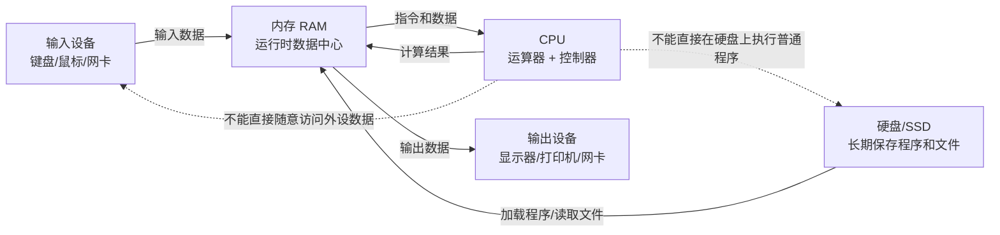
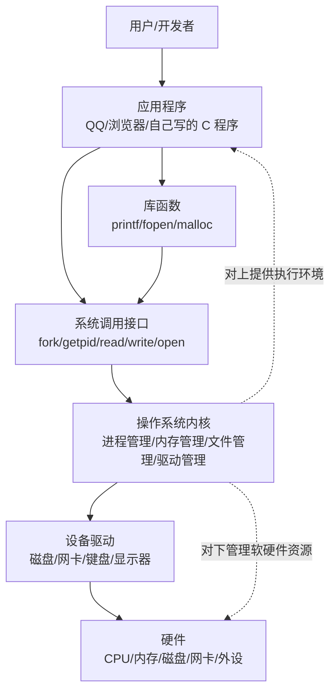
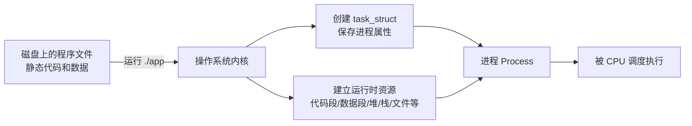
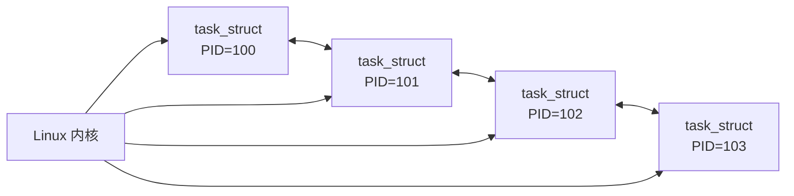
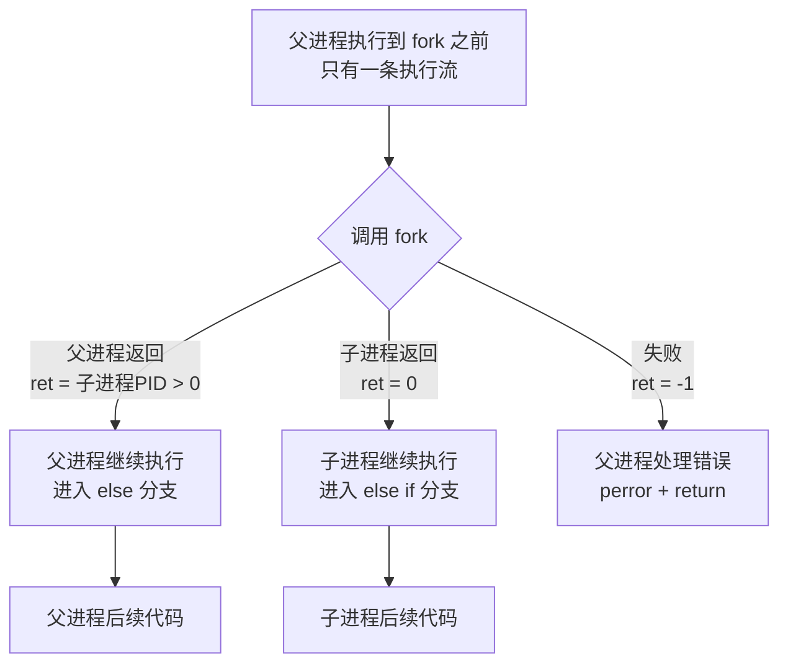

# Linux 进程概念笔记

## 目录

- [0. 学习路线与前置知识](#0-学习路线与前置知识)
  - [0.1 本节学习目标](#01-本节学习目标)
  - [0.2 核心概念](#02-核心概念)
  - [0.3 原理详解](#03-原理详解)
  - [0.4 实操步骤](#04-实操步骤)
  - [0.5 易懂例子](#05-易懂例子)
  - [0.6 常见误区与易错点](#06-常见误区与易错点)
  - [0.7 面试高频考点](#07-面试高频考点)
  - [0.8 企业/大厂经典面试题与解析](#08-企业大厂经典面试题与解析)
  - [0.9 本节小结](#09-本节小结)
- [1. 冯诺依曼体系结构](#1-冯诺依曼体系结构)
  - [1.1 本节学习目标](#11-本节学习目标)
  - [1.2 核心概念](#12-核心概念)
  - [1.3 原理详解](#13-原理详解)
  - [1.4 配图：冯诺依曼体系数据流](#14-配图冯诺依曼体系数据流)
  - [1.5 实操步骤](#15-实操步骤)
  - [1.6 易懂例子](#16-易懂例子)
  - [1.7 常见误区与易错点](#17-常见误区与易错点)
  - [1.8 面试高频考点](#18-面试高频考点)
  - [1.9 企业/大厂经典面试题与解析](#19-企业大厂经典面试题与解析)
  - [1.10 本节小结](#110-本节小结)
- [2. 操作系统的概念与定位](#2-操作系统的概念与定位)
  - [2.1 本节学习目标](#21-本节学习目标)
  - [2.2 核心概念](#22-核心概念)
  - [2.3 原理详解](#23-原理详解)
  - [2.4 配图：操作系统分层结构](#24-配图操作系统分层结构)
  - [2.5 实操步骤](#25-实操步骤)
  - [2.6 易懂例子](#26-易懂例子)
  - [2.7 常见误区与易错点](#27-常见误区与易错点)
  - [2.8 面试高频考点](#28-面试高频考点)
  - [2.9 企业/大厂经典面试题与解析](#29-企业大厂经典面试题与解析)
  - [2.10 本节小结](#210-本节小结)
- [3. 进程基本概念与基本操作](#3-进程基本概念与基本操作)
  - [3.1 本节学习目标](#31-本节学习目标)
  - [3.2 核心概念](#32-核心概念)
  - [3.3 原理详解：程序、进程、PCB、task_struct](#33-原理详解程序进程pcbtask_struct)
  - [3.4 配图：进程 = PCB + 代码 + 数据](#34-配图进程--pcb--代码--数据)
  - [3.5 配图：task_struct 双链表组织](#35-配图task_struct-双链表组织)
  - [3.6 实操步骤一：查看进程](#36-实操步骤一查看进程)
  - [3.7 实操步骤二：获取 PID/PPID](#37-实操步骤二获取-pidppid)
  - [3.8 实操步骤三：fork 创建进程初识](#38-实操步骤三fork-创建进程初识)
  - [3.9 配图：fork 一次调用，两条执行流](#39-配图fork-一次调用两条执行流)
  - [3.10 代码逐行讲解](#310-代码逐行讲解)
  - [3.11 易懂例子](#311-易懂例子)
  - [3.12 常见误区与易错点](#312-常见误区与易错点)
  - [3.13 面试高频考点](#313-面试高频考点)
  - [3.14 企业/大厂经典面试题与解析](#314-企业大厂经典面试题与解析)
  - [3.15 本节小结](#315-本节小结)
- [附录 A：术语表](#附录-a术语表)
- [附录 B：常见命令速查](#附录-b常见命令速查)
- [附录 C：经典面试题总表](#附录-c经典面试题总表)
- [附录 D：实操错误排查表](#附录-d实操错误排查表)
- [附录 E：参考资料](#附录-e参考资料)

---

# 0. 学习路线与前置知识

## 0.1 本节学习目标

这一节学完后，你应该能够：

1. 知道为什么学习 Linux 进程之前，要先理解硬件结构和操作系统。
2. 分清“程序”“进程”“操作系统”“系统调用”之间的关系。
3. 能够在 Linux 环境中编译并运行最简单的 C 程序。
4. 知道本章学习的主线：硬件如何工作 → 操作系统如何管理 → 进程是什么 → Linux 如何描述和创建进程。
5. 能够回答面试中的基础问题：“学习进程需要哪些前置知识？”

---

## 0.2 核心概念

学习进程之前，先建立一条主线：

```text
硬件提供资源
    ↓
操作系统管理资源
    ↓
程序通过系统调用申请资源
    ↓
程序运行起来成为进程
    ↓
操作系统通过 PCB/task_struct 管理进程
```

几个必须先理解的词：

| 中文术语 | 英文术语 | 零基础解释 |
|---|---|---|
| 硬件 | Hardware | 看得见摸得着的设备，比如 CPU、内存、硬盘、键盘、显示器 |
| 操作系统 | Operating System, OS | 管理硬件和软件资源的基础软件，比如 Linux、Windows、macOS |
| 程序 | Program | 保存在磁盘上的代码或可执行文件，本身是静态的 |
| 进程 | Process | 程序运行起来之后的动态执行实例 |
| 系统调用 | System Call | 用户程序请求操作系统帮忙做事的接口 |
| PCB | Process Control Block | 操作系统描述一个进程的数据结构 |
| task_struct | Linux process descriptor | Linux 内核中描述进程的结构体，可理解为 Linux 的 PCB |

最重要的一句话：

> 程序是静态文件，进程是程序运行起来之后的动态实体；操作系统不是直接“看代码”管理进程，而是通过 PCB/task_struct 这种内核数据结构管理进程。

---

## 0.3 原理详解

### 0.3.1 为什么不能直接从 fork 开始学

很多初学者一上来就背：

```text
fork 调用一次，返回两次。
父进程返回子进程 PID，子进程返回 0。
```

这句话本身没错，但如果只背结论，会出现三个问题：

第一，不知道为什么进程能被创建。

`fork()` 不是普通函数。它是系统调用。执行到 `fork()` 时，用户程序会进入内核，让操作系统创建一个新的进程。

第二，不知道操作系统到底复制了什么。

初学者容易以为 `fork()` 把整个程序文件复制了一份。实际上，Linux 创建子进程时重点复制和初始化的是进程相关的内核数据结构、地址空间描述、文件描述符表等，不是简单复制一个 `.c` 文件。

第三，不知道为什么父子进程能独立运行。

父子进程虽然从同一份代码开始执行，但它们是两个进程，有不同 PID，有各自的执行流和资源视图。Linux 为了效率，会用写时拷贝（Copy-On-Write, COW）延迟复制内存页。

所以正确学习顺序应该是：

```text
1. 先理解硬件：CPU、内存、外设怎么协作
2. 再理解 OS：为什么需要操作系统管理资源
3. 再理解管理方法：先描述，再组织
4. 再理解进程：程序运行后如何被 OS 描述
5. 最后理解 fork：OS 如何创建新的进程实体
```

---

### 0.3.2 本章和后续章节的边界

本次笔记只到“进程状态之前”。也就是说，本文件会重点讲清楚：

- 冯诺依曼体系结构
- 操作系统是什么
- 操作系统为什么是“管理”软件
- 系统调用和库函数是什么关系
- 进程和程序有什么区别
- PCB/task_struct 是什么
- 如何查看进程
- 如何获取 PID/PPID
- fork 的基本用法和返回值

本文件不会展开讲：

- R/S/D/T/Z 等进程状态
- 僵尸进程和孤儿进程
- 进程优先级
- 进程调度
- 环境变量
- 虚拟地址空间

这些内容属于后续部分。

---

## 0.4 实操步骤

### 0.4.1 准备 Linux 环境

可以使用以下任意一种环境：

1. WSL Ubuntu
2. 虚拟机 Ubuntu
3. 云服务器 Linux
4. 本地 Linux
5. macOS 终端只能做部分命令，Linux 进程细节建议用 Ubuntu

检查系统：

```bash
# 查看系统内核版本
uname -a

# 查看发行版信息
cat /etc/os-release

# 查看当前 shell
echo $SHELL
```

成功后应该看到类似：

```text
Linux ... x86_64 GNU/Linux
Ubuntu ...
/bin/bash
```

如果 `uname -a` 能输出 Linux 字样，说明你在 Linux 环境。

---

### 0.4.2 安装 gcc 和常用工具

```bash
# Ubuntu/Debian 系统安装 gcc、make、procps、psmisc
sudo apt update
sudo apt install -y gcc make procps psmisc
```

参数解释：

| 命令/包 | 作用 |
|---|---|
| `gcc` | 编译 C 程序 |
| `make` | 管理编译流程，本章暂时不强依赖 |
| `procps` | 提供 `ps`、`top` 等进程查看工具 |
| `psmisc` | 提供 `pstree`、`killall` 等工具 |

验证：

```bash
gcc --version
ps --version
pstree --version
```

如果能看到版本号，说明工具安装成功。

---

### 0.4.3 编写第一个 C 程序

```bash
# 创建实验目录
mkdir -p ~/linux_process_note/chapter0
cd ~/linux_process_note/chapter0

# 创建 hello.c
cat > hello.c <<'CODE'
#include <stdio.h>

int main()
{
    printf("hello Linux process note\n");
    return 0;
}
CODE

# 编译
gcc hello.c -o hello

# 运行
./hello
```

成功后应该看到：

```text
hello Linux process note
```

这一步的意义：

- `hello.c` 是源代码文件。
- `gcc hello.c -o hello` 把源代码编译成可执行程序。
- `./hello` 执行这个程序。
- 当 `./hello` 运行起来时，操作系统会创建一个进程来执行它。

---

## 0.5 易懂例子

把学习 Linux 进程想象成理解一家餐厅：

| 计算机概念 | 餐厅类比 |
|---|---|
| CPU | 厨师，真正执行任务的人 |
| 内存 | 操作台，正在处理的食材要放在这里 |
| 硬盘 | 仓库，长期保存食材和菜谱 |
| 程序 | 菜谱，写着该怎么做 |
| 进程 | 厨师按照菜谱做菜的过程 |
| 操作系统 | 店长，安排厨师、锅、桌子、食材 |
| PCB/task_struct | 每个订单的详细记录单 |
| fork | 按同一张菜谱再开一个新的做菜任务 |

这个类比的重点是：

> 菜谱不是做菜过程；程序也不是进程。只有当厨师开始按菜谱做菜，才有“做菜任务”；只有当操作系统加载程序并执行，才有“进程”。

---

## 0.6 常见误区与易错点

#### 误区 1：把程序和进程当成同一个东西

错误理解：

> `hello` 可执行文件就是进程。

正确理解：

> `hello` 文件本身是程序。执行 `./hello` 之后，操作系统为它创建运行环境，这时才产生进程。

为什么：

程序保存在磁盘上，不占用 CPU 时间；进程正在运行，需要 CPU、内存、文件等资源。

面试中怎么回答：

> 程序是静态的代码和数据集合，进程是程序的一次动态执行实例。一个程序可以运行多次，对应多个进程；多个进程可以共享同一个程序文件，但每个进程有自己的 PID、运行状态和资源信息。

---

#### 误区 2：认为用户程序可以直接操作硬件

错误理解：

> C 程序想读键盘、写文件、申请内存，就直接访问硬件。

正确理解：

> 普通用户程序不能随意直接操作硬件。它需要通过系统调用请求操作系统完成这些操作。

为什么：

如果每个程序都能随意操作硬件，就会破坏安全性和稳定性。例如普通程序随意写磁盘、改内存，会影响其他程序甚至整个系统。

面试中怎么回答：

> 操作系统负责统一管理硬件资源，用户程序通过系统调用进入内核，由内核检查权限并执行具体操作，从而保证资源访问安全和系统稳定。

---

#### 误区 3：认为 fork 是普通函数调用

错误理解：

> `fork()` 就像 `printf()` 一样，只是一个普通函数。

正确理解：

> `fork()` 是系统调用。它会进入内核，由操作系统创建子进程。

为什么：

创建进程涉及 PID 分配、PCB/task_struct 创建、地址空间复制/共享、文件描述符继承等内核级操作，普通用户函数无法完成。

面试中怎么回答：

> `fork()` 是 Linux 创建进程的核心系统调用。调用后内核创建子进程，父进程中返回子进程 PID，子进程中返回 0，失败时返回 -1。

---

## 0.7 面试高频考点

#### 考点 1：程序和进程的区别

面试官想考什么：

- 是否知道程序是静态的，进程是动态的。
- 是否知道一个程序可以对应多个进程。
- 是否知道进程是资源分配和调度的重要实体。

标准回答思路：

1. 先定义程序。
2. 再定义进程。
3. 再说二者关系。
4. 最后举例说明。

回答时容易踩的坑：

- 只说“进程就是程序”，没有体现动态执行。
- 不知道同一个程序可以启动多个进程。

---

#### 考点 2：为什么操作系统要提供系统调用

面试官想考什么：

- 是否理解用户态和内核态的隔离思想。
- 是否理解系统调用是用户程序访问内核功能的接口。

标准回答思路：

> 用户程序不能随意访问硬件和内核数据结构，否则会造成安全和稳定性问题。操作系统通过系统调用提供受控入口，用户程序通过这些接口申请资源或执行特权操作，比如创建进程、读写文件、申请内存等。

回答时容易踩的坑：

- 把系统调用和库函数混为一谈。
- 认为系统调用只是“更底层的函数”，没有说明内核权限切换。

---

## 0.8 企业/大厂经典面试题与解析

#### 面试题 1：程序和进程有什么区别？

题目：

> 请说明程序和进程的区别。一个程序能不能对应多个进程？

考察点：

- 程序与进程的基本定义。
- 静态文件与动态执行的区别。
- 一个程序多次运行产生多个进程。

标准答案：

程序是存放在磁盘上的静态代码和数据集合；进程是程序运行起来之后的一次执行实例。一个程序可以被运行多次，每次运行都可以形成一个独立的进程。多个进程可以来自同一个程序文件，但它们拥有不同 PID、不同运行状态和各自的资源信息。

详细解析：

例如磁盘上有一个 `/bin/bash` 程序文件。你打开两个终端，系统可能会启动两个 bash 进程。它们都来自同一个 `/bin/bash` 文件，但它们的 PID 不同，当前工作目录、环境变量、打开的文件也可能不同。

面试回答模板：

> 程序是静态的，进程是动态的。程序只是保存在磁盘上的代码和数据，进程是程序被操作系统加载并执行后的运行实体。一个程序可以启动多个进程，每个进程都有自己的 PID、状态、PCB/task_struct 和资源信息。

追问 1：进程是不是一定对应一个程序？

回答：通常用户态进程会由某个程序加载运行而来，但内核线程等特殊执行实体可能没有普通意义上的用户态程序映像。初学阶段可以先理解为“进程是程序的一次执行”。

追问 2：两个进程运行同一个程序，会不会互相影响？

回答：正常情况下不会直接互相影响，因为每个进程有独立的进程控制块和地址空间。它们可以共享同一个可执行文件，但运行时状态是独立的。

---

#### 面试题 2：为什么学习进程之前要理解操作系统？

题目：

> 进程是 C 语言代码里的东西，还是操作系统里的东西？为什么？

考察点：

- 是否理解进程属于操作系统管理对象。
- 是否知道用户代码只是触发进程行为，真正管理者是内核。

标准答案：

进程是操作系统里的概念。C 语言程序可以通过系统调用创建、查询和控制进程，但进程本身由操作系统内核管理。Linux 内核用 `task_struct` 描述进程，并通过调度器、内存管理、文件系统等模块管理进程运行。

详细解析：

C 代码里的 `fork()`、`getpid()` 等函数只是调用接口。真正创建子进程、分配 PID、维护 PCB/task_struct、调度进程运行的是操作系统内核。

面试回答模板：

> 进程是操作系统管理资源和调度执行的基本实体。C 程序可以通过系统调用操作进程，但进程的创建、销毁、调度、状态维护都由内核完成。

---

## 0.9 本节小结

本节建立了学习 Linux 进程的主线：硬件提供 CPU、内存、外设等资源；操作系统负责管理这些资源；用户程序不能直接随意访问资源，而是通过系统调用请求内核；程序运行起来后成为进程；Linux 用 `task_struct` 这种内核数据结构描述进程。后面所有内容都围绕这条线展开。

---

# 1. 冯诺依曼体系结构

## 1.1 本节学习目标

这一节学完后，你应该能够：

1. 说清楚冯诺依曼体系结构由哪些核心部件组成。
2. 理解 CPU、内存、输入设备、输出设备之间的数据流。
3. 解释为什么说“不考虑缓存时，CPU 只能直接读写内存”。
4. 能用 QQ/微信聊天、发送文件的例子解释软件数据流。
5. 能回答面试题：“为什么程序运行前需要先加载到内存？”

---

## 1.2 核心概念

冯诺依曼体系结构（Von Neumann Architecture）是一种经典计算机体系结构。大多数常见计算机都符合这个基本模型，比如笔记本、服务器、台式机等。

它主要包含五类部件：

| 部件 | 作用 | 例子 |
|---|---|---|
| 输入设备 | 把外部信息输入计算机 | 键盘、鼠标、摄像头、扫描仪 |
| 输出设备 | 把计算机处理结果展示给外部 | 显示器、打印机、音响 |
| 存储器 | 存放正在运行的程序和数据 | 这里重点指内存 RAM |
| 运算器 | 执行算术和逻辑运算 | CPU 内部的 ALU |
| 控制器 | 控制指令执行流程 | CPU 内部控制单元 |

在现代计算机中，运算器和控制器一般集成在 CPU 里。

本节最关键的一句话：

> 不考虑缓存时，CPU 不能直接读写键盘、显示器、硬盘等外设的数据。CPU 主要直接和内存打交道；外设输入输出数据，也要先写入内存或从内存读取。

---

## 1.3 原理详解

### 1.3.1 为什么“存储器”重点指内存

课程文件中强调：冯诺依曼体系结构里的“存储器”指的是内存，不是硬盘。

这点对初学者非常重要。

硬盘和内存都能“存东西”，但它们的角色不同：

| 对比项 | 内存 RAM | 硬盘 Disk/SSD |
|---|---|---|
| 速度 | 快 | 慢于内存 |
| 断电后数据 | 一般丢失 | 一般保留 |
| 作用 | 存放正在运行的程序和数据 | 长期保存文件 |
| CPU 能否直接执行其中程序 | 程序通常要先加载到内存再执行 | 不能直接在硬盘上执行普通程序 |

当你执行：

```bash
./hello
```

操作系统不是让 CPU 直接从硬盘上执行 `hello` 文件，而是大致经历：

```text
硬盘上的 hello 可执行文件
        ↓ 由操作系统加载
内存中的代码段、数据段等
        ↓ CPU 取指执行
CPU 执行 hello 程序
```

所以，程序运行前通常要进入内存。

---

### 1.3.2 CPU 为什么主要和内存交互

CPU 执行程序时，需要不断做三类动作：

1. 取指令：从内存读取下一条机器指令。
2. 读数据：从内存读取变量、数组、结构体等数据。
3. 写结果：把计算结果写回内存。

例如：

```c
int a = 10;
int b = 20;
int c = a + b;
```

从硬件数据流角度可以理解为：

```text
1. a 和 b 的值在内存中
2. CPU 从内存读取 a 和 b
3. CPU 内部运算器完成加法
4. CPU 把结果 c 写回内存
```

你在 C 语言里看到的是变量，底层对应的是内存中的数据。

---

### 1.3.3 外设为什么也要通过内存

假设你用键盘输入一个字符 `A`。

错误理解是：

```text
键盘直接把 A 交给 CPU
```

更合理的理解是：

```text
键盘产生输入事件
    ↓
设备控制器/驱动处理
    ↓
数据进入内核缓冲区或用户缓冲区
    ↓
CPU 从内存中的缓冲区读取数据
```

再比如显示器显示一个字符：

```text
CPU 准备要显示的数据
    ↓
数据写入内存中的缓冲区/显存相关区域
    ↓
显示设备读取相关数据
    ↓
屏幕显示结果
```

课程中说“一句话，所有设备都只能直接和内存打交道”，这是为了帮助你建立核心数据流意识：

> CPU 和外设之间不是简单地直接互相传数据，内存是运行时数据交换的中心。

---

### 1.3.4 为什么这一节和进程有关

进程是“正在运行的程序”。程序要运行，就必须进入内存，并由 CPU 执行。

因此，理解进程必须先理解：

```text
程序在硬盘上：静态文件
程序加载到内存：准备被执行
CPU 执行内存中的指令：程序开始运行
操作系统为这次运行维护数据结构：形成进程
```

如果不理解冯诺依曼体系结构，就容易把进程误解成“文件本身”。实际上，进程是操作系统在硬件资源之上构造出来的运行实体。

---

### 1.3.5 QQ/微信聊天的数据流

课程文件中要求用 QQ 聊天解释软件数据流。这里用更清楚的方式拆解。

假设你在聊天软件里给朋友发送一句话：

```text
你好
```

大致流程：

```text
1. 你敲键盘
   键盘产生输入信号。

2. 输入数据进入内存
   操作系统驱动读取键盘输入，把字符数据交给聊天软件进程。

3. 聊天软件处理数据
   聊天软件进程在 CPU 上运行，把你输入的文字放入自己的内存缓冲区。

4. 点击发送
   聊天软件调用网络相关接口，把消息交给操作系统网络协议栈。

5. 操作系统网络发送
   数据经过 TCP/IP 协议栈处理，进入网卡发送缓冲区。

6. 网卡发送到网络
   数据通过 Wi-Fi/网线传到服务器或对方设备。

7. 对方设备接收
   对方网卡收到数据，操作系统把数据放入内存。

8. 对方聊天软件读取
   对方聊天软件进程从内存中取到消息并显示到屏幕。
```

这里每一步都离不开内存。

---

### 1.3.6 发送文件的数据流

如果你发送的是一个图片文件，比如 `cat.png`，流程更复杂：

```text
1. 文件原本在硬盘上
   cat.png 长期保存在磁盘。

2. 聊天软件读取文件
   聊天软件调用 read/open 等接口，操作系统把磁盘文件内容读入内存。

3. 聊天软件分块处理
   大文件不会一次性全部发完，通常会分块读入、分块发送。

4. 网络协议栈封装
   操作系统把数据分成网络包，加上 TCP/IP 等协议头。

5. 网卡发送
   网卡从内存中的发送缓冲区取数据，发到网络。

6. 对方接收并保存
   对方机器把网络数据接收到内存，再由聊天软件或操作系统写入磁盘。
```

这说明：

> 文件虽然长期在硬盘上，但发送文件时，数据仍然需要不断经过内存。CPU 处理的是内存中的数据，而不是直接处理硬盘上的静态文件。

---

## 1.4 配图：冯诺依曼体系数据流



图解说明：

1. 输入设备产生的数据通常先进入内存。
2. 硬盘上的程序和文件要被处理，通常也要先加载到内存。
3. CPU 从内存取指令、读数据、写结果。
4. 输出设备显示或发送的数据也来自内存中的结果。
5. 这张图的核心不是画硬件细节，而是建立“内存是运行时中心”的数据流意识。

---

## 1.5 实操步骤

这一节的实操目标：观察一个程序从磁盘文件变成运行中进程的过程。

### 1.5.1 创建一个会持续运行的程序

```bash
mkdir -p ~/linux_process_note/chapter1
cd ~/linux_process_note/chapter1

cat > loop.c <<'CODE'
#include <stdio.h>
#include <unistd.h>

int main()
{
    while (1) {
        printf("I am running...\n");
        sleep(1);
    }
    return 0;
}
CODE

gcc loop.c -o loop
```

代码作用：

- `while (1)`：让程序一直循环。
- `printf()`：每秒输出一行。
- `sleep(1)`：暂停 1 秒，避免刷屏太快。

---

### 1.5.2 运行程序并观察进程

终端 1：

```bash
./loop
```

终端 2：

```bash
ps aux | grep loop
```

你会看到类似：

```text
user   12345  0.0  0.0  ... ./loop
```

解释：

- `./loop` 是磁盘上的可执行程序。
- 执行后，系统中出现了一个名为 `loop` 的进程。
- `12345` 这类数字是 PID，即进程 ID。

---

### 1.5.3 查看程序文件和进程的区别

```bash
# 查看磁盘上的文件
ls -l ./loop

# 查看运行中的进程
ps -ef | grep loop
```

区别：

| 命令 | 看到的对象 | 含义 |
|---|---|---|
| `ls -l ./loop` | 文件 | 磁盘上的程序 |
| `ps -ef | grep loop` | 进程 | 正在运行的程序实例 |

---

## 1.6 易懂例子

把运行程序想象成看电影：

| 计算机概念 | 看电影类比 |
|---|---|
| 硬盘上的可执行文件 | 电影文件，比如 `movie.mp4` |
| 内存 | 播放器当前缓存的视频片段 |
| CPU | 解码器，负责解析和处理视频数据 |
| 显示器 | 画面输出设备 |
| 进程 | 正在播放这部电影的播放器实例 |

电影文件躺在硬盘里时，不等于“正在播放”。只有当播放器打开它、读取数据、解码并显示时，才有播放过程。

同理，程序文件躺在硬盘里时，不是进程。只有被操作系统加载执行，才是进程。

---

## 1.7 常见误区与易错点

#### 误区 1：认为硬盘就是冯诺依曼体系中的“存储器”重点

错误理解：

> 程序保存在硬盘，所以 CPU 直接从硬盘执行程序。

正确理解：

> 冯诺依曼体系结构中讨论程序运行时，重点存储器是内存。硬盘用于长期保存文件，程序运行时通常要加载到内存。

为什么：

CPU 执行指令需要高速度访问，硬盘延迟远高于内存；操作系统会把程序映射/加载到内存地址空间中执行。

面试中怎么回答：

> 程序在磁盘上是静态文件，运行时需要由操作系统加载到内存，CPU 从内存取指令和数据执行。

---

#### 误区 2：认为外设直接和 CPU 传输所有数据

错误理解：

> 键盘把字符直接交给 CPU，显示器直接从 CPU 拿图像。

正确理解：

> 实际系统中外设数据通常通过设备控制器、驱动、缓冲区等进入内存，CPU 再处理内存中的数据。

为什么：

外设速度、协议和 CPU 不同，需要操作系统驱动和内存缓冲来协调。

面试中怎么回答：

> 从软件数据流角度看，外设输入输出的数据通常需要经过内存缓冲区，CPU 主要处理内存中的指令和数据。

---

#### 误区 3：把“缓存”混进初学主线导致混乱

错误理解：

> 既然 CPU 有缓存，那“CPU 只和内存交互”就是错的。

正确理解：

> 初学冯诺依曼体系时，课程中明确“不考虑缓存情况”。缓存是 CPU 和内存之间的性能优化层，不改变“程序运行时指令和数据来自内存体系”的主线。

为什么：

缓存是为了加速 CPU 访问数据。学习进程概念时，先忽略缓存更容易建立正确模型。

面试中怎么回答：

> 严格的现代硬件有多级缓存，但从操作系统和进程入门角度，可以先抽象为 CPU 读写内存，外设通过内存交换数据。缓存属于性能优化细节。

---

## 1.8 面试高频考点

#### 考点 1：冯诺依曼体系结构组成

面试官想考什么：

- 是否知道五大组成：输入、输出、存储器、运算器、控制器。
- 是否知道 CPU 包含运算器和控制器。

标准回答思路：

> 冯诺依曼体系结构主要由输入设备、输出设备、存储器、运算器和控制器组成。现代 CPU 内部包含运算器和控制器，程序和数据运行时放在内存中，CPU 从内存取指令和数据执行。

回答时容易踩的坑：

- 把硬盘当成运行时唯一存储器。
- 只背五个名词，不解释数据流。

---

#### 考点 2：为什么程序要加载到内存执行

面试官想考什么：

- 是否知道程序从磁盘到内存再到 CPU 的运行路径。
- 是否理解内存是运行时中心。

标准回答思路：

> 磁盘用于长期保存程序，CPU 执行指令时需要从内存取指令和数据。程序运行时，操作系统会把可执行文件相关内容加载或映射到进程地址空间中，CPU 再执行内存中的指令。

回答时容易踩的坑：

- 说“因为内存大”或“因为内存能存东西”，没有说明 CPU 取指执行关系。

---

## 1.9 企业/大厂经典面试题与解析

#### 面试题 1：请说明冯诺依曼体系结构的基本组成，并解释程序运行时数据如何流动。

题目：

> 冯诺依曼体系结构由哪些部分组成？一个程序运行时，CPU、内存、外设之间是什么关系？

考察点：

- 冯诺依曼体系结构组成。
- CPU 和内存的数据交互关系。
- 对“程序运行必须进入内存”的理解。

标准答案：

冯诺依曼体系结构主要由输入设备、输出设备、存储器、运算器、控制器组成。现代计算机中，运算器和控制器通常集成在 CPU 中。程序和数据运行时放在内存中，CPU 从内存中读取指令和数据，执行计算后再把结果写回内存。输入设备产生的数据通常先进入内存缓冲区，输出设备也通常从内存中的数据得到输出结果。

详细解析：

这道题不是只考五个组成部件，更考你是否理解数据流。你需要讲清楚：CPU 不是直接从硬盘运行普通程序；硬盘上的程序要被操作系统加载或映射到内存；CPU 执行的是内存中的指令。

面试回答模板：

> 冯诺依曼体系结构包括输入设备、输出设备、存储器、运算器和控制器。现代 CPU 包含运算器和控制器。程序运行时，代码和数据需要进入内存，CPU 从内存取指令、取数据并执行，结果再写回内存。外设输入输出的数据也通常要通过内存缓冲区完成交换。

---

#### 面试题 2：从你发送一条聊天消息开始，解释数据如何流动。

题目：

> 你在聊天软件中输入一条消息并发送，对方收到消息。请从冯诺依曼体系和操作系统角度解释数据流。

考察点：

- 是否能把抽象硬件结构和真实软件行为联系起来。
- 是否理解输入、内存、CPU、网络设备、输出设备之间的关系。

标准答案：

键盘输入的数据先被操作系统驱动处理，进入内存缓冲区；聊天软件进程读取输入内容并在 CPU 上处理；点击发送后，聊天软件调用系统接口把数据交给操作系统网络协议栈；协议栈封装数据后放入发送缓冲区，网卡从内存中取数据发送到网络；对方设备接收后，网卡和操作系统把数据放入内存，对方聊天软件读取并显示到屏幕。

详细解析：

这道题的核心是不要只说“我输入，对方收到”。要体现所有数据都需要经过内存，操作系统负责管理输入、网络和输出资源。

面试回答模板：

> 输入时，键盘数据经驱动进入内存缓冲区；聊天软件进程读取后由 CPU 处理；发送时通过系统调用进入内核网络协议栈，数据被封装后由网卡发送；对方网卡接收后数据进入内存，对方聊天软件进程读取并显示。整个过程体现了 CPU 主要处理内存中的数据，外设输入输出也要经过内存和操作系统管理。

---

#### 面试题 3：为什么说程序不是直接在硬盘上运行？

题目：

> 可执行程序保存在硬盘上，为什么不能说 CPU 直接在硬盘上运行程序？

考察点：

- 程序加载过程。
- CPU 取指和内存关系。

标准答案：

硬盘用于长期保存程序文件，CPU 执行程序时需要从内存中取指令和数据。程序运行时，操作系统会把可执行文件的代码和数据加载或映射到进程地址空间中，CPU 实际执行的是内存中的指令。因此不能说 CPU 直接在硬盘上运行普通程序。

详细解析：

硬盘速度远慢于内存，并且普通程序的执行模型是基于内存地址空间的。后续学习虚拟地址空间时，会进一步理解“程序被加载到进程地址空间”这句话。

面试回答模板：

> 程序文件保存在硬盘上只是静态存储。运行时，操作系统需要把它加载或映射到内存中的进程地址空间，CPU 从内存取指令执行。因此程序不是直接在硬盘上运行的。

---

## 1.10 本节小结

冯诺依曼体系结构的核心是：计算机由输入设备、输出设备、存储器、运算器、控制器组成；现代 CPU 包含运算器和控制器；程序和数据运行时要进入内存；CPU 主要从内存取指令、读数据、写结果；外设输入输出也通常通过内存缓冲完成。理解这点后，才能进一步理解“程序运行起来为什么会变成进程”。

---

# 2. 操作系统的概念与定位

## 2.1 本节学习目标

这一节学完后，你应该能够：

1. 解释操作系统是什么。
2. 说清楚操作系统由内核和其他系统程序组成。
3. 理解操作系统设计目的：对下管理硬件资源，对上提供良好执行环境。
4. 理解操作系统的核心定位：管理软件。
5. 理解“先描述，再组织”这种管理思想。
6. 区分系统调用和库函数。
7. 能回答面试题：“操作系统如何管理进程？”

---

## 2.2 核心概念

操作系统（Operating System, OS）是计算机系统中的基础程序集合。

从粗略角度看，操作系统包括：

1. 内核（Kernel）
2. 其他系统程序，比如 Shell、系统库、工具命令等

内核通常负责四类核心管理：

| 内核功能 | 管理对象 | 举例 |
|---|---|---|
| 进程管理 | 正在运行的程序 | 创建进程、调度进程、回收进程 |
| 内存管理 | 内存资源 | 分配内存、虚拟地址、页表 |
| 文件管理 | 文件和目录 | open/read/write/close |
| 驱动管理 | 硬件设备 | 键盘、显示器、磁盘、网卡 |

课程文件中对操作系统定位非常明确：

> 操作系统是一款纯正的“搞管理”的软件。

这句话要重点理解。

操作系统不是为了替用户写业务代码，也不是为了替 CPU 做加法。它真正的价值是：统一管理复杂的硬件和软件资源，并为上层程序提供安全、稳定、方便的运行环境。

---

## 2.3 原理详解

### 2.3.1 操作系统为什么存在

假设没有操作系统，每个程序都要自己处理：

- 怎么读键盘
- 怎么显示文字
- 怎么读写磁盘
- 怎么使用网卡
- 怎么申请内存
- 怎么避免和其他程序冲突
- 怎么决定谁先用 CPU

这会产生严重问题：

1. 编程复杂度极高

每个程序员都要懂所有硬件细节。写一个普通聊天软件，也要自己写键盘驱动、网卡驱动、文件系统管理。

2. 安全性极差

如果每个程序都能随意访问磁盘和内存，一个恶意程序就能随便读取别的程序数据，甚至破坏系统。

3. 稳定性极差

多个程序同时运行时，可能同时抢 CPU、抢内存、抢磁盘，互相破坏。

4. 资源利用率低

没有统一调度，CPU、内存、I/O 设备就无法被公平高效地分配。

操作系统解决这些问题的方式是：

```text
对下：管理硬件资源
对上：给应用程序提供统一接口和良好运行环境
```

---

### 2.3.2 对下：管理软硬件资源

“对下”是站在操作系统和硬件的关系来说。

操作系统要管理：

| 资源 | 操作系统管理什么 |
|---|---|
| CPU | 谁运行、运行多久、什么时候切换 |
| 内存 | 哪个进程用哪些内存、如何隔离 |
| 磁盘 | 文件怎么存、怎么读、权限如何控制 |
| 网卡 | 网络包怎么收发、协议如何处理 |
| 显示器 | 图形和字符如何输出 |
| 键盘鼠标 | 输入事件如何交给应用程序 |

例如两个程序同时要运行：

```text
程序 A：播放音乐
程序 B：编译代码
```

如果只有一个 CPU 核心，操作系统要决定：

```text
先让 A 运行一小段时间
再让 B 运行一小段时间
再切回 A
再切回 B
```

这就是进程调度的基础思想，后续会展开。

---

### 2.3.3 对上：提供良好的执行环境

“对上”是站在操作系统和用户程序的关系来说。

用户程序不需要自己控制硬件，而是调用操作系统提供的接口。

例如：

```c
printf("hello\n");
```

表面上你调用的是 `printf()`，但最终要把字符显示到终端，这背后会涉及标准库、系统调用、终端设备、驱动等。

再比如：

```c
pid_t pid = fork();
```

表面上是 C 代码调用一个函数，实际是通过系统调用请求内核创建进程。

操作系统给上层程序提供的好处：

1. 屏蔽硬件复杂性。
2. 提供统一接口。
3. 保护系统安全。
4. 管理资源分配。
5. 让多个程序能同时运行。

---

### 2.3.4 如何理解“管理”

课程文件用“学生、辅导员、校长”的例子解释管理。

管理任何对象，基本都分两步：

```text
第一步：描述被管理对象
第二步：组织被管理对象
```

以学校管理学生为例：

第一步，描述学生。

学校需要知道每个学生的信息：

```text
姓名、学号、班级、专业、成绩、宿舍、联系方式
```

在程序里，这可以用结构体表示：

```c
struct Student {
    int id;
    char name[32];
    int age;
    char major[64];
};
```

第二步，组织学生。

只有一个学生结构体不够。学校有几千个学生，需要把它们组织起来，比如：

- 按班级组织
- 按学院组织
- 用链表组织
- 用数组组织
- 用树或哈希表组织

操作系统管理硬件和进程也是一样：

```text
描述起来：用 struct 结构体
组织起来：用链表、树、数组、哈希表等数据结构
```

---

### 2.3.5 操作系统如何管理进程

现在把“管理思想”套到进程上。

操作系统要管理成百上千个进程，首先要描述每个进程。

描述进程需要记录：

- 进程 ID
- 父进程 ID
- 进程状态
- 优先级
- 程序计数器
- 内存信息
- 打开的文件
- CPU 寄存器上下文
- 资源使用情况

Linux 中用 `task_struct` 描述一个进程。

然后操作系统还要组织所有进程。

Linux 会用链表等结构把大量 `task_struct` 组织起来，这样内核才能查找、调度、切换和管理进程。

所以核心回答是：

> 操作系统管理进程的方法是：先用 task_struct 描述每个进程，再用链表、调度队列等数据结构组织这些进程。

---

### 2.3.6 系统调用是什么

系统调用（System Call）是操作系统暴露给用户程序的接口。

为什么需要系统调用？

因为用户程序不能直接操作内核和硬件。

例如用户程序想创建进程，不能自己直接修改内核进程链表，而要调用：

```c
fork();
```

用户程序想获取自己的 PID，不能自己去内核内存里找，而要调用：

```c
getpid();
```

用户程序想读文件，要调用：

```c
read();
```

用户程序想写文件，要调用：

```c
write();
```

这些就是典型系统调用。

---

### 2.3.7 库函数是什么

库函数（Library Function）是程序库提供的函数。

它们可能：

1. 直接在用户态完成工作。
2. 封装一个或多个系统调用。

例如：

```c
printf("hello\n");
```

`printf()` 是 C 标准库函数，不是系统调用。它负责格式化输出，必要时底层会调用 `write()` 系统调用，把数据写到标准输出。

系统调用和库函数关系：

```text
应用程序
  ↓ 调用
库函数 printf/fopen/malloc 等
  ↓ 可能进一步调用
系统调用 write/open/brk/mmap 等
  ↓ 进入
操作系统内核
  ↓ 管理
硬件资源
```

---

### 2.3.8 系统调用和库函数的区别

| 对比项 | 系统调用 | 库函数 |
|---|---|---|
| 提供者 | 操作系统内核 | C 标准库或第三方库 |
| 运行权限 | 会进入内核态 | 通常先在用户态执行 |
| 抽象程度 | 低，功能基础 | 高，更易用 |
| 例子 | `fork()`、`getpid()`、`read()`、`write()` | `printf()`、`scanf()`、`fopen()` |
| 是否一定进入内核 | 是 | 不一定 |
| 面向对象 | 系统资源操作 | 应用开发便利性 |

注意：有些函数名字看起来像普通函数，但它可能是系统调用的封装。初学阶段可以先记住：

> 系统调用是内核提供的接口；库函数是开发者更常用、更高级的封装。

---

## 2.4 配图：操作系统分层结构



图解说明：

1. 用户一般直接接触应用程序。
2. 应用程序可以调用库函数，也可以直接调用系统调用。
3. 库函数可能会进一步调用系统调用。
4. 系统调用是进入内核的接口。
5. 内核负责进程、内存、文件、驱动等管理。
6. 驱动负责和具体硬件交互。

---

## 2.5 实操步骤

这一节实操目标：观察系统调用和库函数的关系。

### 2.5.1 用 man 查看 fork

```bash
man fork
```

如果系统没有安装 man 手册：

```bash
sudo apt install -y manpages manpages-dev man-db
man fork
```

你会看到 `fork` 的说明：

```text
fork() creates a new process by duplicating the calling process.
```

意思是：`fork()` 通过复制调用进程创建一个新进程。

退出 man 页面：按 `q`。

---

### 2.5.2 用 man 查看 getpid

```bash
man getpid
```

你会看到 `getpid()` 和 `getppid()` 的说明：

```text
getpid() returns the process ID of the calling process.
getppid() returns the process ID of the parent of the calling process.
```

解释：

- `getpid()` 返回当前进程 ID。
- `getppid()` 返回父进程 ID。

---

### 2.5.3 用 strace 观察系统调用

安装 `strace`：

```bash
sudo apt install -y strace
```

创建程序：

```bash
mkdir -p ~/linux_process_note/chapter2
cd ~/linux_process_note/chapter2

cat > print.c <<'CODE'
#include <stdio.h>

int main()
{
    printf("hello syscall\n");
    return 0;
}
CODE

gcc print.c -o print
```

运行：

```bash
strace ./print
```

你会看到很多输出，其中可能包含：

```text
write(1, "hello syscall\n", 14) = 14
```

解释：

- 你在 C 代码里写的是 `printf()`。
- 但真正向终端输出时，底层可能调用了 `write()` 系统调用。
- `1` 表示标准输出 stdout。
- `"hello syscall\n"` 是写出的内容。
- `14` 是写出的字节数。

这说明库函数和系统调用不是同一个层次。

---

## 2.6 易懂例子

把操作系统想象成银行大厅。

| 计算机概念 | 银行类比 |
|---|---|
| 用户程序 | 来办业务的客户 |
| 系统调用 | 银行窗口 |
| 操作系统内核 | 银行内部业务系统 |
| 硬件资源 | 现金、账户数据库、保险柜 |
| 库函数 | 取号机、填表模板、手机银行界面 |

客户不能直接冲进保险柜拿钱。客户必须通过窗口办理业务。

同理，用户程序不能直接随意操作内核数据和硬件。它必须通过系统调用请求操作系统。

库函数就像手机银行界面，使用更方便，但底层仍然要经过银行内部系统。

---

## 2.7 常见误区与易错点

#### 误区 1：认为操作系统只是一个“软件集合”，没有管理含义

错误理解：

> 操作系统就是一堆命令，比如 `ls`、`cd`、`pwd`。

正确理解：

> 命令只是操作系统环境中的工具。操作系统的核心是内核，负责管理 CPU、内存、文件、设备、进程等资源。

为什么：

`ls` 只是普通用户程序。真正决定进程调度、内存分配、文件权限的是内核。

面试中怎么回答：

> 操作系统的核心定位是资源管理者。它对下管理硬件资源，对上为应用程序提供稳定、安全、统一的执行环境。

---

#### 误区 2：把系统调用和库函数混为一谈

错误理解：

> `printf()` 是系统调用。

正确理解：

> `printf()` 是 C 标准库函数。它负责格式化输出，底层可能通过 `write()` 系统调用输出数据。

为什么：

库函数是用户态封装，系统调用是进入内核请求服务的接口。

面试中怎么回答：

> 库函数不一定进入内核，系统调用一定进入内核。库函数通常比系统调用更高级、更易用，很多库函数底层会封装系统调用。

---

#### 误区 3：认为管理就是“控制硬件”

错误理解：

> 操作系统管理就是直接控制硬件。

正确理解：

> 管理包括描述对象、组织对象、制定策略、执行操作。操作系统不仅控制硬件，还要维护进程、文件、内存等各种抽象对象。

为什么：

比如进程并不是一个硬件设备，但操作系统要管理它；文件也不是单纯硬盘块，而是操作系统提供的抽象。

面试中怎么回答：

> 操作系统的管理思想是先描述再组织。描述就是用结构体记录对象属性，组织就是用链表、树、队列等数据结构管理对象集合。

---

## 2.8 面试高频考点

#### 考点 1：操作系统的作用

面试官想考什么：

- 是否理解 OS 的上下层定位。
- 是否知道 OS 管理哪些资源。

标准回答思路：

> 操作系统对下管理硬件和软件资源，比如 CPU、内存、文件、设备；对上为应用程序提供统一接口和良好运行环境，比如系统调用、文件抽象、进程抽象等。

回答时容易踩的坑：

- 只说“操作系统是软件”，没有说管理资源。
- 只说“提供界面”，忽略内核管理。

---

#### 考点 2：如何理解操作系统的管理

面试官想考什么：

- 是否掌握“先描述，再组织”。
- 是否能联系 PCB/task_struct。

标准回答思路：

> 操作系统管理对象时，通常先用结构体描述对象属性，再用链表、队列、树等数据结构组织对象。比如 Linux 管理进程时，用 `task_struct` 描述进程，再用链表或调度队列组织进程。

回答时容易踩的坑：

- 只说“操作系统调度进程”，没有解释如何表示进程。

---

#### 考点 3：系统调用和库函数区别

面试官想考什么：

- 是否理解用户态和内核态边界。
- 是否知道常见函数属于哪个层次。

标准回答思路：

> 系统调用是内核提供给用户程序的受控接口，比如 `fork()`、`read()`、`write()`；库函数是库提供的封装，比如 `printf()`、`fopen()`。库函数可能在用户态完成，也可能底层调用系统调用。

回答时容易踩的坑：

- 把所有 C 函数都叫系统调用。
- 把 `printf()` 和 `write()` 混为一谈。

---

## 2.9 企业/大厂经典面试题与解析

#### 面试题 1：操作系统的主要作用是什么？

题目：

> 请说明操作系统在计算机系统中的作用。

考察点：

- OS 对上、对下的定位。
- 资源管理思想。

标准答案：

操作系统是计算机系统中的基础软件。它对下管理 CPU、内存、磁盘、网卡、输入输出设备等软硬件资源；对上为应用程序提供统一、安全、方便的执行环境和接口，例如进程抽象、文件抽象、内存管理和系统调用。

详细解析：

这道题不要只说“操作系统是管理计算机的软件”。要说清楚管理对象和服务对象。管理对象是硬件和系统资源；服务对象是用户程序和用户。

面试回答模板：

> 操作系统的核心作用是资源管理和抽象封装。它对下管理硬件资源，对上提供系统调用、文件、进程、内存等抽象，让应用程序不用直接面对复杂硬件，同时保证安全和稳定。

---

#### 面试题 2：操作系统如何管理进程？

题目：

> 操作系统中可能同时存在很多进程，OS 如何管理这些进程？

考察点：

- “先描述，再组织”的管理思想。
- PCB/task_struct。

标准答案：

操作系统会为每个进程维护一个进程控制块 PCB，用来记录进程 ID、状态、优先级、程序计数器、上下文、内存信息、文件信息等。Linux 中 PCB 的具体实现是 `task_struct`。内核再通过链表、调度队列等数据结构把所有进程组织起来，从而完成查找、调度、切换和资源管理。

详细解析：

操作系统不是“凭空记住”所有进程的。每个进程都要有自己的描述结构。没有 PCB/task_struct，内核就无法知道进程的状态、资源、下一条指令位置等信息。

面试回答模板：

> OS 管理进程的核心方法是先描述再组织。先用 PCB 描述一个进程的所有属性，Linux 下就是 `task_struct`；再用链表、队列等结构组织所有进程，调度器根据这些信息选择进程运行。

追问 1：PCB 里一般有什么？

回答：PID、PPID、状态、优先级、程序计数器、寄存器上下文、内存管理信息、文件描述符表、I/O 信息、记账信息等。

追问 2：为什么进程切换需要 PCB？

回答：进程切换时要保存当前进程的 CPU 上下文，并恢复下一个进程的上下文，这些信息需要保存在 PCB/task_struct 相关结构中。

---

#### 面试题 3：系统调用和库函数有什么区别？

题目：

> `printf()` 和 `write()` 是同一类函数吗？系统调用和库函数有什么区别？

考察点：

- 系统调用和库函数层次。
- 用户态/内核态边界。

标准答案：

`printf()` 是 C 标准库函数，`write()` 是系统调用。库函数由库提供，通常运行在用户态，可能会封装系统调用；系统调用由操作系统内核提供，是用户程序进入内核请求服务的接口。`printf()` 负责格式化输出，底层可能调用 `write()` 把数据写到标准输出。

详细解析：

`printf()` 比 `write()` 更高级。比如 `printf("%d", x)` 会先格式化字符串；`write()` 更底层，只负责把指定缓冲区中的字节写到文件描述符。

面试回答模板：

> 系统调用是内核提供的接口，比如 `read/write/fork`；库函数是用户态库提供的封装，比如 `printf/fopen`。库函数更易用，底层可能调用系统调用，但二者不是一个层次。

---

## 2.10 本节小结

操作系统的核心定位是“管理”。它对下管理 CPU、内存、磁盘、网卡等资源，对上给应用程序提供系统调用和良好执行环境。管理的通用方法是“先描述，再组织”：用结构体描述对象，用链表、队列、树等结构组织对象。Linux 管理进程时，就是用 `task_struct` 描述进程，再用内核数据结构组织和调度进程。系统调用是用户程序进入内核的接口，库函数是更高层的封装。

---

# 3. 进程基本概念与基本操作

## 3.1 本节学习目标

这一节学完后，你应该能够：

1. 准确区分程序和进程。
2. 从课本视角和内核视角解释进程。
3. 理解进程 = 内核数据结构 + 程序代码和数据。
4. 解释 PCB 和 Linux `task_struct` 的关系。
5. 说出 `task_struct` 中保存的主要信息。
6. 使用 `/proc`、`ps`、`top`、`pstree`、`pgrep` 查看进程。
7. 使用 `getpid()` 和 `getppid()` 获取 PID/PPID。
8. 编写最小 `fork()` 示例程序。
9. 解释 `fork()` 为什么一次调用会有两个返回值。
10. 能回答 Linux 进程基础面试题。

---

## 3.2 核心概念

### 3.2.1 程序是什么

程序（Program）是静态的。

它可以是：

- 一个 C/C++ 编译后的可执行文件，比如 `./a.out`
- 一个 Shell 脚本，比如 `test.sh`
- 一个 Python 脚本，比如 `main.py`
- 系统命令，比如 `/bin/ls`

程序通常保存在磁盘上。只要不运行，它就只是一个文件。

---

### 3.2.2 进程是什么

进程（Process）是动态的。

课程文件给出两个角度：

1. 课本概念：进程是程序的一个执行实例，或者正在执行的程序。
2. 内核观点：进程是担当分配系统资源的实体，比如 CPU 时间、内存等。

当前阶段可以记住：

```text
进程 = 内核数据结构 task_struct + 自己的程序代码和数据
```

这句话非常关键。

它说明进程不只是代码，也不只是运行结果，而是由两部分构成：

1. 操作系统为了管理它维护的数据结构。
2. 它运行所需要的代码和数据。

---

### 3.2.3 PCB 是什么

PCB 全称是 Process Control Block，中文叫进程控制块。

它可以理解为“进程档案袋”。

一个进程要被操作系统管理，操作系统必须知道它的信息，例如：

- 你是谁？PID 是多少？
- 你是谁创建的？PPID 是多少？
- 你现在能不能运行？状态是什么？
- 你优先级高不高？
- 你下一条要执行的指令在哪里？
- 你用了哪些内存？
- 你打开了哪些文件？
- 你上次被 CPU 执行到哪里？

这些信息就放在 PCB 中。

---

### 3.2.4 Linux 中的 PCB：task_struct

不同操作系统对 PCB 的具体实现不同。

Linux 中描述进程的核心结构体叫：

```c
struct task_struct
```

可以理解为：

```text
PCB 是操作系统教材中的通用概念。
task_struct 是 Linux 内核中 PCB 的具体实现。
```

所以面试时可以说：

> Linux 中用 `task_struct` 描述进程，它包含进程标识符、状态、优先级、内存指针、上下文、I/O 信息等，是 Linux 下 PCB 的具体实现。

---

## 3.3 原理详解：程序、进程、PCB、task_struct

### 3.3.1 程序和进程的关系

假设有一个程序文件：

```bash
./loop
```

当它躺在磁盘上时：

```text
它是程序。
```

当你执行：

```bash
./loop
```

操作系统会为它创建运行时环境：

```text
分配 PID
创建 task_struct
建立地址空间
加载/映射代码和数据
加入调度队列
让 CPU 有机会执行它
```

这时它就是进程。

如果你同时开两个终端执行：

```bash
./loop
```

会产生两个进程。

它们可能共享同一个磁盘程序文件，但它们的 PID 不同，运行状态不同，资源信息不同。

---

### 3.3.2 进程为什么需要 PCB

操作系统是管理者，管理者必须先知道被管理对象的信息。

如果没有 PCB，操作系统会遇到这些问题：

| 问题 | 没有 PCB 会怎样 |
|---|---|
| 如何区分进程 | 不知道哪个是哪个 |
| 如何调度进程 | 不知道谁能运行、谁在等待 |
| 如何恢复运行 | 不知道上次执行到哪里 |
| 如何管理内存 | 不知道进程用了哪些地址空间 |
| 如何关闭文件 | 不知道进程打开了哪些文件 |
| 如何回收资源 | 不知道进程退出状态和资源信息 |

所以 PCB 不是可有可无的概念。它是进程能被操作系统管理的基础。

---

### 3.3.3 task_struct 里保存了什么

课程文件列出的 `task_struct` 内容分类包括：

| 分类 | 含义 | 零基础解释 |
|---|---|---|
| 标识符 | 描述本进程的唯一标识符 | PID，用来区分不同进程 |
| 状态 | 任务状态、退出代码、退出信号 | 表示进程正在运行、等待、停止等 |
| 优先级 | 相对于其他进程的优先级 | 决定谁更容易被 CPU 调度 |
| 程序计数器 | 下一条要执行指令的地址 | 记录进程执行到哪里了 |
| 内存指针 | 指向代码、数据、共享内存等 | 管理进程使用的内存区域 |
| 上下文数据 | CPU 寄存器中的数据 | 进程切换时保存现场 |
| I/O 状态信息 | I/O 请求、设备、打开文件列表 | 记录进程使用的输入输出资源 |
| 记账信息 | CPU 时间、时钟数、限制等 | 统计进程资源使用情况 |
| 其他信息 | 后续扩展 | 信号、调度、命名空间等 |

---

### 3.3.4 程序计数器是什么

程序计数器（Program Counter, PC）记录 CPU 下一条要执行的指令地址。

可以把它理解为“书签”。

你读一本书，读到第 50 页，突然去吃饭。回来后你要知道从哪里继续读，所以需要书签。

进程也是一样。CPU 不可能永远只执行一个进程。进程被切走时，内核要保存它执行到哪里了；下次切回来时，要从对应位置继续执行。

这个“执行到哪里”的信息，就是上下文的一部分。

---

### 3.3.5 上下文数据是什么

上下文（Context）可以理解为进程的“运行现场”。

包括：

- CPU 寄存器值
- 程序计数器
- 栈指针
- 其他与 CPU 执行状态有关的信息

生活类比：

你正在写作业，写到一半老师让你去办公室。你要继续写，就必须保留：

- 当前写到哪一题
- 草稿纸上算到哪一步
- 参考书翻到哪一页
- 笔记本打开了哪些内容

这些就是你的“上下文”。

进程切换时保存上下文，才能保证切回来之后继续运行。

---

### 3.3.6 操作系统如何组织进程

课程文件强调：Linux 中所有运行在系统里的进程都以 `task_struct` 双链表的形式存在内核里。

这体现了“先描述，再组织”：

```text
描述：每个进程一个 task_struct
组织：多个 task_struct 用链表等结构连接起来
```

为什么用链表？

因为系统中进程数量会动态变化：

- 新进程创建：插入一个节点
- 进程退出：删除一个节点
- 查找进程：遍历或通过其他结构辅助查找

链表适合动态插入和删除。

注意：真实 Linux 内核不仅仅用一个简单链表管理所有进程，还会有调度队列、哈希表、红黑树等结构。初学阶段先掌握“双链表组织 task_struct”的模型。

---

## 3.4 配图：进程 = PCB + 代码 + 数据



图解说明：

1. 磁盘上的程序文件不是进程。
2. 执行程序时，操作系统创建 `task_struct` 并准备运行时资源。
3. `task_struct` 保存进程管理信息。
4. 代码和数据是进程执行所需内容。
5. 二者合起来，才构成操作系统视角下的进程。

---

## 3.5 配图：task_struct 双链表组织



图解说明：

1. 每个 `task_struct` 描述一个进程。
2. `next/prev` 这类指针可以把多个进程结构连接起来。
3. 内核通过这些结构遍历、查找和管理进程。
4. 后续学习调度时，还会看到进程进入运行队列、等待队列等更具体的组织方式。

---

## 3.6 实操步骤一：查看进程

### 3.6.1 准备一个持续运行的进程

```bash
mkdir -p ~/linux_process_note/chapter3
cd ~/linux_process_note/chapter3

cat > sleep_loop.c <<'CODE'
#include <stdio.h>
#include <unistd.h>

int main()
{
    while (1) {
        printf("pid demo is running...\n");
        sleep(2);
    }
    return 0;
}
CODE

gcc sleep_loop.c -o sleep_loop
./sleep_loop
```

这个程序会一直运行，每 2 秒输出一行。

接下来新开另一个终端查看它。

---

### 3.6.2 用 ps 查看进程

```bash
ps aux | grep sleep_loop
```

可能输出：

```text
user   12345  0.0  0.0   2484   900 pts/0    S+   10:00   0:00 ./sleep_loop
user   12350  0.0  0.0   4028  2048 pts/1    S+   10:01   0:00 grep --color=auto sleep_loop
```

字段解释：

| 字段 | 含义 |
|---|---|
| USER | 进程所属用户 |
| PID | 进程 ID |
| %CPU | CPU 占用率 |
| %MEM | 内存占用率 |
| VSZ | 虚拟内存大小 |
| RSS | 实际占用物理内存大小 |
| TTY | 关联终端 |
| STAT | 进程状态，后续章节详细讲 |
| START | 启动时间 |
| TIME | 累计 CPU 时间 |
| COMMAND | 启动命令 |

注意：

`grep sleep_loop` 自己也会显示出来，因为你执行的 `grep` 本身也是一个进程。

过滤掉 grep：

```bash
ps aux | grep sleep_loop | grep -v grep
```

---

### 3.6.3 用 ps -ef 查看父子关系

```bash
ps -ef | grep sleep_loop | grep -v grep
```

可能输出：

```text
user   12345  12000  0 10:00 pts/0  00:00:00 ./sleep_loop
```

常见字段：

| 字段 | 含义 |
|---|---|
| UID | 用户 |
| PID | 当前进程 ID |
| PPID | 父进程 ID |
| C | CPU 使用相关字段 |
| STIME | 启动时间 |
| TTY | 终端 |
| TIME | 累计 CPU 时间 |
| CMD | 命令 |

`PPID` 很重要，它表示这个进程由哪个父进程创建。

---

### 3.6.4 用 /proc 查看进程

假设 `sleep_loop` 的 PID 是 `12345`。

```bash
ls /proc/12345
```

你会看到很多文件和目录，例如：

```text
cmdline  cwd  environ  exe  fd  maps  stat  status
```

几个常见项：

| 路径 | 作用 |
|---|---|
| `/proc/PID/status` | 可读性较强的进程状态信息 |
| `/proc/PID/stat` | 机器更容易解析的状态信息，ps 等工具会使用 |
| `/proc/PID/cmdline` | 启动命令行参数 |
| `/proc/PID/exe` | 指向可执行文件的符号链接 |
| `/proc/PID/cwd` | 当前工作目录 |
| `/proc/PID/fd` | 打开的文件描述符 |

查看：

```bash
cat /proc/12345/status
```

重点看：

```text
Name:   sleep_loop
Pid:    12345
PPid:   12000
State:  S (sleeping)
```

说明：

- `/proc` 是一个伪文件系统。
- 它不是普通磁盘目录，而是内核把运行时信息以文件形式暴露给用户查看。
- `ps` 等工具很多信息也来自 `/proc`。

---

### 3.6.5 用 top 动态查看进程

```bash
top
```

进入后常用按键：

| 按键 | 作用 |
|---|---|
| `P` | 按 CPU 占用排序 |
| `M` | 按内存占用排序 |
| `T` | 按累计 CPU 时间排序 |
| `k` | 输入 PID 发送信号终止进程 |
| `q` | 退出 top |
| `1` | 显示每个 CPU 核心使用率 |

如果只想看指定 PID：

```bash
top -p 12345
```

---

### 3.6.6 用 pstree 查看进程树

```bash
pstree -p
```

`-p` 表示显示 PID。

如果只想看当前 shell 附近的关系：

```bash
pstree -p $$
```

解释：

- `$$` 是当前 shell 的 PID。
- `pstree` 可以帮助你看到父子进程关系。

---

### 3.6.7 用 pgrep 查找进程

```bash
pgrep sleep_loop
```

输出：

```text
12345
```

如果想显示进程名：

```bash
pgrep -l sleep_loop
```

输出：

```text
12345 sleep_loop
```

`pgrep` 比 `ps | grep` 更直接。

---

## 3.7 实操步骤二：获取 PID/PPID

### 3.7.1 C 语言获取 PID/PPID

创建代码：

```bash
cd ~/linux_process_note/chapter3

cat > get_pid.c <<'CODE'
#include <stdio.h>
#include <sys/types.h>
#include <unistd.h>

int main()
{
    printf("pid : %d\n", getpid());
    printf("ppid: %d\n", getppid());
    return 0;
}
CODE

gcc get_pid.c -o get_pid
./get_pid
```

可能输出：

```text
pid : 13579
ppid: 12000
```

解释：

- `getpid()` 获取当前进程 PID。
- `getppid()` 获取父进程 PID。
- `pid_t` 是用于表示进程 ID 的类型，通常本质上是整数类型。

---

### 3.7.2 用 ps 验证 PPID

执行：

```bash
ps -f
```

你会看到当前终端相关进程。

如果你的 `get_pid` 程序很快退出，可能来不及在 `ps` 中看到。可以改成睡眠版：

```bash
cat > get_pid_sleep.c <<'CODE'
#include <stdio.h>
#include <sys/types.h>
#include <unistd.h>

int main()
{
    printf("pid : %d\n", getpid());
    printf("ppid: %d\n", getppid());
    sleep(30);
    return 0;
}
CODE

gcc get_pid_sleep.c -o get_pid_sleep
./get_pid_sleep
```

新开终端执行：

```bash
ps -ef | grep get_pid_sleep | grep -v grep
```

你可以对照输出里的 PID 和 PPID。

---

### 3.7.3 Bash 中获取当前进程 PID

创建脚本：

```bash
cat > get_pid.sh <<'CODE'
#!/bin/bash

echo "当前 shell 脚本进程 PID: $$"
echo "父进程 PPID: $PPID"
sleep 5
CODE

bash get_pid.sh
```

解释：

- `$$` 是当前 shell 进程的 PID。
- `$PPID` 是父进程 PID。

注意：

如果你使用 `source get_pid.sh`，脚本不会启动新的 bash 进程，而是在当前 shell 中执行，PID 现象会不同。

---

## 3.8 实操步骤三：fork 创建进程初识

### 3.8.1 fork 的基本语义

`fork()` 的作用：

> 创建一个子进程。

它的最经典特点：

```text
调用一次，返回两次。
```

返回值规则：

| 返回位置 | 返回值 | 含义 |
|---|---|---|
| 父进程中 | 子进程 PID，大于 0 | 父进程知道自己创建了哪个子进程 |
| 子进程中 | 0 | 子进程通过 0 知道自己是子进程 |
| 失败时 | -1 | 创建失败，只在父进程中返回失败 |

---

### 3.8.2 fork 最小代码

```bash
cd ~/linux_process_note/chapter3

cat > fork_first.c <<'CODE'
#include <stdio.h>
#include <sys/types.h>
#include <unistd.h>

int main()
{
    int ret = fork();

    printf("hello proc, pid: %d, ppid: %d, ret: %d\n", getpid(), getppid(), ret);

    sleep(1);
    return 0;
}
CODE

gcc fork_first.c -o fork_first
./fork_first
```

可能输出：

```text
hello proc, pid: 20001, ppid: 18000, ret: 20002
hello proc, pid: 20002, ppid: 20001, ret: 0
```

说明：

- 输出两行，因为 fork 后有父子两个进程继续执行 `printf()`。
- 父进程中 `ret` 是子进程 PID。
- 子进程中 `ret` 是 0。

注意：输出顺序不固定。可能父进程先打印，也可能子进程先打印。

---

### 3.8.3 fork 后用 if 分流

实际写多进程程序时，通常要根据 `fork()` 返回值区分父子进程。

```bash
cat > fork_branch.c <<'CODE'
#include <stdio.h>
#include <sys/types.h>
#include <unistd.h>

int main()
{
    int ret = fork();

    if (ret < 0) {
        perror("fork");
        return 1;
    }
    else if (ret == 0) {
        printf("I am child, pid: %d, ppid: %d, ret: %d\n", getpid(), getppid(), ret);
    }
    else {
        printf("I am father, pid: %d, child pid: %d, ret: %d\n", getpid(), ret, ret);
    }

    sleep(1);
    return 0;
}
CODE

gcc fork_branch.c -o fork_branch
./fork_branch
```

可能输出：

```text
I am father, pid: 21000, child pid: 21001, ret: 21001
I am child, pid: 21001, ppid: 21000, ret: 0
```

解释：

- `ret < 0`：创建失败。
- `ret == 0`：当前是子进程。
- `ret > 0`：当前是父进程，ret 是子进程 PID。

---

### 3.8.4 fork 与写时拷贝初步理解

课程文件提到：父子进程代码共享，数据各自开辟空间，私有一份，采用写时拷贝。

先用简单语言理解：

`fork()` 后，父子进程看起来拥有相同的代码和数据。但如果一开始就把父进程内存完整复制一份，成本很高。

Linux 的优化方法是：

```text
刚 fork 完：父子进程先共享某些物理内存页
某一方要修改数据：再复制对应内存页
```

这叫写时拷贝（Copy-On-Write, COW）。

为什么需要 COW？

很多程序 fork 后马上调用 `exec` 去执行新程序。如果 fork 时完整复制父进程所有内存，随后又被 exec 替换掉，就很浪费。

所以 COW 的价值是：

- 减少 fork 的内存开销。
- 提高创建进程速度。
- 只有真的写数据时才复制。

这一部分后续学习虚拟地址空间时会深入。

---

## 3.9 配图：fork 一次调用，两条执行流



图解说明：

1. `fork()` 之前只有一个进程。
2. `fork()` 成功后出现父子两个进程。
3. 父子进程都从 `fork()` 返回后的下一行继续执行。
4. 只是它们拿到的返回值不同，所以可以用 `if/else if/else` 分流。
5. `ret` 不是一个变量同时等于两个值，而是在两个不同进程的地址空间中各有一份表现。

---

## 3.10 代码逐行讲解

以 `fork_branch.c` 为例：

```c
#include <stdio.h>
#include <sys/types.h>
#include <unistd.h>
```

解释：

- `stdio.h`：提供 `printf()`、`perror()` 等函数声明。
- `sys/types.h`：提供 `pid_t` 等类型定义。虽然本例用 `int ret`，实际更推荐用 `pid_t`。
- `unistd.h`：提供 `fork()`、`getpid()`、`getppid()`、`sleep()` 等函数声明。

---

```c
int main()
{
    int ret = fork();
```

解释：

- 程序从 `main()` 开始执行。
- 执行到 `fork()` 时，进程请求内核创建子进程。
- 如果成功，从这一行之后开始，就有父子两个进程继续运行。
- 父进程中 `ret` 是子进程 PID。
- 子进程中 `ret` 是 0。

更规范写法可以是：

```c
pid_t ret = fork();
```

因为 `fork()` 返回值类型是 `pid_t`。

---

```c
    if (ret < 0) {
        perror("fork");
        return 1;
    }
```

解释：

- 如果 `fork()` 失败，返回 -1。
- `perror("fork")` 会打印错误原因。
- 常见失败原因包括系统进程数限制、用户进程数限制、内存不足等。
- `return 1` 表示程序异常退出。

---

```c
    else if (ret == 0) {
        printf("I am child, pid: %d, ppid: %d, ret: %d\n", getpid(), getppid(), ret);
    }
```

解释：

- `ret == 0` 的分支只会在子进程中执行。
- `getpid()` 获取子进程自己的 PID。
- `getppid()` 获取子进程的父进程 PID。
- 此时父进程通常就是创建它的那个进程。

---

```c
    else {
        printf("I am father, pid: %d, child pid: %d, ret: %d\n", getpid(), ret, ret);
    }
```

解释：

- `ret > 0` 的分支在父进程中执行。
- 父进程通过 `ret` 知道子进程 PID。
- 父进程自己的 PID 由 `getpid()` 获取。

---

```c
    sleep(1);
    return 0;
}
```

解释：

- 父子进程都会执行到这里。
- `sleep(1)` 让进程暂停 1 秒，便于观察输出和进程存在。
- `return 0` 表示正常退出。

---

### 3.10.1 为什么一个变量 ret 能让 if 和 else if 都成立

这是初学 fork 最大困惑之一。

问题：

```c
int ret = fork();

if (ret < 0) { ... }
else if (ret == 0) { ... }
else { ... }
```

为什么 `ret == 0` 和 `ret > 0` 都能发生？

答案：

> 不是同一个进程里的同一个 `ret` 同时等于两个值，而是 fork 后出现了两个进程。父进程里有一份 `ret`，子进程里也有一份 `ret`。父进程中的 `ret` 是子进程 PID，子进程中的 `ret` 是 0。

可以这样想：

```text
fork 前：一个进程，一个 ret 变量即将被赋值
fork 后：两个进程，各自有自己的执行流和变量视图
父进程 ret = 子进程 PID
子进程 ret = 0
```

后续学习虚拟地址空间和写时拷贝，会从内存角度解释为什么父子进程能看到“相同代码、不同返回值”。

---

### 3.10.2 推荐的 fork 写法模板

```c
#include <stdio.h>
#include <stdlib.h>
#include <sys/types.h>
#include <unistd.h>

int main()
{
    pid_t pid = fork();

    if (pid < 0) {
        perror("fork");
        exit(1);
    }

    if (pid == 0) {
        // 子进程执行逻辑
        printf("child: pid=%d, ppid=%d\n", getpid(), getppid());
        exit(0);
    }

    // 父进程执行逻辑
    printf("parent: pid=%d, child=%d\n", getpid(), pid);

    return 0;
}
```

为什么推荐这种写法：

1. 用 `pid_t` 接收返回值，类型更准确。
2. 先判断失败，避免后续逻辑混乱。
3. 子进程逻辑结束后显式 `exit(0)`，避免误执行父进程后续复杂逻辑。
4. 父子逻辑分离清楚，面试和工程都更容易读。

注意：本章还没有讲 `wait()`，所以这里暂不展开父进程回收子进程。下一节进程状态、僵尸进程会讲。

---

## 3.11 易懂例子

### 3.11.1 fork 像复印一份任务单

假设你是店长，手里有一张任务单：

```text
任务：打包一份外卖
当前进度：准备开始
```

你复印了一份任务单，交给另一个员工。

现在有两个人：

- 店长继续执行原任务。
- 员工执行复印出来的新任务。

虽然任务内容看起来一样，但两个人是不同的人，有不同身份。

对应到 fork：

| 类比 | Linux 概念 |
|---|---|
| 店长 | 父进程 |
| 员工 | 子进程 |
| 任务单 | 程序代码和执行状态 |
| 复印任务单 | fork 创建子进程 |
| 店长知道员工编号 | 父进程返回子进程 PID |
| 员工知道自己是新员工 | 子进程返回 0 |

---

### 3.11.2 PCB 像学生档案

学校管理学生，不是靠记忆，而是靠学生档案。

学生档案包括：

- 学号
- 姓名
- 班级
- 年级
- 宿舍
- 成绩
- 奖惩记录

操作系统管理进程，也不是只看程序名，而是看 PCB/task_struct。

进程档案包括：

- PID
- PPID
- 状态
- 优先级
- 内存信息
- 打开的文件
- CPU 上下文

如果没有学生档案，学校无法管理大量学生。如果没有 PCB，操作系统无法管理大量进程。

---

## 3.12 常见误区与易错点

#### 误区 1：认为进程就是代码

错误理解：

> 进程就是 `.c` 文件或者可执行文件。

正确理解：

> 代码只是进程的一部分。进程还包括操作系统维护的 PCB/task_struct、运行状态、内存、文件等资源信息。

为什么：

同一个程序可以运行多次形成多个进程，它们代码相同，但 PID、状态、资源信息不同。

面试中怎么回答：

> 进程是程序的一次执行实例。从 Linux 内核角度看，进程由 `task_struct` 以及对应代码、数据和资源上下文组成。

---

#### 误区 2：认为 PCB 是用户程序里的结构体

错误理解：

> 我可以在自己的 C 程序里直接访问 PCB。

正确理解：

> PCB/task_struct 是内核数据结构，普通用户程序不能直接访问，只能通过系统调用或 `/proc` 等接口间接查看部分信息。

为什么：

如果用户程序能随意修改 PCB，就能伪造 PID、改进程状态、破坏调度，系统会不安全。

面试中怎么回答：

> PCB 是内核维护的进程描述结构，用户程序无法直接访问，只能通过系统调用或 proc 文件系统等受控接口获取部分进程信息。

---

#### 误区 3：认为 ps 显示的信息是 ps 自己维护的

错误理解：

> `ps` 命令自己记录了所有进程。

正确理解：

> `ps` 是用户级工具，它从内核提供的接口中读取进程信息，常见来源是 `/proc`。

为什么：

真正知道进程状态的是内核，`ps` 只是展示工具。

面试中怎么回答：

> `ps` 并不管理进程，它只是读取内核暴露的进程信息并格式化显示。Linux 中很多进程信息可以通过 `/proc/PID` 查看。

---

#### 误区 4：认为 fork 后父进程和子进程一定谁先运行

错误理解：

> fork 后一定是父进程先输出，或者一定是子进程先输出。

正确理解：

> fork 后父子进程谁先运行由调度器决定，没有固定顺序。

为什么：

两个进程都处于可运行状态，具体谁先得到 CPU 时间由内核调度决定。

面试中怎么回答：

> fork 后父子进程的执行顺序不确定，不能依赖输出顺序写逻辑。如果需要顺序控制，要使用进程等待、进程间通信或同步机制。

---

#### 误区 5：认为 fork 会立即完整复制所有内存

错误理解：

> fork 会马上把父进程所有内存完整拷贝一份，所以很慢。

正确理解：

> Linux 使用写时拷贝，fork 后父子进程先共享内存页，只有写入时才复制对应页。

为什么：

这样可以减少内存消耗和创建进程开销，尤其适合 fork 后马上 exec 的场景。

面试中怎么回答：

> Linux 的 fork 采用 Copy-On-Write。父子进程初始共享物理页，页表设置为只读；当某一方写入时触发缺页异常，内核再复制对应页。

注意：最后一句涉及页表和缺页异常，属于更深入内容；面试可说，零基础阶段先理解“写时才拷贝”。

---

## 3.13 面试高频考点

#### 考点 1：进程的定义

面试官想考什么：

- 是否能从课本和内核两个角度解释进程。

标准回答思路：

> 课本角度，进程是程序的一次执行实例；内核角度，进程是操作系统进行资源分配和调度管理的实体。Linux 中用 `task_struct` 描述进程。

回答时容易踩的坑：

- 只说“进程是运行中的程序”，不说资源和内核数据结构。

---

#### 考点 2：PCB/task_struct

面试官想考什么：

- 是否知道 PCB 保存什么。
- 是否知道 Linux 中对应 `task_struct`。

标准回答思路：

> PCB 是进程控制块，保存进程 ID、状态、优先级、程序计数器、上下文、内存信息、文件信息等。Linux 中 PCB 的实现是 `task_struct`。

回答时容易踩的坑：

- 说 PCB 只保存 PID。
- 不知道 `task_struct` 是 Linux 进程描述结构。

---

#### 考点 3：查看进程的方法

面试官想考什么：

- 是否能实际排查进程问题。
- 是否熟悉 Linux 常用命令。

标准回答思路：

> 可以用 `ps aux` 或 `ps -ef` 查看进程快照，用 `top` 动态监控进程，用 `pstree -p` 查看进程树，用 `pgrep` 根据名字查 PID，也可以直接查看 `/proc/PID` 下的信息。

回答时容易踩的坑：

- 只会 `ps | grep`，不知道 `/proc`。
- 不知道 `ps` 是快照，`top` 是动态刷新。

---

#### 考点 4：fork 返回值

面试官想考什么：

- 是否真正理解 `fork()` 一次调用，两次返回。
- 是否知道父子分流写法。

标准回答思路：

> fork 成功后会产生子进程，父子进程都从 fork 返回后的地方继续执行。父进程中 fork 返回子进程 PID，子进程中返回 0，失败返回 -1。通常根据返回值用 if/else 区分父子逻辑。

回答时容易踩的坑：

- 认为 fork 返回两个值给同一个进程。
- 忘记处理 `fork()` 失败。

---

## 3.14 企业/大厂经典面试题与解析

#### 面试题 1：什么是进程？从操作系统角度怎么理解？

题目：

> 请解释什么是进程。为什么说进程不仅仅是正在运行的程序？

考察点：

- 进程定义。
- 程序与进程区别。
- 内核管理视角。

标准答案：

进程是程序的一次执行实例。从操作系统角度看，进程是资源分配和调度管理的实体。它不仅包含程序代码和数据，还包括内核维护的进程控制块 PCB。Linux 中 PCB 的具体实现是 `task_struct`，里面记录 PID、状态、优先级、上下文、内存和文件等信息。

详细解析：

如果只说“进程是运行中的程序”，只能算课本入门定义。面试中更好的回答要补充内核视角：操作系统必须维护描述进程的数据结构，否则无法调度和管理进程。

面试回答模板：

> 进程是程序的一次动态执行。它不只是代码，还包括操作系统为管理它维护的 PCB，以及运行时所需的地址空间、文件、上下文等资源。Linux 下 PCB 对应 `task_struct`。

追问 1：一个程序能不能产生多个进程？

回答：可以。同一个可执行文件可以运行多次，每次运行都有独立的 PID 和进程状态。

追问 2：进程之间默认共享内存吗？

回答：普通进程之间默认地址空间相互独立，不会随意共享内存。共享内存需要专门机制。fork 初始可能利用写时拷贝共享物理页，但从进程视角看仍是各自独立地址空间。

---

#### 面试题 2：PCB 中一般保存哪些信息？

题目：

> PCB 是什么？里面保存哪些内容？Linux 中对应什么结构体？

考察点：

- PCB 概念。
- `task_struct`。
- 进程管理信息。

标准答案：

PCB 是进程控制块，是操作系统描述和管理进程的数据结构。它通常保存进程标识符、进程状态、优先级、程序计数器、CPU 上下文、内存管理信息、I/O 信息、打开文件列表、记账信息等。Linux 中 PCB 的具体实现是 `task_struct`。

详细解析：

PCB 的核心作用是让操作系统能“认识”和“管理”进程。操作系统调度进程、切换进程、回收进程，都离不开 PCB 中的信息。

面试回答模板：

> PCB 是进程的内核档案，保存 PID、状态、优先级、上下文、程序计数器、内存和文件等信息。Linux 中用 `task_struct` 表示一个进程，所以可以把 `task_struct` 理解为 Linux 的 PCB。

追问 1：为什么 PCB 中要保存 CPU 上下文？

回答：因为进程可能被切换出去。切换时要保存当前 CPU 寄存器等现场，下次调度回来才能继续执行。

追问 2：PCB 是用户态还是内核态的数据？

回答：PCB/task_struct 是内核数据结构，用户程序不能直接修改。

---

#### 面试题 3：ps、top、/proc 有什么关系？

题目：

> Linux 中如何查看进程？`ps` 和 `/proc` 有什么关系？

考察点：

- 进程查看命令。
- `/proc` 伪文件系统。
- 工具和内核信息来源。

标准答案：

可以使用 `ps aux`、`ps -ef` 查看进程快照，使用 `top` 动态查看进程资源占用，使用 `pstree -p` 查看进程树，使用 `pgrep` 查找 PID。Linux 还提供 `/proc` 伪文件系统，每个进程通常对应 `/proc/PID` 目录，里面有 `status`、`stat`、`cmdline`、`fd` 等信息。`ps` 等工具的很多进程信息来自 `/proc`。

详细解析：

`ps` 和 `top` 是用户级工具，不是内核本身。真正维护进程信息的是内核，`/proc` 把部分内核信息以文件形式暴露给用户态工具。

面试回答模板：

> 查看进程常用 `ps`、`top`、`pstree`、`pgrep`。更底层可以看 `/proc/PID`，它是内核暴露进程信息的伪文件系统。`ps` 只是读取并格式化这些信息的工具之一。

---

#### 面试题 4：getpid 和 getppid 分别做什么？

题目：

> `getpid()` 和 `getppid()` 的作用分别是什么？

考察点：

- PID/PPID。
- 父子进程关系。

标准答案：

`getpid()` 返回当前调用进程的 PID，`getppid()` 返回当前进程的父进程 PID。PID 用于唯一标识进程，PPID 用于表示进程由哪个父进程创建。

详细解析：

在多进程程序中，PID 是区分进程的基础。父子进程关系可以通过 PPID 观察，例如 shell 启动一个程序时，该程序的 PPID 通常是 shell 的 PID。

面试回答模板：

> `getpid()` 获取当前进程 ID，`getppid()` 获取父进程 ID。它们常用于调试多进程程序、确认父子进程关系。

---

#### 面试题 5：fork 为什么会有两个返回值？

题目：

> `fork()` 为什么调用一次却会返回两次？父子进程中返回值分别是什么？

考察点：

- fork 语义。
- 父子进程分流。
- 进程创建原理。

标准答案：

`fork()` 用于创建子进程。调用成功后，系统中有父进程和子进程两个执行流，它们都会从 `fork()` 返回后的代码继续执行，因此表现为调用一次、返回两次。父进程中返回子进程 PID，子进程中返回 0；如果失败，返回 -1。

详细解析：

`fork()` 不是返回两个值给同一个进程，而是在两个不同进程中分别返回。父进程需要知道子进程 PID，以便后续管理子进程；子进程返回 0，是为了让代码能区分自己处于子进程分支。

面试回答模板：

> fork 成功后会产生一个子进程，父子进程都从 fork 返回处继续执行，所以看起来返回两次。父进程返回子进程 PID，子进程返回 0，失败返回 -1。通常根据返回值用 if/else 做父子分流。

追问 1：fork 后父子谁先执行？

回答：不确定，由调度器决定，不能依赖固定顺序。

追问 2：fork 失败可能是什么原因？

回答：可能是系统或用户进程数量达到限制、内存不足、内核资源不足等。代码中应判断返回值是否小于 0。

追问 3：fork 后父子进程共享什么？

回答：初学阶段可以说父子进程共享代码，数据在逻辑上各自独立，Linux 使用写时拷贝优化内存复制。文件描述符等资源会被继承，具体共享语义后续进程控制和文件章节再深入。

---

#### 面试题 6：写时拷贝是什么？为什么 fork 要使用写时拷贝？

题目：

> Linux 中 fork 为什么不直接完整复制父进程内存？写时拷贝解决了什么问题？

考察点：

- fork 的性能优化。
- COW 基本思想。

标准答案：

写时拷贝是指 fork 后父子进程初始共享某些物理内存页，只有当其中一方尝试写入时，内核才复制对应页面，让写入方拥有自己的副本。这样可以避免 fork 时立即完整复制父进程内存，减少内存开销，提高创建进程效率。尤其是很多程序 fork 后会马上 exec，如果先完整复制再替换地址空间，会造成浪费。

详细解析：

这道题不要只背“写的时候才拷贝”。要说出为什么需要：减少 fork 成本。父子进程从逻辑上看有独立地址空间，但底层可以暂时共享只读物理页，等写入时再复制。

面试回答模板：

> COW 是 fork 的一种优化。fork 后父子进程先共享内存页，不立即完整复制；当某一方写入时才复制对应页。这样既保持进程地址空间的独立语义，又减少了不必要的内存复制，提高 fork 效率。

---

#### 面试题 7：下面代码会输出几行？为什么？

题目：

```c
#include <stdio.h>
#include <unistd.h>

int main()
{
    fork();
    printf("hello\n");
    return 0;
}
```

考察点：

- fork 后父子进程都继续执行。
- 输出次数分析。

标准答案：

通常会输出 2 行 `hello`。因为 `fork()` 成功后产生父子两个进程，两个进程都会继续执行 `printf("hello\n")`。

详细解析：

`fork()` 前只有一个进程。`fork()` 后变成两个进程，父进程和子进程都从 `fork()` 后继续执行，所以 `printf()` 被执行两次。输出顺序不固定。

面试回答模板：

> fork 成功后有两个执行流，父子进程都会执行 fork 后的 printf，所以输出两行。顺序由调度器决定。

追问：如果写两个 fork 呢？

```c
fork();
fork();
printf("hello\n");
```

回答：通常输出 4 行。每次 fork 都会让当前进程数量翻倍，两个 fork 后是 2² = 4 个进程。

---

## 3.15 本节小结

本节是进程概念的核心入门。程序是静态文件，进程是程序的一次动态执行。从内核角度看，进程是资源分配和调度管理的实体。操作系统要管理进程，必须先描述再组织：Linux 用 `task_struct` 描述进程，其中保存 PID、状态、优先级、程序计数器、上下文、内存信息和 I/O 信息等；再用链表等结构组织进程。查看进程可以用 `/proc`、`ps`、`top`、`pstree`、`pgrep`。获取进程标识符使用 `getpid()` 和 `getppid()`。创建进程使用 `fork()`，它调用一次、返回两次：父进程返回子进程 PID，子进程返回 0，失败返回 -1。Linux 使用写时拷贝优化 fork 的内存复制成本。

---

# 附录 A：术语表

| 术语 | 英文 | 解释 |
|---|---|---|
| 冯诺依曼体系结构 | Von Neumann Architecture | 经典计算机体系结构，由输入、输出、存储器、运算器、控制器组成 |
| CPU | Central Processing Unit | 中央处理器，负责执行指令和运算 |
| 内存 | RAM | 程序运行时主要存储区域 |
| 外设 | Peripheral Device | 输入输出设备，如键盘、显示器、磁盘、网卡 |
| 操作系统 | Operating System | 管理硬件和软件资源的基础软件 |
| 内核 | Kernel | 操作系统核心部分，负责进程、内存、文件、驱动等管理 |
| Shell | Shell | 命令解释器，如 bash |
| 系统调用 | System Call | 用户程序请求内核服务的接口 |
| 库函数 | Library Function | 程序库提供的函数，可能封装系统调用 |
| 程序 | Program | 磁盘上的静态代码和数据集合 |
| 进程 | Process | 程序运行起来之后的动态执行实例 |
| PCB | Process Control Block | 进程控制块，操作系统描述进程的数据结构 |
| task_struct | Linux Process Descriptor | Linux 内核中描述进程的结构体 |
| PID | Process ID | 进程 ID，用于唯一标识进程 |
| PPID | Parent Process ID | 父进程 ID |
| 程序计数器 | Program Counter | 保存下一条将要执行的指令地址 |
| 上下文 | Context | 进程运行现场，如寄存器、PC、栈指针等 |
| 文件描述符 | File Descriptor | Linux 中进程访问文件、管道、socket 等资源的整数句柄 |
| /proc | proc filesystem | Linux 伪文件系统，暴露内核和进程信息 |
| fork | fork system call | Linux/Unix 创建子进程的系统调用 |
| 写时拷贝 | Copy-On-Write, COW | 写入时才复制资源的优化机制 |

---

# 附录 B：常见命令速查

## B.1 环境检查

```bash
uname -a
cat /etc/os-release
echo $SHELL
```

## B.2 安装工具

```bash
sudo apt update
sudo apt install -y gcc make procps psmisc strace manpages manpages-dev man-db
```

## B.3 编译运行 C 程序

```bash
gcc file.c -o app
./app
```

## B.4 查看进程

```bash
ps aux
ps -ef
ps aux | grep app
ps aux | grep app | grep -v grep
```

## B.5 动态查看进程

```bash
top
top -p PID
```

## B.6 查看进程树

```bash
pstree
pstree -p
pstree -p $$
```

## B.7 查找进程 PID

```bash
pgrep app
pgrep -l app
```

## B.8 查看 /proc 进程信息

```bash
ls /proc/PID
cat /proc/PID/status
cat /proc/PID/cmdline
ls -l /proc/PID/exe
ls -l /proc/PID/fd
```

## B.9 查看系统调用手册

```bash
man fork
man getpid
man proc
man ps
```

## B.10 观察系统调用

```bash
strace ./app
```

---

# 附录 C：经典面试题总表

| 编号 | 题目 | 核心考点 |
|---|---|---|
| 1 | 程序和进程有什么区别？ | 静态文件 vs 动态执行 |
| 2 | 操作系统的主要作用是什么？ | 对下管理资源，对上提供环境 |
| 3 | 如何理解操作系统的管理？ | 先描述，再组织 |
| 4 | 系统调用和库函数有什么区别？ | 内核接口 vs 用户态封装 |
| 5 | 冯诺依曼体系结构由哪些部分组成？ | 输入、输出、存储器、运算器、控制器 |
| 6 | 为什么程序要加载到内存执行？ | CPU 从内存取指和读写数据 |
| 7 | 什么是进程？ | 程序执行实例，资源分配实体 |
| 8 | PCB 是什么？ | 进程控制块，进程档案 |
| 9 | Linux 中 PCB 对应什么？ | `task_struct` |
| 10 | PCB 中保存哪些信息？ | PID、状态、优先级、上下文、内存、文件 |
| 11 | 如何查看 Linux 进程？ | `ps`、`top`、`pstree`、`pgrep`、`/proc` |
| 12 | `/proc/PID` 是什么？ | 进程信息伪文件系统入口 |
| 13 | `getpid()` 和 `getppid()` 有什么作用？ | 获取当前 PID 和父进程 PID |
| 14 | fork 为什么调用一次返回两次？ | 父子两个执行流 |
| 15 | fork 返回值分别是什么？ | 父进程返回子进程 PID，子进程返回 0，失败 -1 |
| 16 | fork 后父子谁先执行？ | 不确定，由调度器决定 |
| 17 | 写时拷贝是什么？ | 写入时才复制内存页 |
| 18 | 两个 fork 会输出几行 hello？ | 进程数翻倍，通常 4 行 |

---

# 附录 D：实操错误排查表

| 问题 | 可能原因 | 解决方法 |
|---|---|---|
| `gcc: command not found` | 没安装 gcc | `sudo apt install -y gcc` |
| `man: command not found` | 没安装 man | `sudo apt install -y man-db manpages manpages-dev` |
| `pstree: command not found` | 没安装 psmisc | `sudo apt install -y psmisc` |
| `strace: command not found` | 没安装 strace | `sudo apt install -y strace` |
| `./app: Permission denied` | 文件没有执行权限 | `chmod +x app`，但 gcc 输出一般已有执行权限 |
| `./app: No such file or directory` | 当前目录没有 app 或路径错误 | `ls -l` 检查文件名；用 `./app` 执行当前目录程序 |
| `ps | grep` 看到 grep 自己 | grep 命令本身也是进程 | 加 `grep -v grep` 或用 `pgrep` |
| fork 输出顺序每次不同 | 父子进程调度顺序不确定 | 不要依赖输出顺序；需要同步时用 wait/IPC，后续学习 |
| fork 返回 -1 | 进程数量限制或资源不足 | 检查 `ulimit -u`、系统负载、内存；代码中必须处理错误 |
| `/proc/PID` 不存在 | 进程已经退出或 PID 写错 | 重新运行进程，确认 PID |
| `cat /proc/PID/cmdline` 输出挤在一起 | cmdline 用 `\0` 分隔参数 | 可用 `tr '\0' ' ' < /proc/PID/cmdline` |

